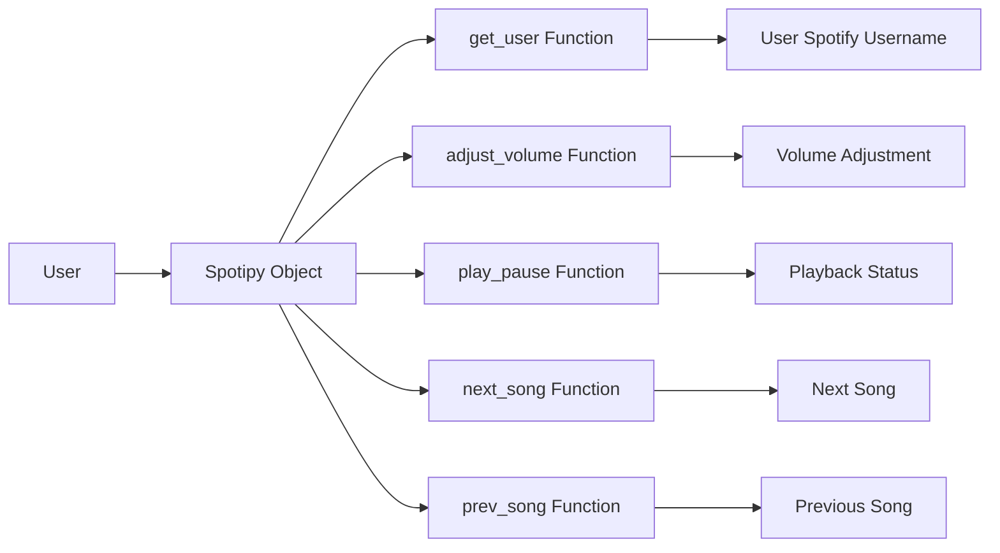

## Module: spotify_functions.py
- **Module Name**: The module name is `spotify_functions.py`.

- **Primary Objectives**: The module's purpose is to interact with the Spotify API to manage and control a user's Spotify playback. It provides functions to adjust volume, play or pause music, skip to the next song, and go back to the previous song.

- **Critical Functions**:
    - `get_user()`: Retrieves the current user's Spotify username.
    - `adjust_volume(vol_percent)`: Adjusts the volume of the user's Spotify playback.
    - `play_pause()`: Toggles between playing and pausing the user's Spotify playback based on the current playback status.
    - `next_song()`: Skips to the next song in the user's Spotify queue.
    - `prev_song()`: Returns to the previous song in the user's Spotify queue.

- **Key Variables**:
    - `SPOTIPY_CLIENT_ID`: The Spotify API client ID.
    - `SPOTIPY_CLIENT_SECRET`: The Spotify client secret.
    - `SPOTIPY_REDIRECT_URI`: The redirect URI for Spotify OAuth.
    - `scope`: The scope of permissions for the Spotify API.
    - `sp`: The Spotipy object used to interact with the Spotify API.

- **Interdependencies**: This module depends on the Spotipy library to interact with the Spotify API.

- **Core vs. Auxiliary Operations**: Core operations include adjusting volume, playing/pausing music, and navigating through songs. Auxiliary operations include getting the current user's Spotify username.

- **Operational Sequence**: The Spotipy object is first created with the necessary credentials and scope. Then, the various functions can be called as needed to control the user's Spotify playback.

- **Performance Aspects**: Performance is largely dependent on the responsiveness of the Spotify API. Proper handling of API responses and errors can improve performance.

- **Reusability**: This module is highly reusable as it encapsulates the Spotify API's functionality into distinct functions. As long as the necessary credentials are provided, these functions can be imported and used in any other Python script.

- **Usage**: This module can be used in any Python application that needs to control Spotify playback for a user. The functions can be called directly with the necessary parameters.

- **Assumptions**: The module assumes that valid Spotify API credentials are provided and that the user has granted the necessary permissions in the defined scope. It also assumes that the user is currently playing music on Spotify for some functions to work correctly.
## Mermaid Diagram

