# Introduction :

The system is a sophisticated conversational AI platform powered by advanced AI models like GPT-4 or similar. It comprises numerous modules, each designed to perform specific tasks to facilitate the operation of the AI. 

The system is designed to handle various types of messages including internal monologues, assistant messages, memory messages, system messages, user messages, and function messages. It can also create conversational AI agents that can interact, load and attach data, and process user messages.

The system interacts with various APIs, including the OpenAI API, to generate text based on given prompts and settings. It also includes modules for error handling, managing presets for the agent, generating a JSON schema from a Python function, and testing the functionality of various components of the system.

Additionally, the system includes modules for managing the state of the system in memory, loading data into archival storage, and managing WebSocket connections for real-time, full-duplex communication between the agent and multiple clients.

The system's performance depends on the underlying AI models used and the available system resources. It is designed to be reusable and adaptable for different scenarios by changing the configuration and the initial message from the user. 

The system assumes that the necessary packages are installed and that the environment variables for the models and API keys are set correctly. It also assumes that the user initiates the chat.

# Full System Overview


# Module Overview
## Module: __main__.py

- **Module Name**: The name of the module is `__main__.py`. This is a special name in Python, and it's used for the file that is run as the main entry point of a program.

- **Primary Objectives**: The primary purpose of this module appears to be to import and run an `app` function from a `main` module. 

- **Critical Functions**: The main function in this module is `app()`. Without more context, it's hard to say what this function does, but it's likely the main function of your program.

- **Key Variables**: The key variable in this module is `app`. It's a function imported from another module.

- **Interdependencies**: This module has a dependency on the `main` module, from which it imports the `app` function.

- **Core vs. Auxiliary Operations**: The core operation of this module is to run the `app` function. There don't appear to be any auxiliary operations in this module.

- **Operational Sequence**: The operational sequence of this module is straightforward: import the `app` function and then run it.

- **Performance Aspects**: Without more information about what the `app` function does, it's hard to comment on the performance aspects of this module.

- **Reusability**: This module could potentially be reused in any project that has a similar `main` module from which to import an `app` function.

- **Usage**: This module is used as the main entry point of a program. When you run a Python program, it starts by running the code in `__main__.py`.

- **Assumptions**: The main assumption made in this module is that there is a `main` module that has an `app` function which can be run without any arguments.

## Flow Diagram [via mermaid]
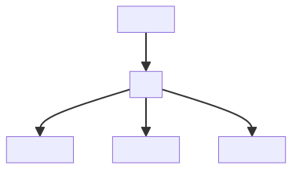
## Module: agent.py
 Here is a comprehensive analysis of the agent.py module:

**Module Name**: agent.py

**Primary Objectives**: Defines the Agent class, which handles conversational interactions between a human and an AI assistant. The agent orchestrates passing messages between the human and AI, calling functions, and maintaining conversation state.

**Critical Functions**:
- `__init__`: Constructor to create an Agent instance, initializing key components like memory, messages, functions, etc.
- `step`: Main method to handle a human message, get AI response, execute any functions, and update state. 
- `get_ai_reply`: Calls API to get AI response.
- `handle_ai_response`: Parses AI response, calls any functions, handles errors.
- `summarize_messages_inplace`: Summarizes old messages to reduce context length.
- `load` and `save`: Load/save agent state to disk.

**Key Variables**:
- `model`: AI model name (e.g. GPT-3) 
- `memory`: CoreMemory object containing persona and dialog history
- `messages`: Full message log between human and AI
- `functions`: Available functions the AI can call

**Interdependencies**:
- `Interface`: Abstract interface for handling messages/functions.
- `PersistenceManager`: Abstract persistence manager for saving/loading state.
- `openai_tools`: Utils for calling OpenAI API.
- `functions/functions.py`: Available functions to call.

**Core vs Auxiliary Operations**:
- Core: `step`, `get_ai_reply`, `handle_ai_response` 
- Auxiliary: `load`, `save`, `summarize_messages_inplace`

**Operational Sequence**:
1. `step` gets user message
2. Passes updated message history to `get_ai_reply` 
3. `get_ai_reply` calls API for AI response
4. `handle_ai_response` parses response, calls functions
5. `step` updates state with new messages

**Performance Aspects**:
- Caching past responses
- Summarizing old messages 
- Configurable context window size

**Reusability**:
- Could be adapted for different AI models
- `Interface` allows different platforms (CLI, web, etc)
- `PersistenceManager` allows different storage backends

**Usage**:
- Create `Agent` with config, model, memory, functions
- Call `agent.step(user_message)` to handle each user interaction

**Assumptions**:
- Stateful conversation with persistent memory
- Messages are text-based
- Using an underlying large language model API
## Flow Diagram [via mermaid]
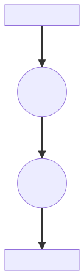
## Module: agent_autoreply.py
- **Module Name**: agent_autoreply.py

- **Primary Objectives**: The purpose of this module is to demonstrate how to integrate the MemGPT model into an AutoGen group chat. It provides an example of how to replace the default "coder" agent in AutoGen with a MemGPT agent.

- **Critical Functions**: 
  - `create_memgpt_autogen_agent_from_config`: This function creates a MemGPT agent with the specified configuration.
  - `UserProxyAgent`: This class creates a user agent that interacts with the other agents.
  - `AssistantAgent`: This class creates an assistant agent that can play the role of a coder.
  - `initiate_chat`: This method starts the group chat with a message from the user.

- **Key Variables**: 
  - `config_list`: This list contains the configuration for the model.
  - `USE_MEMGPT`: This boolean variable determines whether to use the MemGPT model or not.
  - `llm_config`: This dictionary contains the configuration for the language model.
  - `user_proxy`: This is the user agent.
  - `coder`: This is the coder agent, which can either be an AssistantAgent or a MemGPT agent depending on the `USE_MEMGPT` variable.

- **Interdependencies**: This module depends on the `autogen` and `memgpt` packages.

- **Core vs. Auxiliary Operations**: The core operation is the creation and configuration of the agents (either MemGPT or AssistantAgent), and the initiation of the chat. Auxiliary operations include setting up the configuration and environment variables.

- **Operational Sequence**: The module begins by setting up the configuration and creating the user agent. Then, based on the `USE_MEMGPT` variable, it either creates an AssistantAgent or a MemGPT agent. Finally, it initiates the chat with a message from the user.

- **Performance Aspects**: Performance depends on the underlying model (GPT-4 or similar) and the configuration settings. The use of MemGPT may improve performance due to its persistent memory capabilities.

- **Reusability**: The module is highly adaptable for reuse. By changing the configuration, one can use different models or agents. The chat initiation message can also be modified to suit different scenarios.

- **Usage**: This module is used to demonstrate how to integrate a MemGPT agent into an AutoGen group chat. It can be used as a template for similar tasks.

- **Assumptions**: The module assumes that the necessary packages (`autogen` and `memgpt`) are installed and that the OPENAI_API_KEY environment variable is set. It also assumes that the user wants to use a GPT-4 model.
## Flow Diagram [via mermaid]

## Module: agent_docs.py
- **Module Name**: The module is named `agent_docs.py`.

- **Primary Objectives**: The purpose of this module is to provide an example of how to integrate MemGPT into an AutoGen group chat and interact with documents. It demonstrates the setup process, how to create a group chat, and how to initiate a chat.

- **Critical Functions**: 
  - `create_autogen_memgpt_agent`: This function creates an AutoGen agent powered by MemGPT.
  - `create_memgpt_autogen_agent_from_config`: This function creates a MemGPT AutoGen agent from a given configuration.
  - `UserProxyAgent`: This class represents a user in the group chat.
  - `GroupChat`: This class represents a group chat between the user and two LLM agents.
  - `GroupChatManager`: This class manages the group chat.

- **Key Variables**: 
  - `config_list` and `config_list_memgpt`: These lists contain the configurations for creating AutoGen agents.
  - `USE_AUTOGEN_WORKFLOW`: This boolean variable determines whether to use the AutoGen workflow or not.
  - `DEBUG`: This boolean variable controls the debug mode.
  - `interface_kwargs`: This dictionary contains interface-related configurations.
  - `llm_config` and `llm_config_memgpt`: These dictionaries contain configurations for creating agents.
  - `user_proxy`: This is an instance of `UserProxyAgent` representing the user in the group chat.
  - `coder`: This is an instance of an AutoGen agent.
  - `groupchat`: This is an instance of `GroupChat` representing the group chat.
  - `manager`: This is an instance of `GroupChatManager` managing the group chat.

- **Interdependencies**: This module depends on the `autogen` and `memgpt` modules to create and manage the AutoGen group chat.

- **Core vs. Auxiliary Operations**: The core operations involve creating the AutoGen agents and initiating the group chat, while auxiliary operations include setting up configurations and debugging options.

- **Operational Sequence**: The module first sets up configurations, creates the user proxy and the coder (AutoGen agent), initializes the group chat, and finally initiates the chat with a message from the user.

- **Performance Aspects**: Performance considerations are not explicitly mentioned in the module. However, the performance could be influenced by the configurations of the AutoGen agents and the debugging options.

- **Reusability**: This module is highly reusable. It can be used as a template to create AutoGen group chats with different configurations and agents.

- **Usage**: This module is used as an example of how to create an AutoGen group chat with MemGPT and documents. It is used by importing the module and running it.

- **Assumptions**: The module assumes that the necessary packages (`autogen` and `memgpt`) are installed and that the environment variable for the OpenAI API key is set. It also assumes that the user wants to initiate the chat with a specific message.
## Flow Diagram [via mermaid]
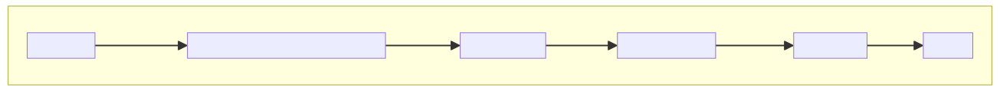
## Module: agent_groupchat.py
- **Module Name**: agent_groupchat.py

- **Primary Objectives**: This module is an example of how to integrate MemGPT into an AutoGen group chat. It sets up a simulated group chat environment where a user interacts with two agents: a product manager and a coder. 

- **Critical Functions**: 
  - `create_autogen_memgpt_agent`: Creates a MemGPT agent for the group chat.
  - `create_memgpt_autogen_agent_from_config`: Creates a MemGPT agent from a given configuration.
  - `autogen.UserProxyAgent`: Creates a user agent.
  - `autogen.AssistantAgent`: Creates an assistant agent.
  - `autogen.GroupChat`: Initializes the group chat.
  - `autogen.GroupChatManager`: Manages the group chat.

- **Key Variables**:
  - `config_list` and `config_list_memgpt`: Configuration lists for AutoGen agents.
  - `USE_MEMGPT`, `USE_AUTOGEN_WORKFLOW`, `DEBUG`: Flags to control the behavior of the program.
  - `interface_kwargs`, `llm_config`, `llm_config_memgpt`: Configuration parameters.
  - `user_proxy`, `pm`, `coder`: Agents participating in the group chat.
  - `groupchat`, `manager`: Handles the group chat.

- **Interdependencies**: This module interacts with the AutoGen and MemGPT libraries.

- **Core vs. Auxiliary Operations**: The core operations involve setting up the group chat and managing the interactions between the user and the agents. Auxiliary operations include setting up the configuration and creating the agents.

- **Operational Sequence**: The module first sets up the configuration and creates the agents. Then, it initializes the group chat and begins the chat with a message from the user.

- **Performance Aspects**: The performance of this module would depend on the efficiency of the AutoGen and MemGPT libraries.

- **Reusability**: This module can be reused to set up different scenarios for a group chat with AutoGen and MemGPT agents. The agents, their roles, and the initial message can be customized.

- **Usage**: This module is used to simulate a group chat environment where a user interacts with two agents: a product manager and a coder.

- **Assumptions**: The module assumes that the necessary libraries are installed and the environment variables are set correctly. It also assumes that the user initiates the chat.
## Flow Diagram [via mermaid]
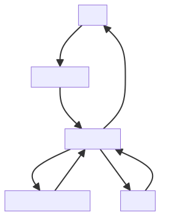
## Module: airoboros.py
- **Module Name**: airoboros.py

- **Primary Objectives**: The purpose of this module is to provide a wrapper for the Airoboros 70b v2.1 model, which only generates JSON and no inner thoughts. The module also contains a class for a wrapper that does include inner monologue as a field.

- **Critical Functions**: 
    - `chat_completion_to_prompt(self, messages, functions)`: This method formats a prompt for the Airoboros model.
    - `clean_function_args(self, function_name, function_args)`: This method cleans function arguments specific to the MemGPT model.
    - `output_to_chat_completion_response(self, raw_llm_output)`: This method transforms raw LLM output into a ChatCompletion style response.

- **Key Variables**: 
    - `simplify_json_content`: This variable determines whether to simplify the JSON content.
    - `clean_func_args`: This variable decides whether to clean function arguments.
    - `include_assistant_prefix`: This variable determines whether to include the assistant prefix.
    - `include_opening_brance_in_prefix`: This variable decides whether to include the opening brace in the prefix.
    - `include_section_separators`: This variable determines whether to include section separators.

- **Interdependencies**: This module interacts with the `wrapper_base` (from which it inherits), `json_parser` for cleaning JSON, and `errors` for handling exceptions.

- **Core vs. Auxiliary Operations**: Core operations include formatting prompts for the Airoboros model, cleaning function arguments, and transforming raw LLM output. Auxiliary operations include the handling of various flags to control aspects of the formatting and cleaning processes.

- **Operational Sequence**: The operational sequence is primarily driven by the `chat_completion_to_prompt` function, which formats the prompt, followed by the `clean_function_args` function to clean function arguments, and finally the `output_to_chat_completion_response` function to transform the output.

- **Performance Aspects**: Performance considerations are not explicitly mentioned in this module. However, the module is designed to handle JSON parsing, formatting, and cleaning efficiently.

- **Reusability**: The module is designed to be reusable, with the ability to handle various formatting and cleaning tasks related to the Airoboros model. It can be adapted for use with other models that require similar tasks.

- **Usage**: This module is used to interact with the Airoboros model, handling tasks such as formatting prompts, cleaning function arguments, and transforming model output.

- **Assumptions**: It is assumed that the first message is always from the system, and the role of the message can only be "user", "assistant", or "function". The module also assumes valid JSON format for the input and output.
## Flow Diagram [via mermaid]
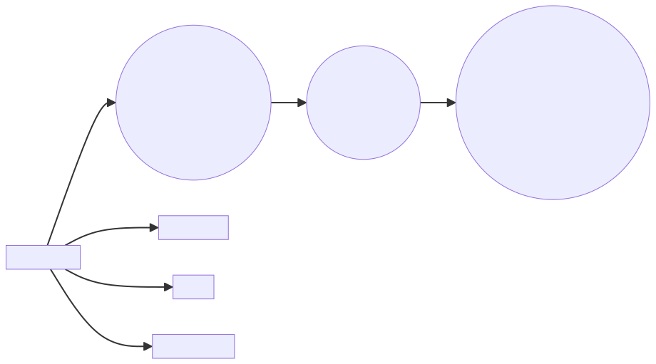
## Module: api.py
- **Module Name**: api.py
- **Primary Objectives**: The module's main purpose is to interact with an external API (LM Studio) to generate responses for prompts. It can either use the ChatCompletions API or the basic string completions API.
- **Critical Functions**: 
    - `get_lmstudio_completion(endpoint, prompt, context_window, settings=SIMPLE, api="chat")`: This function sends a request to the LM Studio API and retrieves the generated completion.
- **Key Variables**: 
    - `LMSTUDIO_API_CHAT_SUFFIX`: Used to construct the endpoint for the ChatCompletions API.
    - `LMSTUDIO_API_COMPLETIONS_SUFFIX`: Used to construct the endpoint for the basic string completions API.
    - `DEBUG`: A flag for debugging.
    - `endpoint`: The base URL for the API.
    - `prompt`: The input for the API to complete.
    - `context_window`: The maximum number of tokens to be generated.
    - `settings`: The settings for the generation.
    - `api`: The type of API to be used.
- **Interdependencies**: This module relies on the 'requests' library to send HTTP requests, the 'urllib.parse' library to join URLs, and the 'os' library to interact with the operating system. It also depends on the '.settings' and '..utils' modules for settings and utility functions respectively.
- **Core vs. Auxiliary Operations**: The core operation of this module is to interact with the LM Studio API to generate completions. The auxiliary operations include error handling and debugging.
- **Operational Sequence**: The function first checks if the number of tokens in the prompt exceeds the context window. Then, it prepares the request and sends it to the appropriate API endpoint based on the 'api' parameter. Finally, it handles the response, including error handling.
- **Performance Aspects**: Performance considerations include the number of tokens in the prompt and the context window, as well as the response time of the API.
- **Reusability**: The module is highly reusable as it provides a function to interact with the LM Studio API, which can be used in different contexts.
- **Usage**: This module is used to generate completions for prompts using the LM Studio API.
- **Assumptions**: The module assumes that the LM Studio API is available and reachable at the provided endpoint. It also assumes that the number of tokens in the prompt does not exceed the context window.
## Flow Diagram [via mermaid]
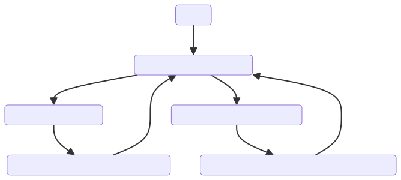
## Module: api.py
- **Module Name**: api.py

- **Primary Objectives**: This module is designed to interact with the Llama.cpp API. It sends a POST request to the API with a provided prompt and receives a completion response.

- **Critical Functions**: 
    - `get_llamacpp_completion(endpoint, prompt, context_window, grammar=None, settings=SIMPLE)`: This function sends a POST request to the Llama.cpp API and returns the response. It also handles errors and exceptions related to the request.

- **Key Variables**: 
    - `LLAMACPP_API_SUFFIX`: This is the endpoint suffix for the Llama.cpp API.
    - `SIMPLE`: This is the default settings for the API request.
    - `endpoint`: This is the base URL for the API.
    - `prompt`: This is the input for the API.
    - `context_window`: This is the maximum context length.
    - `grammar`: This is an optional parameter for a grammar file.
    - `settings`: These are the settings for the API request.

- **Interdependencies**: This module depends on the `requests` library for sending HTTP requests, `os` and `urllib.parse` for URL and path handling, and custom modules `.settings` and `..utils` for loading settings and utility functions.

- **Core vs. Auxiliary Operations**: The core operation of this module is the `get_llamacpp_completion` function. The error handling within this function can be considered as auxiliary operations.

- **Operational Sequence**: The module first checks if the prompt exceeds the maximum context length. It then prepares the request with the provided settings and prompt. If a grammar file is provided, it is loaded and added to the request. The module then sends the POST request to the API and returns the response.

- **Performance Aspects**: The module doesn't seem to have any specific performance considerations. However, the performance might be influenced by the response time of the Llama.cpp API.

- **Reusability**: This module is highly reusable as it provides a function to interact with the Llama.cpp API which can be used in different contexts where API interaction is required.

- **Usage**: This module is used by importing it and calling the `get_llamacpp_completion` function with the necessary parameters.

- **Assumptions**: The module assumes that the provided endpoint starts with "http://" or "https://". It also assumes that the Llama.cpp server is running and reachable at the provided endpoint.
## Flow Diagram [via mermaid]
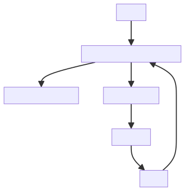
## Module: api.py
- **Module Name**: The module is named as `api.py`.

- **Primary Objectives**: The purpose of this module is to interact with the Koboldcpp API to generate text completions based on the given prompt and settings. 

- **Critical Functions**: The main function in this module is `get_koboldcpp_completion()`. This function takes in parameters like endpoint, prompt, context_window, grammar, and settings. It sends a POST request to the API and returns the generated text. 

- **Key Variables**: The key variables in this module are `KOBOLDCPP_API_SUFFIX`, `DEBUG`, `SIMPLE`, `endpoint`, `prompt`, `context_window`, `grammar`, `settings`, `request`, `URI`, `response`, and `result`.

- **Interdependencies**: This module interacts with other system components such as `settings` and `utils` modules. It uses the `SIMPLE` settings and the `load_grammar_file` and `count_tokens` functions from these modules.

- **Core vs. Auxiliary Operations**: The core operation is the interaction with the Koboldcpp API to generate text. The auxiliary operations include token counting, grammar file loading, and error handling.

- **Operational Sequence**: The sequence of operation is as follows: 
  1. Count the tokens in the prompt.
  2. Prepare the request with the settings, prompt, and context window.
  3. Load the grammar file if provided.
  4. Send a POST request to the API.
  5. Handle any errors and return the generated text.

- **Performance Aspects**: Performance considerations include ensuring the prompt does not exceed the maximum context length, and handling any non-200 response codes from the API.

- **Reusability**: This module is highly reusable. The `get_koboldcpp_completion()` function can be used to interact with the Koboldcpp API from any part of the system that requires text generation.

- **Usage**: This module is used whenever text generation is required. It is invoked by providing the appropriate parameters to the `get_koboldcpp_completion()` function.

- **Assumptions**: The main assumption made in this module is that the Koboldcpp API is running and reachable at the provided endpoint.
## Flow Diagram [via mermaid]
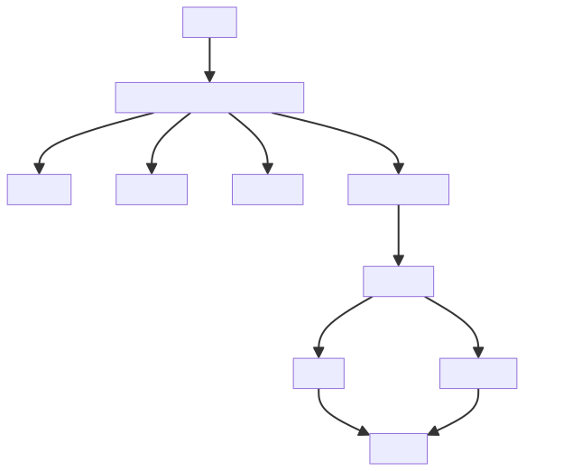
## Module: api.py
- **Module Name**: The module is named `api.py`.

- **Primary Objectives**: This module is designed to interact with a web-based API. Specifically, it sends a text prompt to the OpenAI API and retrieves the generated completion. 

- **Critical Functions**: 
  - `get_webui_completion`: This is the main function in the module. It takes in parameters like the endpoint, prompt, context window, settings, and grammar, and it sends a request to the OpenAI API. It then processes the response and returns the generated text.

- **Key Variables**: 
  - `WEBUI_API_SUFFIX`: This variable holds the suffix for the API endpoint.
  - `DEBUG`: This variable is a flag for debugging.
  - `endpoint`: This variable holds the URL of the API endpoint.
  - `prompt`: This variable contains the text prompt to be sent to the API.
  - `context_window`: This variable specifies the maximum number of tokens that the API should consider from the prompt.
  - `settings`: This variable contains settings for the text generation.
  - `grammar`: This variable, if provided, contains grammar rules for the text generation.
  - `request`: This variable holds the request to be sent to the API, including the prompt and settings.
  - `URI`: This variable holds the complete URL of the API endpoint.

- **Interdependencies**: This module depends on the `requests` library for sending HTTP requests, and the `urllib.parse` library for manipulating URLs. It also depends on the `settings` and `utils` modules in the same package.

- **Core vs. Auxiliary Operations**: The core operation of this module is sending the request to the API and processing the response, done in the `get_webui_completion` function. Auxiliary operations include counting tokens in the prompt, loading a grammar file, and validating the endpoint URL.

- **Operational Sequence**: The `get_webui_completion` function first counts the tokens in the prompt and validates the context window. It then prepares the request, including setting the grammar if provided. It validates the endpoint URL, sends the request to the API, and processes the response. If the response is successful, it extracts the generated text and returns it.

- **Performance Aspects**: The performance of this module largely depends on the performance of the OpenAI API. If the API is slow or unresponsive, the module will also be slow. The module also includes some error handling for non-200 response codes.

- **Reusability**: This module is quite reusable. The `get_webui_completion` function can be used with any endpoint and text prompt, and with any settings and grammar that are compatible with the OpenAI API.

- **Usage**: This module is used by importing it and calling the `get_webui_completion` function with the appropriate parameters.

- **Assumptions**: This module assumes that the OpenAI API is available at the provided endpoint and that it responds with a JSON object that includes a `choices` array with a `text` field. It also assumes that the `settings` and `grammar` parameters are compatible with the API.
## Flow Diagram [via mermaid]
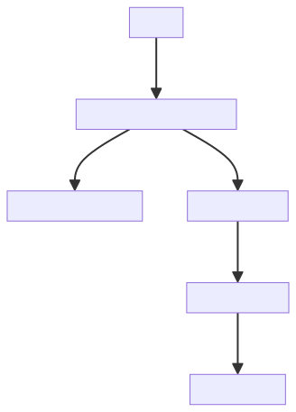
## Module: api.py
- **Module Name**: The module name is `api.py`.

- **Primary Objectives**: This module is designed to send a POST request to a specified API endpoint and return the response. It is particularly designed to work with the Ollama API for text generation.

- **Critical Functions**: 
  - `get_ollama_completion`: This function takes in several parameters including the API endpoint, the model to be used, the prompt, the context window, settings, and grammar. It constructs the API request, sends it, and returns the response.

- **Key Variables**: 
  - `OLLAMA_API_SUFFIX`: This is the suffix for the API endpoint.
  - `DEBUG`: This boolean variable is used for debugging purposes.
  - `request`: This dictionary contains the data to be sent in the API request.

- **Interdependencies**: This module depends on several other modules including `os`, `requests`, `urllib.parse`, and local modules such as `settings` and `utils`.

- **Core vs. Auxiliary Operations**: 
  - Core Operations: The core operation is the `get_ollama_completion` function which sends the API request and returns the response.
  - Auxiliary Operations: Error handling and debugging print statements are auxiliary operations.

- **Operational Sequence**: The function first checks the validity of the inputs, then constructs the API request, sends it, and returns the response.

- **Performance Aspects**: The performance of this module is dependent on the responsiveness of the API it interacts with. Error handling is implemented to manage potential issues.

- **Reusability**: This module is specific to the Ollama API but can be adapted for use with other APIs that require similar request structures.

- **Usage**: This module is used to interact with the Ollama API, sending a POST request and returning the received response.

- **Assumptions**: The module assumes that the API endpoint is correctly formatted and the API server is reachable. It also assumes that the `model` parameter is not `None`.
## Flow Diagram [via mermaid]
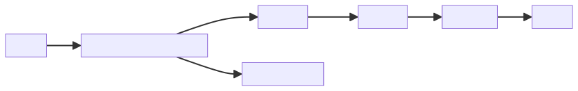
## Module: base.py
- **Module Name**: base.py

- **Primary Objectives**: This module provides a set of functions for interacting with a human user, managing conversation and memory, and performing search operations within the conversation and archival memory.

- **Critical Functions**: 
  1. `send_message()`: Sends a message to the human user.
  2. `pause_heartbeats()`: Temporarily ignore timed heartbeats.
  3. `core_memory_append()`: Appends content to a section of the core memory.
  4. `core_memory_replace()`: Replaces content in a section of the core memory.
  5. `conversation_search()`: Searches prior conversation history using case-insensitive string matching.
  6. `conversation_search_date()`: Searches prior conversation history using a date range.
  7. `archival_memory_insert()`: Adds content to archival memory.
  8. `archival_memory_search()`: Searches archival memory using semantic (embedding-based) search.

- **Key Variables**: 
  1. `message`: The message content to be sent or processed.
  2. `minutes`: The number of minutes to ignore heartbeats for.
  3. `name`, `content`, `old_content`, `new_content`: Variables related to memory management.
  4. `query`, `page`, `start_date`, `end_date`: Variables related to search operations.

- **Interdependencies**: This module interacts with the `interface`, `memory`, and `persistence_manager` components of the system.

- **Core vs. Auxiliary Operations**: Core operations include sending messages, managing memory, and performing search operations. Auxiliary operations include pausing heartbeats and formatting search results.

- **Operational Sequence**: 
  1. A message is sent or a command is given.
  2. The appropriate function is invoked, such as sending a message, updating memory, or performing a search.
  3. The function performs its task and returns a result or status message.

- **Performance Aspects**: This module is designed for efficient memory management and search operations. It uses case-insensitive string matching and semantic search for efficient retrieval of conversation history and archival memory.

- **Reusability**: The functions provided in this module are general-purpose and can be reused across different conversations and sessions.

- **Usage**: This module is used to manage the conversation with the user, update and query the conversation and archival memory, and control the system's responsiveness.

- **Assumptions**: 
  1. It is assumed that the input parameters for each function are provided in the correct format and type.
  2. It is also assumed that the memory management and persistence components are functioning correctly.
## Flow Diagram [via mermaid]
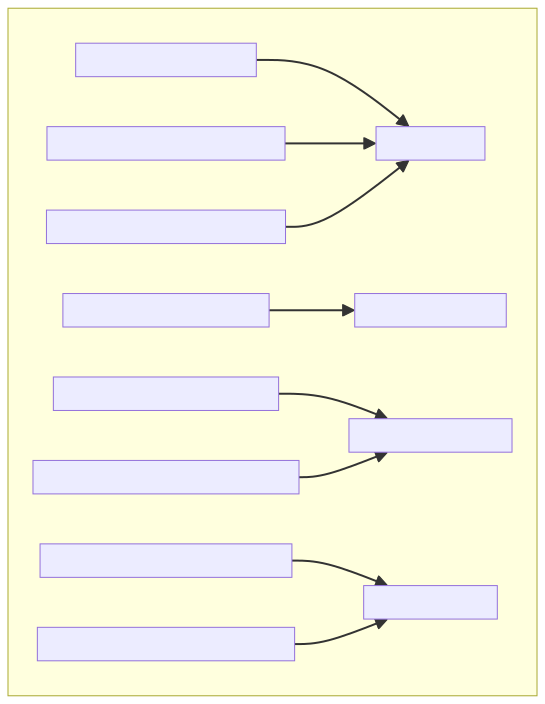
## Module: chat_completion_proxy.py
- **Module Name**: The module name is "chat_completion_proxy.py".

- **Primary Objectives**: The primary purpose of this module is to create a drop-in replacement for an agent's ChatCompletion call that runs on an OpenLLM backend. It facilitates communication with the backend, converts the message sequence into a prompt that the model expects, and processes the response.

- **Critical Functions**:
  - `get_chat_completion`: This is the main function of the module. It requires the model, messages, context_window, endpoint, and endpoint_type. It handles the communication with the backend, the conversion of the message sequence into a prompt, and the processing of the response.
  - `get_available_wrappers`: This function returns all available wrappers.
  - `get_webui_completion`, `get_webui_completion_legacy`, `get_lmstudio_completion`, `get_llamacpp_completion`, `get_koboldcpp_completion`, `get_ollama_completion`: These functions are used to get completions from different types of endpoints.

- **Key Variables**:
  - `endpoint`: This is the base URL of the API.
  - `endpoint_type`: This determines the type of endpoint to be used.
  - `DEBUG`: This is a boolean variable used for debugging.
  - `has_shown_warning`: This is used to control the display of warnings.
  - `available_wrappers`: This is a list of all available wrappers.

- **Interdependencies**: This module interacts with several other system components. It imports functions from other modules such as `webui.api`, `webui.legacy_api`, `lmstudio.api`, `llamacpp.api`, `koboldcpp.api`, `ollama.api`, `llm_chat_completion_wrappers`, `constants`, `utils`, `prompts.gpt_summarize`, and `errors`.

- **Core vs. Auxiliary Operations**: The core operation of this module is the `get_chat_completion` function, which communicates with the backend, converts the message sequence into a prompt, and processes the response. Auxiliary operations include the retrieval of available wrappers and the processing of different types of completions.

- **Operational Sequence**: The operational sequence starts with the `get_chat_completion` function, which checks the validity of the input, determines the wrapper to use, converts the message sequence into a prompt, gets the completion from the appropriate endpoint, and processes the response.

- **Performance Aspects**: The performance of this module depends on the efficiency of the conversion of the message sequence into a prompt, the speed of the communication with the backend, and the processing of the response.

- **Reusability**: This module is highly reusable. It can be used with different models, messages, and endpoints.

- **Usage**: This module is used to create a drop-in replacement for an agent's ChatCompletion call that runs on an OpenLLM backend.

- **Assumptions**: The module assumes that the context_window, endpoint, and endpoint_type are provided for the `get_chat_completion` function. It also assumes that the endpoint is reachable and returns a valid response.
## Flow Diagram [via mermaid]
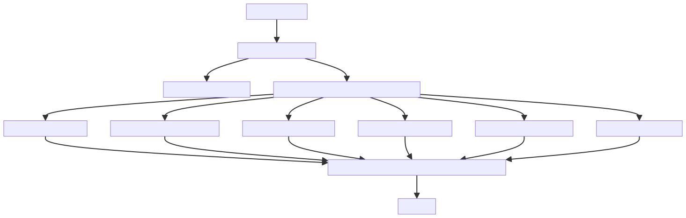
## Module: cli.py
- **Module Name**: cli.py
- **Primary Objectives**: The module is primarily used for running and configuring the MemGPT agent. It also contains functions to attach data to the agent and check the version.
- **Critical Functions**:
    - `run()`: This method is used to start chatting with a MemGPT agent. It includes various parameters like persona, agent, human, model, debug, etc.
    - `attach()`: This method is used to load the data contained in a data source into the agent's memory.
    - `version()`: This method is used to print and return the version of memgpt.
- **Key Variables**:
    - `agent`: Specifies the agent name.
    - `persona`: Specifies the persona.
    - `human`: Specifies the human.
    - `model`: Specifies the LLM model.
    - `debug`: Enables debugging output.
    - `config`: Holds the configuration for MemGPT.
- **Interdependencies**: This module interacts with several other modules such as `memgpt`, `typer`, `json`, `sys`, `io`, `logging`, `os`, `prettytable`, `questionary`, `openai`, `llama_index`, `memgpt.interface`, `memgpt.cli.cli_config`, `memgpt.agent`, `memgpt.system`, `memgpt.presets.presets`, `memgpt.constants`, `memgpt.personas.personas`, `memgpt.humans.humans`, `memgpt.utils`, `memgpt.persistence_manager`, `memgpt.config`, `memgpt.embeddings`, and `memgpt.openai_tools`.
- **Core vs. Auxiliary Operations**: The core operations of this module are running the agent, attaching data to the agent, and checking the version. Auxiliary operations include setting up the logger, loading or creating agent configuration, and pretty printing agent configuration.
- **Operational Sequence**: The module starts with importing necessary libraries and then defines the main functions. The `run` function is the main entry point for running the agent. If the agent config doesn't exist, it will create a new one; otherwise, it will use the existing one. The `attach` function is for attaching data to the agent, and `version` is for checking the memgpt version.
- **Performance Aspects**: The performance of this module largely depends on the configurations set and the data provided. The module uses an efficient way of loading data into the agent's memory in batches to optimize memory usage.
- **Reusability**: The module is highly reusable. It's designed to run different agents with various configurations, attach different data sources to the agents, and check the version.
- **Usage**: This module is used as a command-line interface for interacting with the MemGPT agent.
- **Assumptions**: The module assumes that the necessary libraries are installed and the agent configurations are set correctly. It also assumes that the data source provided in the `attach` function contains the correct data for the agent.
## Flow Diagram [via mermaid]
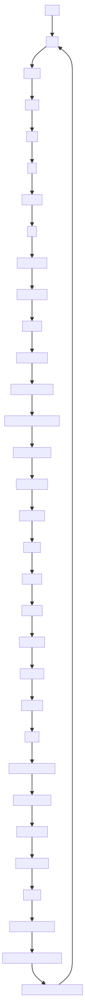
## Module: cli_config.py
- **Module Name**: This is the "cli_config.py" module. 

- **Primary Objectives**: This module is responsible for configuring the MemGPT model and its components. It allows for the setting of various parameters and elements including model endpoints, model types, context window, embedding endpoints, CLI configurations, and archival storage among others. 

- **Critical Functions**: 
  - `get_azure_credentials()`: Retrieves Azure credentials from the environment variables.
  - `get_openai_credentials()`: Retrieves OpenAI credentials from the environment variables.
  - `configure_llm_endpoint(config: MemGPTConfig)`: Configures the model endpoint.
  - `configure_model(config: MemGPTConfig, model_endpoint_type: str)`: Configures the model, model wrapper and context window.
  - `configure_embedding_endpoint(config: MemGPTConfig)`: Configures the embedding endpoint.
  - `configure_cli(config: MemGPTConfig)`: Configures the CLI with preset, persona, human, and agent.
  - `configure_archival_storage(config: MemGPTConfig)`: Configures the archival storage backend.
  - `configure()`: Updates default MemGPT configurations.
  - `list(option: str)`: Lists all agents, humans, personas or data sources.
  - `add(option: str, name: str, text: str, filename: str)`: Adds a persona or human.

- **Key Variables**: 
  - `app`: Instance of the Typer application.
  - `azure_key`, `azure_endpoint`, `azure_version`, `azure_deployment`, `azure_embedding_deployment`: Azure credentials.
  - `openai_key`: OpenAI API key.
  - `model_endpoint_type`, `model_endpoint`: Model endpoint configurations.
  - `model`, `model_wrapper`, `context_window`: Model configurations.
  - `embedding_endpoint_type`, `embedding_endpoint`, `embedding_dim`: Embedding configurations.
  - `default_preset`, `default_persona`, `default_human`, `default_agent`: CLI configurations.
  - `archival_storage_type`, `archival_storage_uri`: Archival storage configurations.

- **Interdependencies**: This module interacts with other system components such as the `questionary`, `typer`, `os`, `shutil`, `openai`, `prettytable`, `memgpt` and other utility modules.

- **Core vs. Auxiliary Operations**: The core operations of this module are the configuration of the model, embedding endpoint, CLI, and archival storage. Auxiliary operations include retrieving Azure and OpenAI credentials, listing agents, humans, personas or data sources, and adding a persona or human.

- **Operational Sequence**: The sequence starts with retrieving credentials, then configuring the model endpoint, model, embedding endpoint, CLI, and archival storage. After configuration, the module can list or add agents, humans, personas, or data sources.

- **Performance Aspects**: The performance of this module depends on the successful retrieval of credentials and configuration of the different components. Errors in any of these steps can lead to performance issues.

- **Reusability**: This module is highly reusable as it provides a standardized way to configure the MemGPT model and its components, which can be used across different projects and applications.

- **Usage**: This module is used to configure the MemGPT model and its components. It can be used by calling the `configure()` function, after which the model can be used as per the set configurations.

- **Assumptions**: The module assumes that the necessary environment variables for Azure and OpenAI are set. It also assumes that the directories for personas and humans exist.
## Flow Diagram [via mermaid]
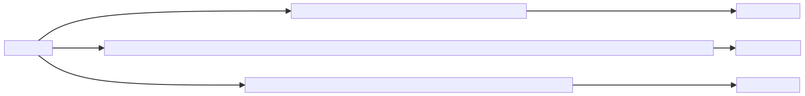
## Module: cli_load.py
- **Module Name**: cli_load.py
- **Primary Objectives**: This Python module is designed to load data into MemGPT's archival storage. It supports loading data from different sources such as directories, webpages, databases, and vector databases.
- **Critical Functions**: 
  - `store_docs(name, docs, show_progress=True)`: This function embeds and stores documents.
  - `load_index(name: str, dir: str)`: This function loads a LlamaIndex saved VectorIndex into MemGPT.
  - `load_directory(name: str, input_dir: str, input_files: List[str], recursive: bool)`: This function loads data from a directory.
  - `load_webpage(name: str, urls: List[str])`: This function loads data from webpages.
  - `load_database(name: str, query: str, dump_path: str, scheme: str, host: str, port: int, user: str, password: str, dbname: str)`: This function loads data from a database.
  - `load_vector_database(name: str, uri: str, table_name: str, text_column: str, embedding_column: str)`: This function loads pre-computed embeddings into MemGPT from a database.
- **Key Variables**: 
  - `name`: The name of the dataset to load.
  - `docs`: The documents to be embedded and stored.
  - `dir`: The path to the directory containing the index.
  - `input_dir`, `input_files`: The path to the directory or files containing the dataset.
  - `urls`: The list of URLs to load.
  - `query`, `dump_path`, `scheme`, `host`, `port`, `user`, `password`, `dbname`: The parameters for database connection.
  - `uri`, `table_name`, `text_column`, `embedding_column`: The parameters for vector database connection.
- **Interdependencies**: This module interacts with other system components such as `memgpt.embeddings`, `memgpt.connectors.storage`, `memgpt.config`, and `llama_index`.
- **Core vs. Auxiliary Operations**: The core operations of this module are the loading of data from different sources and storing them. The auxiliary operations include the embedding of documents and creating storage connectors.
- **Operational Sequence**: The sequence of operations depends on the source of the data. The general sequence is to load the data, embed the documents, and store them into the storage.
- **Performance Aspects**: Performance considerations include the efficiency of data loading, embedding, and storing. The module uses tqdm for progress bars to provide feedback on long-running operations.
- **Reusability**: This module is highly reusable as it provides a generic framework for loading data from different sources. The loading functions can be easily adapted for different sources or datasets.
- **Usage**: The module is used by calling the appropriate load function with the necessary arguments. For example, to load data from a directory, you would call `load_directory()` with the name of the dataset and the directory path.
- **Assumptions**: The module assumes that the provided data is in a suitable format for the chosen load function. For example, when loading data from a database, it assumes that the database connection parameters are correct. It also assumes that the embedding dimension of the loaded data matches the configuration.
## Flow Diagram [via mermaid]
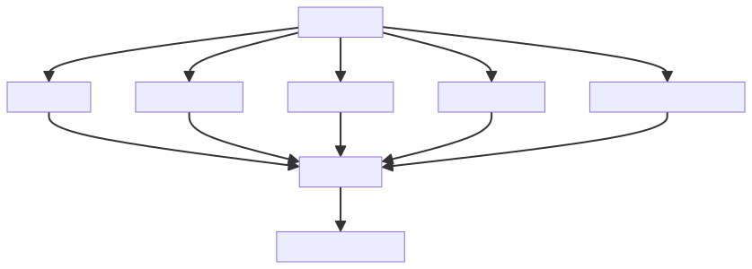
## Module: config.py
 Here is a comprehensive analysis of the config.py module:

**Module Name**: config.py

**Primary Objectives**: Defines configuration classes and utilities to load MemGPT agent and runtime configuration from files. Provides helpers to interactively create new configs.

**Critical Functions**:
- MemGPTConfig: Dataclass for main MemGPT config loaded from config file. Handles model, embedding, storage configs.
- AgentConfig: Dataclass for agent-specific config. Stores persona, model, embedding info.
- Config: Helper class to initialize configs from flags or interactive prompts. Handles personas.

**Key Variables**:
- MEMGPT_DIR: Base directory for MemGPT data storage.
- model_choices: Available models for interactive config.
- LLM_MAX_TOKENS: Context length limits per model.

**Interdependencies**:
- Depends on model wrappers, personas, humans, presets defined elsewhere. Saves configs to disk.

**Core vs Auxiliary Operations**:
- Core: Loading/saving configs, prompting for settings, config dataclasses.
- Auxiliary: Indentation, persona text helpers.

**Operational Sequence**:
1. Load default config from file or create new one interactively.
2. Override settings from flags or interactive prompts. 
3. Save updated config to file.

**Performance Aspects**: 
- Avoid reloading config repeatedly. Cache and reuse.
- Config files enable quick launch without prompts.

**Reusability**:
- Configs encapsulate all settings in shareable files.
- Dataclasses provide reusable config objects.

**Usage**: 
- Created at launch to configure MemGPT runtime environment.
- AgentConfig used to persist agent-specific settings.

**Assumptions**:
- Config file in expected MEMGPT_DIR location.
- Personas and humans in expected subdirs.
## Module: constants.py
- **Module Name**: The module name is "constants.py".

- **Primary Objectives**: The primary purpose of this module is to define constants that are used throughout the application. In this case, it defines a single constant, TIMEOUT, which presumably is used to set a time limit for some operation or operations.

- **Critical Functions**: This module does not contain any functions or methods. It only defines a constant.

- **Key Variables**: The key variable in this module is TIMEOUT. It is set to 30, which is presumably a time in seconds. 

- **Interdependencies**: As a constants module, it may not have dependencies of its own, but other modules in the system might depend on the constants it defines. Any module that needs to use a timeout of 30 seconds would likely import this constant from this module.

- **Core vs. Auxiliary Operations**: This module does not perform any operations, core or auxiliary. It simply provides a value that other modules can use.

- **Operational Sequence**: There is no operational sequence in this module, as it does not perform operations.

- **Performance Aspects**: There are no direct performance aspects to this module as it simply defines a constant. However, the value of the TIMEOUT constant could indirectly affect performance in other modules that use it. For example, if TIMEOUT is used as a limit for a network operation, setting it to a higher value could slow down the application, while setting it to a lower value could lead to incomplete operations or errors.

- **Reusability**: This module is highly reusable. Any part of the system that needs to use a timeout of 30 seconds can import the TIMEOUT constant from this module. Furthermore, if the need arises for a different timeout value in the future, a new constant can be added to this module.

- **Usage**: To use this module, other modules would import it and then use the TIMEOUT constant. For example, in Python, this might look like: `from constants import TIMEOUT`.

- **Assumptions**: The main assumption here is that TIMEOUT is a suitable name for this constant, and that a value of 30 seconds is appropriate for the timeout in question. Further assumptions might depend on how and where the TIMEOUT constant is used in the rest of the system.
## Flow Diagram [via mermaid]
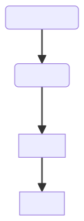
## Module: constants.py
- **Module Name**: The module is named "constants.py".

- **Primary Objectives**: This module's purpose is to define the default endpoints for different services and the default AI model and wrapper. It serves as a centralized place for managing these constants, which are used throughout the application.

- **Critical Functions**: This module does not contain any functions or methods. It only defines constant values.

- **Key Variables**: 
    - `DEFAULT_ENDPOINTS`: This is a dictionary that maps service names to their default endpoints.
    - `DEFAULT_OLLAMA_MODEL`: This is a string that specifies the default AI model.
    - `DEFAULT_WRAPPER`: This is an instance of the default wrapper class.
    - `DEFAULT_WRAPPER_NAME`: This is a string that specifies the name of the default wrapper.

- **Interdependencies**: This module is dependent on the `airoboros` module from `memgpt.local_llm.llm_chat_completion_wrappers`.

- **Core vs. Auxiliary Operations**: As this module only defines constants, it does not have any operations.

- **Operational Sequence**: There is no operational sequence in this module as it only defines constants.

- **Performance Aspects**: Since this module only contains constant definitions, it does not have significant performance considerations.

- **Reusability**: This module is highly reusable. The constants defined in this module can be imported and used in any other module that requires these values.

- **Usage**: Other modules import this module when they need to use the constants it defines. For example, a module that needs to make a request to one of the services would import `DEFAULT_ENDPOINTS` and use it to get the endpoint for the service.

- **Assumptions**: It is assumed that the endpoints and the AI model specified in this module are correct and available. If these values are incorrect or the services or model are not available, it could cause errors in other parts of the application that use these constants.
## Flow Diagram [via mermaid]
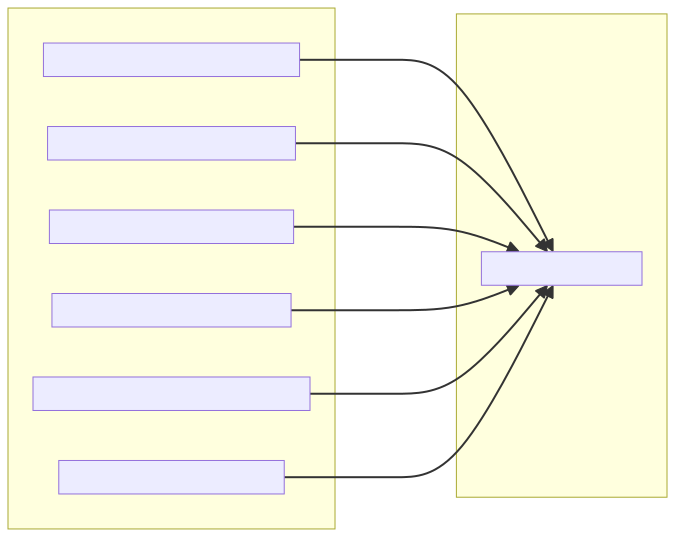
## Module: constants.py
- **Module Name**: constants.py

- **Primary Objectives**: This module is designed to store and manage constants, including directory paths, model names, message strings, token limits, memory limits, and function parameters. It provides a centralized location for managing these constants, reducing the likelihood of errors and making the code easier to maintain.

- **Critical Functions**: This module does not contain any functions. It only declares and initializes constants.

- **Key Variables**: Some of the key variables include:
  - `MEMGPT_DIR`: Directory path for memgpt.
  - `DEFAULT_MEMGPT_MODEL`: Default model used for memgpt.
  - `LLM_MAX_TOKENS`: Dictionary that maps models to their maximum token limit.
  - `MESSAGE_SUMMARY_WARNING_FRAC`, `MESSAGE_SUMMARY_TRUNC_TOKEN_FRAC`, and `MESSAGE_SUMMARY_TRUNC_KEEP_N_LAST`: Constants for conversation length and truncation.
  - `CORE_MEMORY_PERSONA_CHAR_LIMIT` and `CORE_MEMORY_HUMAN_CHAR_LIMIT`: Constants for memory limits.
  - `RETRIEVAL_QUERY_DEFAULT_PAGE_SIZE`: Default page size for retrieval queries.

- **Interdependencies**: This module does not interact with other system components directly. However, the constants defined here are likely used across the system, creating indirect dependencies.

- **Core vs. Auxiliary Operations**: All operations in this module are auxiliary since they support the core functionalities of the system by providing constants.

- **Operational Sequence**: Not applicable as this module does not contain any operational flow.

- **Performance Aspects**: This module does not have any direct impact on performance. However, the constants defined here, such as token limits or memory limits, can indirectly affect the system's performance.

- **Reusability**: This module is highly reusable. The constants defined here can be imported and used in any other module in the system.

- **Usage**: This module is used to provide constants to the rest of the system. Other modules import the required constants from this module.

- **Assumptions**: The module assumes that the directory in which memgpt is stored and the default model will not change. It also assumes that the token limits for the models are fixed.
## Flow Diagram [via mermaid]

## Module: constants.py
**Module Name**: constants.py

**Primary Objectives**: This module is designed to store constant values that are used throughout the application. This can include configuration settings, default values, and any other values that remain consistent across the application.

**Critical Functions**: As this is a constants file, it does not contain any functions or methods. Its primary role is to store static data.

**Key Variables**: 
- `DEFAULT_PORT`: This variable is used to define the default port on which the application will run.
- `CLIENT_TIMEOUT`: This variable is used to define the maximum amount of time the application will wait for a client response before timing out.

**Interdependencies**: This module interacts with any other modules or components that require the use of these constants. These could be networking modules, client modules, server modules, etc.

**Core vs. Auxiliary Operations**: The operations of this module are auxiliary, as it does not perform any core functionalities but provides support to them by supplying constant values.

**Operational Sequence**: There is no distinct flow in this module as it only contains static data.

**Performance Aspects**: This module does not have any direct impact on performance. However, the values of the constants can indirectly affect the performance of the modules that use them. For example, a lower `CLIENT_TIMEOUT` could make the application seem more responsive at the risk of prematurely timing out slower clients.

**Reusability**: This module is highly reusable. The constants defined in this module can be imported and used in any other module within the application. Changes to the constants will also be reflected in all modules that import them.

**Usage**: This module is used by importing the required constants into another module. For example, `from constants import DEFAULT_PORT`.

**Assumptions**: It is assumed that the values of `DEFAULT_PORT` and `CLIENT_TIMEOUT` are suitable for the application's needs and that any changes to these values are made with an understanding of their impact on the rest of the application.
## Flow Diagram [via mermaid]
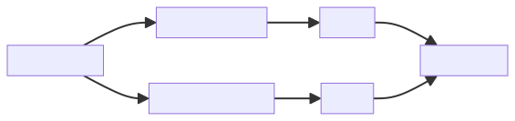
## Module: db.py
- **Module Name**: db.py

- **Primary Objectives**: This module is designed to provide database connectivity and operations for a system, likely an AI model, that works with textual passages. It supports two types of database connectors: PostgresStorageConnector and LanceDBConnector.

- **Critical Functions**: 
   - `get_db_model(table_name: str)`: Generates a SQLAlchemy model for the provided table name.
   - `PostgresStorageConnector`: A class that provides methods for connecting to a PostgreSQL database and performing CRUD operations.
   - `LanceDBConnector`: A class that provides methods for connecting to a LanceDB database and performing CRUD operations.

- **Key Variables**: 
   - `table_name`: The name of the table in the database.
   - `config`: An instance of the MemGPTConfig class.
   - `engine`: SQLAlchemy engine instance for database connectivity.
   - `Session`: SQLAlchemy sessionmaker instance for database session management.

- **Interdependencies**: This module relies on several external libraries such as SQLAlchemy, psycopg, pgvector, and lancedb for database operations. It also uses MemGPTConfig and StorageConnector from the memgpt module.

- **Core vs. Auxiliary Operations**: Core operations include creating database models, establishing database connections, and performing CRUD operations. Auxiliary operations include sanitizing table names and listing loaded data.

- **Operational Sequence**: The typical sequence of operations would involve initializing a database connector (either PostgresStorageConnector or LanceDBConnector), specifying the table name, and then performing the desired database operations (insertion, retrieval, deletion, etc.).

- **Performance Aspects**: The module uses pagination to retrieve records, which can help manage memory usage when dealing with large datasets. It also uses SQLAlchemy's sessionmaker for efficient database session management.

- **Reusability**: The module is highly reusable. The database model and connector classes can be used with different table names and configurations, making them adaptable for various database schemas and systems.

- **Usage**: This module is used whenever the system needs to interact with a database, whether it's to store, retrieve, update, or delete data. 

- **Assumptions**: The module assumes that the database URI is provided in the MemGPTConfig. It also assumes that the Postgres database has the vector extension installed, and that the LanceDB database is accessible via the provided URI.
## Flow Diagram [via mermaid]
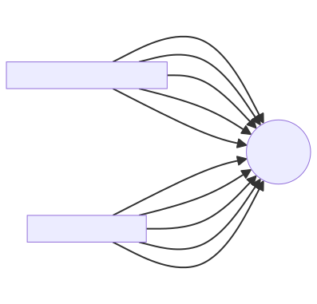
## Module: dolphin.py
- **Module Name**: dolphin.py

- **Primary Objectives**: This module is a wrapper for Dolphin 2.1 Mistral 7b, which is a language model. The module is designed to format prompts that only generate JSON and no inner thoughts. 

- **Critical Functions**: 
  - `__init__`: Initializes the Dolphin21MistralWrapper class with several parameters.
  - `chat_completion_to_prompt`: Converts chat completion to a prompt.
  - `create_function_description`: Creates a function description in airorobos style.
  - `create_function_call`: Converts ChatCompletion to Airoboros style function trace (in prompt).
  - `clean_function_args`: Cleans function arguments.
  - `output_to_chat_completion_response`: Turns raw LLM output into a ChatCompletion style response.

- **Key Variables**: 
  - `simplify_json_content`: Simplify the JSON content or not.
  - `clean_func_args`: Clean function arguments or not.
  - `include_assistant_prefix`: Include assistant prefix or not.
  - `include_opening_brance_in_prefix`: Include opening brace in prefix or not.
  - `include_section_separators`: Include section separators or not.

- **Interdependencies**: This module interacts with the wrapper_base and json_parser modules, as well as the errors module in the parent directory.

- **Core vs. Auxiliary Operations**: Core operations include creating function descriptions, cleaning function arguments, and converting outputs to chat completion responses. Auxiliary operations include initializing the class and formatting the prompt.

- **Operational Sequence**: The module begins by initializing the class and its parameters. It then converts chat completions to prompts, creates function descriptions, cleans function arguments, and finally converts outputs to chat completion responses.

- **Performance Aspects**: This module is designed for performance and efficiency, as it includes functions for cleaning arguments and simplifying JSON content.

- **Reusability**: This module can be reused in different contexts where Dolphin 2.1 Mistral 7b wrapper is needed. 

- **Usage**: The module is used by calling the Dolphin21MistralWrapper class and using its functions to work with the Dolphin 2.1 Mistral 7b language model.

- **Assumptions**: The module assumes that the input will be in a specific format, and it includes error handling to deal with scenarios where the input does not meet these assumptions.
## Flow Diagram [via mermaid]
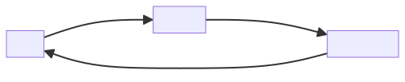
## Module: embeddings.py
- **Module Name**: The module name is `embeddings.py`.

- **Primary Objectives**: The purpose of this module is to return the LlamaIndex embedding model to be used for embeddings. It supports different types of embedding endpoints including OpenAI, Azure, and Hugging Face.

- **Critical Functions**: The main function in this module is `embedding_model()`. This function loads the configuration, checks the type of embedding endpoint (OpenAI, Azure, or default to Hugging Face), and returns the corresponding embedding model.

- **Key Variables**: 
    - `config`: Holds the loaded configuration.
    - `endpoint`: Stores the type of embedding endpoint.
    - `model`: The embedding model to be used.

- **Interdependencies**: This module interacts with other system components such as `typer`, `os`, `llama_index.embeddings`, `memgpt.config`, and potentially `HuggingFaceEmbedding`.

- **Core vs. Auxiliary Operations**: The core operation is the creation and return of the appropriate embedding model based on the configuration. The auxiliary operations include loading the configuration and setting the environment variable for Hugging Face.

- **Operational Sequence**: The function first loads the configuration, then checks the type of embedding endpoint. If it's OpenAI or Azure, it returns the corresponding embedding model. If not, it defaults to the Hugging Face model.

- **Performance Aspects**: The performance of this module depends on the efficiency of the chosen embedding model and the speed of the API endpoints.

- **Reusability**: This module is highly reusable as it allows for the flexible selection of an embedding model based on the configuration.

- **Usage**: This module is used whenever an embedding model is needed. The type of model returned is determined by the `embedding_endpoint_type` in the configuration.

- **Assumptions**: The module assumes that the configuration loaded correctly and that the specified embedding endpoint type is supported. It also assumes that the necessary API keys and endpoints are correctly provided in the configuration.
## Flow Diagram [via mermaid]
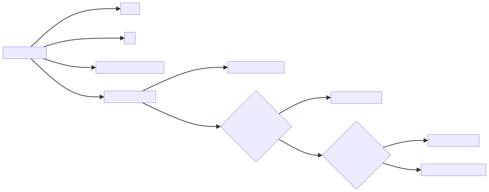
## Module: errors.py
- **Module Name**: The module is named `errors.py`.

- **Primary Objectives**: The primary purpose of this module is to define and handle various types of errors related to LLM (Local Link Manager). It provides a mechanism to raise and catch specific exceptions in the LLM context.

- **Critical Functions**: The main functions are the constructors (`__init__`) of the exception classes `LLMError`, `LLMJSONParsingError`, `LocalLLMError`, and `LocalLLMConnectionError`. They initialize the error messages for their respective exceptions.

- **Key Variables**: The key variable in this module is `self.message`, which stores the error message for each exception.

- **Interdependencies**: This module does not appear to interact directly with other system components, but it can be imported and used wherever error handling is necessary in the larger system context.

- **Core vs. Auxiliary Operations**: The core operations of this module are defining and initializing the exceptions. There do not appear to be any auxiliary operations.

- **Operational Sequence**: When an exception is raised, its `__init__` method is called, setting the `message` attribute. When the exception is caught, this message can be accessed and logged or displayed to provide information about the error.

- **Performance Aspects**: As this module is primarily related to error handling, its performance impact should be minimal. The main performance consideration is ensuring that exceptions are handled efficiently to avoid unnecessary disruptions to the program flow.

- **Reusability**: This module is highly reusable. The defined exceptions can be imported and used in any part of the system where LLM-related errors need to be handled.

- **Usage**: To use this module, import the required exceptions at the top of the Python file. When an error condition is detected, raise the appropriate exception. In the try/except block where the LLM operation is performed, catch the exception and handle it appropriately, such as by logging the error message and terminating the operation.

- **Assumptions**: The main assumption is that these exceptions will be raised and caught correctly in the rest of the system. It is also assumed that the error messages provided are sufficient to understand and address the error.
## Flow Diagram [via mermaid]
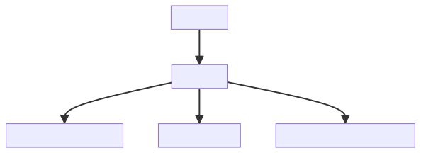
## Module: extras.py
- **Module Name**: extras.py

- **Primary Objectives**: This module is primarily designed to provide additional utility functions for interacting with the AI model, file handling, and generating HTTP requests.

- **Critical Functions**: 
  - `message_chatgpt`: This function sends a message to a basic AI, ChatGPT, and gets a reply. It does not retain memory of previous interactions.
  - `read_from_text_file`: This function reads lines from a text file, given a filename, starting line, and the number of lines to read.
  - `append_to_text_file`: This function appends content to a text file.
  - `http_request`: This function generates an HTTP request and returns the response.

- **Key Variables**: 
  - `message_sequence` in `message_chatgpt`: It's a list that holds system and user messages.
  - `filename`, `line_start`, `num_lines` in `read_from_text_file`: These variables are used to specify the file and the lines to read.
  - `filename`, `content` in `append_to_text_file`: These are used to specify the file and the content to append.
  - `method`, `url`, `payload_json` in `http_request`: These are used to specify the HTTP request details.

- **Interdependencies**: This module depends on the `os`, `json`, `requests`, `typing.Optional` libraries, and `memgpt.constants` and `memgpt.openai_tools` modules.

- **Core vs. Auxiliary Operations**: Core operations include sending messages to ChatGPT, reading from a text file, appending to a text file, and generating HTTP requests. Auxiliary operations include validation and error handling within these operations.

- **Operational Sequence**: Each function in the module can be used independently as per requirements. The sequence of operations would depend on the specific use case.

- **Performance Aspects**: The performance of this module depends on the efficiency of the I/O operations (file and HTTP requests) and the response time of the ChatGPT model.

- **Reusability**: Each function in the module is designed to be reusable in various scenarios - interacting with ChatGPT, handling text files, and making HTTP requests.

- **Usage**: This module is used when there's a need to interact with the ChatGPT model, perform file operations, or generate HTTP requests.

- **Assumptions**: 
  - The file paths provided exist and are accessible.
  - The message sent to ChatGPT is a full English sentence.
  - The HTTP method provided is valid and the URL is accessible.
  - For GET requests, the payload is ignored.
  - The payload for non-GET requests is a valid JSON string.
## Flow Diagram [via mermaid]
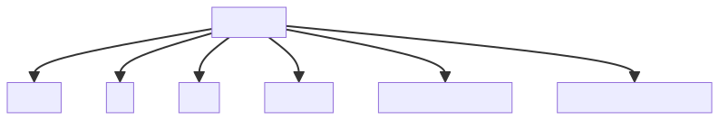
## Module: functions.py
- **Module Name**: The module name is `functions.py`.

- **Primary Objectives**: This module's purpose is to load and manage sets of functions. It provides a way to load functions from a module, generate a JSON schema for them, and handle them in a dictionary. It also allows loading all function sets from a directory, including user-provided and built-in ones.

- **Critical Functions**: 
  - `load_function_set(module)`: This function loads the functions from a given module and generates a schema for each of them.
  - `load_all_function_sets(merge=True)`: This function loads all function sets from a directory. It can merge all functions from all sets into the same level dict or return a nested dict where the top level is organized by the function set name.

- **Key Variables**: 
  - `function_dict`: A dictionary that stores the functions and their generated schema from a module.
  - `schemas_and_functions`: A dictionary that stores the function sets and their associated functions and schemas.

- **Interdependencies**: This module interacts with other components such as `schema_generator` from `memgpt.functions` and `MEMGPT_DIR` from `memgpt.constants`. It also interacts with Python's built-in modules like `os`, `sys`, `importlib`, and `inspect`.

- **Core vs. Auxiliary Operations**: The core operations include loading function sets from a module and generating their schemas. Auxiliary operations include handling exceptions and validating the uniqueness of function names.

- **Operational Sequence**: The module first defines the paths of the scripts and function sets directories. It then lists all Python files in these directories. The module then iterates over these files, imports the modules, and loads the function sets. If the `merge` parameter is set to `True`, it will merge all functions from all sets into the same level dict.

- **Performance Aspects**: The module is designed to efficiently load and manage function sets. However, the performance may be affected when dealing with a large number of function sets or large modules.

- **Reusability**: The module is highly reusable. The functions `load_function_set` and `load_all_function_sets` can be used to load and manage function sets from any module or directory.

- **Usage**: This module is used to load and manage function sets. It is particularly useful in projects where functions are organized in modules and directories, and there is a need to dynamically load and handle these functions.

- **Assumptions**: The module assumes that all function names within a set are unique. It also assumes that the directories and files it interacts with exist and are accessible.
## Flow Diagram [via mermaid]
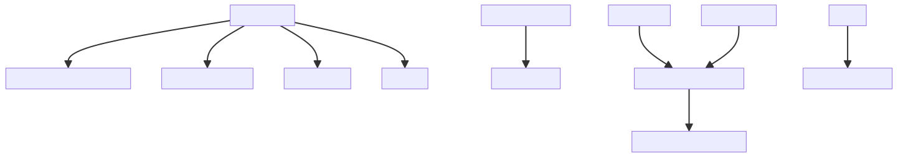
## Module: generate_embeddings_for_docs.py
- **Module Name**: The module name is `generate_embeddings_for_docs.py`.

- **Primary Objectives**: The primary objective of this module is to generate embeddings for documents. It reads the documents from a file, processes them, and generates embeddings using OpenAI's API.

- **Critical Functions**: 
    - `generate_requests_file(filename)`: This function generates a file of requests which can be fed to the OpenAI API to generate embeddings.
    - `generate_embedding_file(filename, parallel_mode)`: This function generates the embeddings for the documents in the file. It can work in parallel mode or sequential mode.
    - `main()
## Flow Diagram [via mermaid]
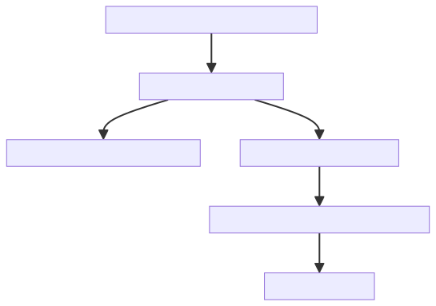
## Module: gpt_functions.py

## Flow Diagram [via mermaid]
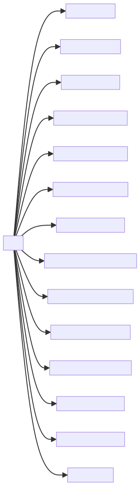
## Module: gpt_summarize.py
- **Module Name**: The module is named `gpt_summarize.py`.

- **Primary Objectives**: This module's purpose is to summarize a history of previous messages in a conversation between an AI persona and a human. The summary is from the AI's perspective and must be less than a given word limit.

- **Critical Functions**: The main function of this module is to generate a summary of the conversation. However, the specific functions/methods aren't provided in the given context.

- **Key Variables**: The key variable is `WORD_LIMIT`, which determines the maximum length of the summary.

- **Interdependencies**: The module interacts with the conversation history and the AI's messages. It also relies on the system's ability to distinguish between different roles ('assistant', 'user', 'function') and events (login, heartbeat).

- **Core vs. Auxiliary Operations**: The core operation is the summarization of the conversation. Auxiliary operations could include parsing the conversation, identifying the roles and messages, and ensuring the word limit isn't exceeded.

- **Operational Sequence**: The module likely begins by parsing the conversation history, identifying the roles and messages, then generates a summary from the AI's perspective, and finally ensures the summary doesn't exceed the word limit.

- **Performance Aspects**: Performance considerations may include the efficiency of the summarization algorithm and the ability to process large conversation histories within the word limit.

- **Reusability**: This module could potentially be reused for summarizing any conversation, provided the conversation follows the same structure of roles and messages.

- **Usage**: This module is used to generate a concise summary of a conversation between an AI and a human, useful for understanding the context and content of the conversation without needing to read the entire conversation history.

- **Assumptions**: The module assumes that the AI's messages are marked with the 'assistant' role, function outputs are marked with the 'function' role, and user messages and system events are marked with the 'user' role. It also assumes that the conversation follows a certain structure and that the AI's inner monologue is not visible to the user.
## Module: gpt_system.py
Module Name: gpt_system.py

Primary Objectives: The primary objective of this module is to retrieve system text based on a given key.

Critical Functions:
1. `get_system_text(key)`: This function takes a key as input and retrieves the corresponding system text. It first checks if the text file exists in the "prompts/system/" directory. If the file exists, it reads the content of the file and returns it. If the file does not exist in the "prompts/system/" directory, it checks in the "~/.memgpt/system_prompts/" directory. If the file is found in the "~/.memgpt/system_prompts/" directory, it reads the content of the file and returns it. If the file is not found in either directory, it raises a FileNotFoundError.

Key Variables:
- `filename`: Stores the name of the text file based on the given key.
- `file_path`: Stores the path of the text file.
- `user_system_prompts_dir`: Stores the path of the "~/.memgpt/system_prompts/" directory.

Interdependencies: This module depends on the `os` module and the `MEMGPT_DIR` constant from the `memgpt.constants` module.

Core vs. Auxiliary Operations: The core operation of this module is the `get_system_text()` function, which retrieves the system text. There are no auxiliary operations in this module.

Operational Sequence: The operational sequence of this module is as follows:
1. Check if the text file exists in the "prompts/system/" directory.
2. If the file exists, read the content and return it.
3. If the file does not exist in the "prompts/system/" directory, check in the "~/.memgpt/system_prompts/" directory.
4. If the file is found, read the content and return it.
5. If the file is not found in either directory, raise a FileNotFoundError.

Performance Aspects: The performance of this module depends on the size of the text files and the efficiency of file operations. Reading the content of large text files may impact performance.

Reusability: This module can be reused in any system that requires retrieving system text based on keys. It can be easily integrated into different codebases.

Usage: This module is used to retrieve system text by providing a key as input. It can be used in various applications where dynamic system text is required.

Assumptions: This module assumes that the text files exist in either the "prompts/system/" directory or the "~/.memgpt/system_prompts/" directory. It also assumes that the user has the necessary permissions to read the files.
## Flow Diagram [via mermaid]
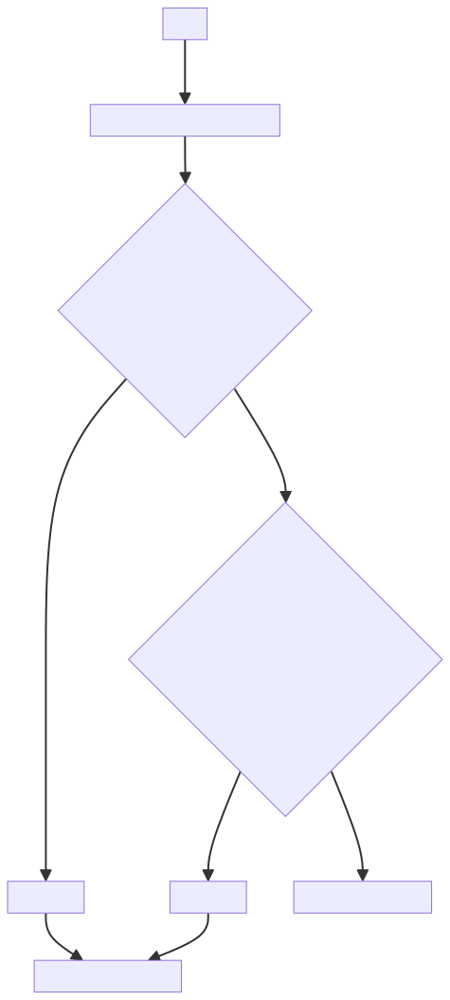
## Module: humans.py
- **Module Name**: The module is named humans.py.

- **Primary Objectives**: The purpose of this module is to fetch and return the contents of a text file given its key. If the key does not include a .txt extension, it appends it before trying to open the file. 

- **Critical Functions**: The main function in this module is `get_human_text(key=DEFAULT, dir=None)`. This function takes in a key and a directory. If no directory is provided, it sets the directory to the examples folder in the current file's directory. It then constructs a file path and attempts to open and read the file at that path. If the file does not exist, it raises a FileNotFoundError.

- **Key Variables**: 
  - `key`: This is the name of the text file to be read. 
  - `dir`: This is the directory where the file is located. 
  - `DEFAULT`: This is the default key used if no key is provided.
  - `file_path`: This is the full path to the file constructed using `dir` and `key`.

- **Interdependencies**: This module depends on the os module for interacting with the file system.

- **Core vs. Auxiliary Operations**: The core operation of this module is reading a file and returning its contents. The construction of the file path and the handling of the FileNotFoundError are auxiliary operations that support the core operation.

- **Operational Sequence**: The function first checks if a directory is provided, if not it sets the directory to the examples folder. It then constructs the file path using the directory and key. It then tries to open and read the file, returning the contents if successful and raising a FileNotFoundError if not.

- **Performance Aspects**: The performance of this module depends on the file system's speed and the size of the text file being read.

- **Reusability**: This module is highly reusable. It can be used in any situation where you need to read the contents of a text file given its name and optionally its directory.

- **Usage**: This module can be used by importing it and calling the `get_human_text` function with the appropriate arguments.

- **Assumptions**: This module assumes that the file to be read is a text file and is located either in the provided directory or the examples directory in the current file's directory. It also assumes that the file exists, and if it doesn't, it raises a FileNotFoundError.
## Flow Diagram [via mermaid]
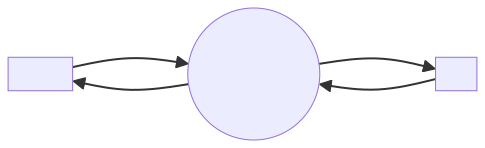
## Module: interface.py
- **Module Name**: interface.py

- **Primary Objectives**: This module primarily serves as an interface for handling MemGPT-related events, including user messages, internal monologue, assistant messages, and function calls. It also includes a command-line interface for dumping agent events.

- **Critical Functions**: 
    - `user_message(self, msg)`: Handles the receipt of a user message.
    - `internal_monologue(self, msg)`: Handles the generation of some internal monologue.
    - `assistant_message(self, msg)`: Handles the use of send_message.
    - `function_message(self, msg)`: Handles the call of a function.
    - `print_messages(message_sequence, dump=False)`: Prints a sequence of messages.
    - `print_messages_simple(message_sequence)`: Prints a simple sequence of messages.
    - `print_messages_raw(message_sequence)`: Prints a raw sequence of messages.

- **Key Variables**: 
    - `DEBUG`: A boolean variable that controls the level of message output in the terminal.
    - `STRIP_UI`: A boolean variable that controls whether to strip the user interface.
    - `msg`: A string or dictionary representing a message.

- **Interdependencies**: This module interacts with the `abc`, `json`, `re`, `colorama`, and `memgpt.utils` modules. 

- **Core vs. Auxiliary Operations**: Core operations involve handling different types of messages (user, assistant, function, etc.) and printing them. Auxiliary operations involve formatting and color-coding the messages for better readability.

- **Operational Sequence**: When a message is received, the appropriate handler function is called based on the type of the message. If the message is to be printed, it is passed to one of the print_messages functions, which formats the message and prints it to the console.

- **Performance Aspects**: This module primarily involves I/O operations, so its performance depends on the efficiency of these operations. 

- **Reusability**: This module is highly reusable. The `AgentInterface` class can be subclassed to create new interfaces for handling MemGPT-related events. The `CLIInterface` class provides a basic command-line interface that can be used in any program that needs to dump agent events to the console.

- **Usage**: This module is used to handle and display MemGPT-related events in a user-friendly manner.

- **Assumptions**: The module assumes that all messages are either strings or dictionaries. It also assumes that all messages can be formatted and color-coded for display in the console.
## Flow Diagram [via mermaid]
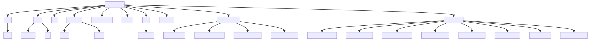
## Module: interface.py
- **Module Name**: interface.py

- **Primary Objectives**: The module is designed to manage and display messages in a chat-based interface. It provides a way to handle different types of messages (such as user messages, system messages, assistant messages, memory messages, and function messages), format them for display, and manage a buffer for these messages.

- **Critical Functions**: 
    - `set_message_list`: Sets the message list for the DummyInterface.
    - `internal_monologue`: Handles internal monologue messages.
    - `assistant_message`: Handles assistant messages.
    - `memory_message`: Handles memory messages.
    - `system_message`: Handles system messages.
    - `user_message`: Handles user messages.
    - `function_message`: Handles function messages.
    - `reset_message_list`: Clears the buffer, called before every step when using MemGPT+AutoGen.
    - `__init__`: Initializes the AutoGenInterface with various parameters.

- **Key Variables**: 
    - `message_list`: A list holding all the messages.
    - `fancy`: A boolean variable to control the display of colored outputs and emoji prefixes.
    - `show_user_message`, `show_inner_thoughts`, `show_function_outputs`: Booleans to control the display of different types of messages.
    - `debug`: A boolean to control the debug mode.

- **Interdependencies**: The module relies on the `json` and `re` modules for parsing and regular expression operations, and `colorama` for colored terminal text.

- **Core vs. Auxiliary Operations**: Core operations include handling and displaying different types of messages. Auxiliary operations include managing the message buffer and controlling the display settings.

- **Operational Sequence**: The module defines two classes: DummyInterface and AutoGenInterface. The DummyInterface provides a basic structure for message handling, while the AutoGenInterface extends this with additional functionality. The AutoGenInterface initializes with various parameters, handles different types of messages, and manages a buffer for these messages.

- **Performance Aspects**: The module is designed for efficient handling and display of messages. The use of a buffer helps to manage the flow of messages and the various display options allow for flexible and efficient use.

- **Reusability**: The module is highly reusable. The classes defined can be used as a base for any chat-based interface that needs to handle and display a variety of message types.

- **Usage**: The module is used to handle and display messages in a chat-based interface. It is used by creating an instance of the AutoGenInterface class and calling the appropriate methods to handle different types of messages.

- **Assumptions**: It is assumed that messages are provided in a specific format (e.g., as a string or a dictionary). It's also assumed that the colorama module is available for colored terminal text.
## Flow Diagram [via mermaid]
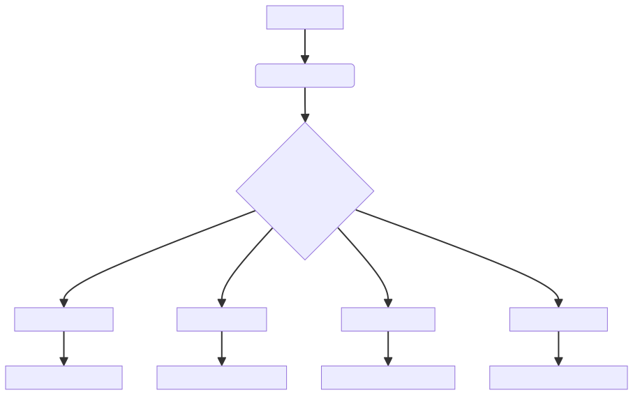
## Module: json_parser.py
- **Module Name**: json_parser.py

- **Primary Objectives**: This module is designed to parse JSON data, handle errors, and repair malformed JSON strings. It is intended to extract information from JSON strings and deal with any inconsistencies or errors that may occur during the extraction process.

- **Critical Functions**: 
  - `extract_first_json(string)`: Extracts the first JSON object from a string.
  - `add_missing_heartbeat(llm_json)`: Inserts heartbeat requests into messages that should have them.
  - `repair_json_string(json_string)`: Repairs a JSON string where line feeds were accidentally added within string literals.
  - `repair_even_worse_json(json_string)`: Repairs a malformed JSON string where string literals are broken up and not properly enclosed in quotes.
  - `clean_json(raw_llm_output, messages=None, functions=None)`: Tries a bunch of hacks to parse the data coming out of the LLM.

- **Key Variables**: 
  - `depth` and `start_index` in `extract_first_json(string)`: Used to track the depth of nested JSON objects and the start index of the first JSON object.
  - `new_string`, `in_string`, and `escape` in `repair_json_string(json_string)`: Used to create the repaired JSON string and track the current state of the string parsing.
  - `in_message`, `in_string`, `escape`, `message_content`, and `new_json_parts` in `repair_even_worse_json(json_string)`: Used to track the current state of the string parsing and store the parts of the repaired JSON string.
  - `data` in `clean_json(raw_llm_output, messages=None, functions=None)`: Stores the parsed JSON data.

- **Interdependencies**: This module seems to be independent of other system components, but it imports the `json` module for JSON operations and `memgpt.utils` for debugging purposes.

- **Core vs. Auxiliary Operations**: The core operations of this module include the extraction, repair, and cleaning of JSON strings. Auxiliary operations include error handling and debugging.

- **Operational Sequence**: The `clean_json` function attempts to parse the JSON data and, if it encounters errors, it tries various methods to repair the JSON string until it succeeds or exhausts all possibilities.

- **Performance Aspects**: The module's performance may be affected by the size of the input JSON string and the extent of its malformation. More complex or larger JSON strings may require more processing time.

- **Reusability**: The functions in this module are highly reusable for any tasks that involve parsing and repairing JSON strings.

- **Usage**: This module is used to parse and repair JSON strings in a larger system, likely as part of data preprocessing or cleanup.

- **Assumptions**: The module assumes that the input is a JSON string or can be converted into one. It also assumes that any errors encountered during parsing are due to malformation of the JSON string and can be fixed by one of the repair methods.
## Flow Diagram [via mermaid]
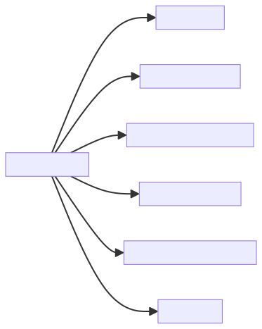
## Module: legacy_api.py
- **Module Name**: The module is named as `legacy_api.py`.

- **Primary Objectives**: The purpose of this module is to interact with a web server to generate text based on the provided prompt and settings. It also validates the input and handles the response from the server.

- **Critical Functions**: The main function in this module is `get_webui_completion()`. This function makes a POST request to the specified endpoint with the given prompt and settings, and returns the generated text.

- **Key Variables**: 
  - `endpoint`: The API endpoint to which the request is sent.
  - `prompt`: The text prompt for the text generation.
  - `context_window`: The maximum number of tokens that the context can contain.
  - `settings`: The settings for the text generation.
  - `grammar`: The grammar file to be used for text generation.
  - `request`: The request object containing the prompt and settings.
  - `URI`: The full URL of the API endpoint.
  - `response`: The response received from the server.
  - `result`: The generated text.

- **Interdependencies**: This module interacts with the `requests` library for making HTTP requests, the `urllib.parse` library for URL manipulation, and the `legacy_settings` and `utils` modules from the same project.

- **Core vs. Auxiliary Operations**: The core operation of this module is making the POST request to the server and handling the response. The auxiliary operations include validating the input, constructing the URL, and loading the grammar file.

- **Operational Sequence**: The function first validates the input, constructs the request object and the URL, and then makes the POST request. It then checks the response status code and returns the generated text if the request was successful.

- **Performance Aspects**: The performance of this module depends on the efficiency of the network request and the server's response time. In addition, the `count_tokens()` function and the loading of the grammar file can also affect the performance.

- **Reusability**: This module is highly reusable as it provides a generic function for making POST requests to a text generation server. The function can be used with different prompts, settings, and grammar files.

- **Usage**: This module can be used in any project that requires text generation based on a prompt and specific settings. The user needs to provide the server endpoint, the prompt, and the settings.

- **Assumptions**: The module assumes that the server endpoint starts with "http://" or "https://", and that the server is running and reachable. It also assumes that the prompt does not exceed the maximum context length.
## Flow Diagram [via mermaid]
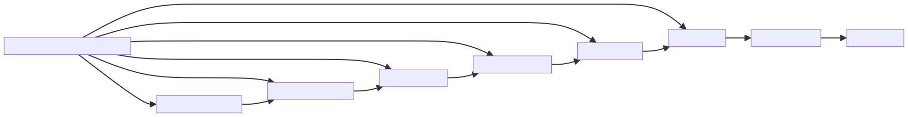
## Module: legacy_settings.py
- **Module Name**: The module name is `legacy_settings.py`.

- **Primary Objectives**: This module seems to handle settings related to text processing and tokenization in a legacy system. It defines stopping strings and maximum new tokens, which are likely used for parsing or generating text.

- **Critical Functions**: The module does not seem to contain any functions or methods. It appears to be a configuration file.

- **Key Variables**: 
  - `stopping_strings`: A list of strings that signal the end of a text segment.
  - `max_new_tokens`: The maximum number of new tokens that can be generated, set to 3072.
  - `truncation_length`: This variable seems to be commented out but it likely sets the maximum length of a text segment. It appears to be set to a constant `LLM_MAX_TOKENS` imported from another module.

- **Interdependencies**: The module imports `LLM_MAX_TOKENS` from a `constants` module. It likely interacts with other parts of the system that require these settings, including text parsing and generating components.

- **Core vs. Auxiliary Operations**: As a configuration file, it does not seem to have core or auxiliary operations. All the settings it provides are essential for the components that depend on it.

- **Operational Sequence**: There doesn't appear to be a distinct operational sequence in this module as it is a configuration file.

- **Performance Aspects**: The settings in this module likely affect the system's performance. For example, `max_new_tokens` could limit the size of generated text, and `stopping_strings` could impact the speed of text parsing.

- **Reusability**: This module seems highly reusable. The settings it provides could be used by any component that needs to parse or generate text.

- **Usage**: This module is likely used by importing it into other parts of the system. The importing components can then access the settings it provides.

- **Assumptions**: The module seems to assume that the `stopping_strings` are sufficient to signal the end of a text segment. It also assumes that `max_new_tokens` is an appropriate limit for the size of generated text. The commented-out `truncation_length` suggests that there may be an assumption about the maximum length of a text segment.
## Flow Diagram [via mermaid]

## Module: local.py
- **Module Name**: The module is named 'local.py'.

- **Primary Objectives**: The module's primary purpose is to handle data storage and retrieval operations locally, using the LlamaIndex library for data indexing and storage.

- **Critical Functions**: 
  - `__init__`: Initializes the LocalStorageConnector class, sets up the context, and loads or creates the index.
  - `get_nodes`: Returns the nodes in the Llama index.
  - `add_nodes`: Adds nodes to the Llama index.
  - `get_all_paginated`: Returns all passages in the index, paginated.
  - `get_all`: Returns all passages up to a specified limit.
  - `get`: Placeholder function to get a specific passage by id.
  - `insert`: Inserts a passage into the index.
  - `insert_many`: Inserts multiple passages into the index.
  - `query`: Queries the index for passages based on a given query and vector.
  - `save`: Saves the current state of the nodes to a pickle file.
  - `list_loaded_data`: Lists all the data sources currently loaded.
  - `size`: Returns the size of the index.

- **Key Variables**: 
  - `self.name`: The name of the storage connector.
  - `self.save_directory`: The directory where the index is saved.
  - `self.embed_model`: The embedding model used.
  - `self.service_context`: The service context for the Llama index.
  - `self.save_path`: The path where the nodes pickle file is saved.
  - `self.nodes`: The list of nodes in the index.
  - `self.index`: The Llama index itself.

- **Interdependencies**: This module interacts with other system components such as the `memgpt` and `llama_index` modules for configurations, constants, storage, and indexing.

- **Core vs. Auxiliary Operations**: Core operations include initializing the class, getting and adding nodes, and querying the index. Auxiliary operations include saving the index, listing loaded data, and getting the size of the index.

- **Operational Sequence**: The module initializes the class and loads or creates the index. It then provides functions to add nodes, get nodes, query the index, and save the index.

- **Performance Aspects**: The module uses Llama index for efficient storage and retrieval of data. However, the `query` function may be slow due to the retrieval process.

- **Reusability**: The module is highly reusable, as it provides a generic local storage connector that can be used with any data that can be indexed with Llama index.

- **Usage**: The module is used to handle local data storage and retrieval operations. It is used to add nodes to the index, get nodes from the index, query the index, and save the index.

- **Assumptions**: The module assumes that the embedding model and service context are set up correctly. It also assumes that the nodes pickle file exists if the save path exists.
## Flow Diagram [via mermaid]
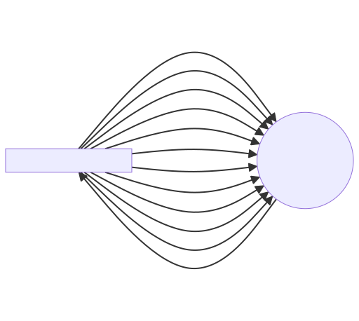
## Module: main.py
 Here is a comprehensive analysis of the provided Python module `main.py`:

**Module Name**: main

**Primary Objectives**: This is the main module that handles running the MemGPT conversational agent system from the command line. It initializes the agent, processes user input and runs the conversation loop.

**Critical Functions**:
- `main()`: Parses command line arguments and initializes the MemGPT agent.
- `run_agent_loop()`: Runs the main conversation loop, passing user input to the agent and printing responses.

**Key Variables**:
- `memgpt_agent`: The MemGPT Agent instance that handles the conversation.
- `user_input`: Stores the latest user input string.
- `skip_next_user_input`: Flag to skip requesting next user input.
- `user_message`: Packaged user message dict to pass to agent.
- `cfg`: The MemGPT Config object with parameters.

**Interdependencies**:
- Depends on `memgpt.agent`, `memgpt.system`, `memgpt.interface` and other MemGPT modules to initialize agent, process user input/output.
- Interacts with `StorageConnector` to attach data sources.
- Uses `questionary` for CLI interactions.

**Core vs Auxiliary Operations**:
- Core: `main()`, `run_agent_loop()` 
- Auxiliary: argument parsing, CLI interactions, attaching data sources.

**Operational Sequence**:
1. Parse arguments and initialize MemGPT agent and config. 
2. Print welcome message.
3. Enter input loop:
   - Get user input.
   - Handle CLI commands (/exit, /load etc).
   - Pass non-command input to agent.
   - Print agent response.
4. Exit when user enters '/exit'.

**Performance Aspects**: 
- Uses `rich` status bar to show "Thinking..." when agent is processing to avoid blocking.
- Handles exceptions during `agent.step()` to avoid crashes.

**Reusability**:
- `main()` and `run_agent_loop()` could be imported and reused by other modules to run the CLI conversation loop.
- CLI argument parsing logic could be reused/imported separately.

**Usage**: This module is intended to be run as a CLI program to start a MemGPT conversational agent session:

```
python main.py
```

**Assumptions**:
- User will provide inputs via CLI when prompted.
- `memgpt.agent` and other modules are available to import.
- Required packages like `questionary` are installed.
## Flow Diagram [via mermaid]

## Module: main.py
Here is the analysis based on the provided code snippet:

- **Module Name**: The module's name is `main.py`.

- **Primary Objectives**: The primary purpose of this module is to run the application from the `memgpt.main` module.

- **Critical Functions**: The critical function in this module is `app()`. This function is responsible for initializing and running the application.

- **Key Variables**: There are no explicit variables in this brief code snippet. However, implicit variables are likely to be present within the `app()` function in the `memgpt.main` module.

- **Interdependencies**: This module is dependent on the `memgpt.main` module, specifically the `app` function within that module.

- **Core vs. Auxiliary Operations**: The core operation in this module is running the `app()` function. There are no auxiliary operations in this code snippet.

- **Operational Sequence**: The operational sequence is straightforward - the `app()` function from the `memgpt.main` module is called and executed.

- **Performance Aspects**: Performance considerations are not evident from this code snippet. They would be dependent on what is inside the `app()` function from the `memgpt.main` module.

- **Reusability**: The code snippet is quite reusable, as it simply calls the `app()` function from the `memgpt.main` module. As long as the `app()` function is designed to be reusable, this code snippet will also be reusable.

- **Usage**: This module is used to initialize and run the application by calling the `app()` function from the `memgpt.main` module.

- **Assumptions**: The main assumption here is that the `memgpt.main` module and the `app()` function within it exist and function as expected. Furthermore, it assumes that the `app()` function does not require any arguments.

Please note that this analysis might not be fully accurate or complete due to the limited context and code snippet provided. For a more comprehensive analysis, the full code of the `memgpt.main` module and its `app()` function would be needed.
## Flow Diagram [via mermaid]
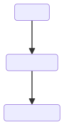
## Module: memgpt_agent.py
- **Module Name**: memgpt_agent.py

- **Primary Objectives**: This module defines the MemGPTAgent class and its associated methods. It is designed to create a GPT-based agent that can interact in a conversational manner, load and attach data, and handle various types of user messages.

- **Critical Functions**:
  - `create_memgpt_autogen_agent_from_config`: This function creates an AutoGen agent from a given configuration.
  - `create_autogen_memgpt_agent`: This function creates an AutoGen MemGPT agent with specified parameters.
  - `load`: This function loads data based on given type.
  - `attach`: This function attaches new data to the agent.
  - `load_and_attach`: This function loads and attaches data to the agent.
  - `_generate_reply_for_user_message`: This function generates a reply for a user message.
  - `pretty_concat`: This function concatenates all of MemGPT's steps into one and returns as a single message.

- **Key Variables**:
  - `name`: The name of the agent.
  - `system_message`: A system message to initialize the agent.
  - `is_termination_msg`: A function to determine if a message should terminate the conversation.
  - `max_consecutive_auto_reply`: The maximum number of consecutive automatic replies.
  - `human_input_mode`: The mode of human input.
  - `function_map`: A map of functions.
  - `code_execution_config`: The configuration for code execution.
  - `llm_config`: The configuration for the language model.
  - `default_auto_reply`: The default automatic reply.
  - `interface_kwargs`: Arguments for the interface.

- **Interdependencies**: This module interacts with several other modules such as `autogen.agentchat`, `memgpt.agent`, `memgpt.autogen.interface`, `memgpt.persistence_manager`, `memgpt.system`, `memgpt.constants`, `memgpt.presets.presets`, `memgpt.personas`, `memgpt.humans`, `memgpt.config`, `memgpt.cli.cli`, `memgpt.cli.cli_load`, and `memgpt.connectors.storage`.

- **Core vs. Auxiliary Operations**: The core operations are the creation and interaction of the MemGPT agent, including loading and attaching data, and generating replies for user messages. Auxiliary operations include formatting other agent messages, finding the last user message, finding new messages, and pretty concatenating messages.

- **Operational Sequence**: The module first creates an agent with a given configuration. Then, it loads and attaches data to the agent. After that, it generates replies for user messages and formats the messages.

- **Performance Aspects**: The module uses a GPT model, which can be computationally intensive. It also handles data loading and attachment, which might be IO-bound.

- **Reusability**: The module is highly reusable. It can be used to create various types of conversational agents with different configurations.

- **Usage**: This module is used to create a conversational agent that can interact with users, load and attach data, and handle various types of user messages.

- **Assumptions**: The module assumes that the data to be loaded and attached is available and in the correct format. It also assumes that the GPT model is available and properly configured.
## Flow Diagram [via mermaid]
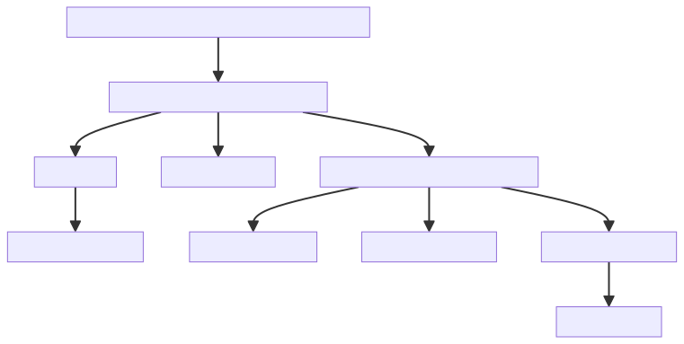
## Module: memory.py
 Here is a comprehensive analysis of the memory.py module:

**Module Name**: memory.py

**Primary Objectives**: Provides implementations for the core memory, archival memory, and recall memory components of an AI assistant agent. Enables editing, querying, and persistence of memories.

**Critical Functions**:
- CoreMemory: Manages the core persona and human memories. Allows editing with character limits.
- ArchivalMemory (interface): Defines interface for archival memories.
- DummyArchivalMemory: Simple in-memory archival memory with text search.
- DummyArchivalMemoryWithEmbeddings: Adds embedding based search to dummy archival. 
- DummyArchivalMemoryWithFaiss: Uses Faiss for fast nearest neighbors search.
- RecallMemory (interface): Defines interface for recall memories.
- DummyRecallMemory: Simple in-memory recall memory with text and date search.
- DummyRecallMemoryWithEmbeddings: Adds embedding based search.
- LocalArchivalMemory: Archival memory using Llama Index for search.
- EmbeddingArchivalMemory: Archival memory using custom storage and embeddings.

**Key Variables**:
- self._archive: Holds documents in dummy archival memories. 
- self._message_logs: Holds message logs in dummy recall memories.
- self.index: Llama Index object for search in LocalArchivalMemory.
- self.storage: Custom storage connector in EmbeddingArchivalMemory.

**Interdependencies**:
- Integrates with other system components like agent config, persistence manager, embeddings module. 
- Relies on external libraries like Llama Index, Faiss, Storage Connectors.

**Core vs Auxiliary Operations**:
- Core operations involve managing and editing the memories, inserting documents, and querying.
- Auxiliary operations are things like date validation, embedding management.

**Operational Sequence**:
1. Memories initialized with config parameters and optional existing data.
2. Core memory edited via wrapper methods.  
3. New info inserted into archival memories.
4. Queries executed on archival and recall memories.
5. Results returned.

**Performance Aspects**:
- Llama Index and Faiss provide optimized search performance.
- Caching embeddings and search results avoids repeat expensive computations. 
- Chunking strings for embedding improves efficiency.

**Reusability**: 
- Interfaces allow swapping underlying implementation.
- Config driven design allows reuse across agents.

**Usage**:
- Used by agent during conversations to manage memory.
- Persistence manager handles loading and saving memory state.

**Assumptions**:
- Agent config and parameters are provided.
- External libs like Llama Index are installed.
- Appropriate storage backends exist if configured.

In summary, the memory module provides key capabilities for an AI agent to manage both short-term and long-term memories in a performant and reusable manner. The interfaces and config driven design allow flexibility in the underlying implementations.
## Flow Diagram [via mermaid]
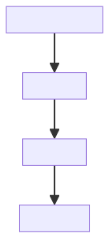
## Module: openai_parallel_request_processor.py
- **Module Name**: openai_parallel_request_processor.py

- **Primary Objectives**: 
This module is designed to process a large number of API requests in parallel while staying under the rate limits set by OpenAI. It provides a way to efficiently handle a high volume of requests without exceeding the rate limits and without causing the system to run out of memory.

- **Critical Functions**: 
The main function, `process_api_requests_from_file()`, reads API requests from a file, processes them in parallel, and saves the results. The `APIRequest` class represents an API request and contains a method, `call_api()`, to make an API call and save the results. The `StatusTracker` class stores metadata about the script's progress. The `append_to_jsonl()` function appends a JSON payload to the end of a JSONL file.

- **Key Variables**: 
The module uses several key variables such as `requests_filepath`, `save_filepath`, `request_url`, `api_key`, `max_requests_per_minute`, `max_tokens_per_minute`, `token_encoding_name`, `max_attempts`, and `logging_level`.

- **Interdependencies**: 
This module relies on several Python libraries including `aiohttp` for making API calls concurrently, `argparse` for running the script from the command line, `asyncio` for running API calls concurrently, `json` for saving results to a JSONL file, `logging` for logging rate limit warnings and other messages, `os` for reading the API key, `re` for matching the endpoint from the request URL, `tiktoken` for counting tokens, and `time` for sleeping after a rate limit is hit.

- **Core vs. Auxiliary Operations**: 
The core operation of this module is to process API requests in parallel while staying under the rate limits. Auxiliary operations include reading API requests from a file, saving results to a file, logging rate limit warnings and other messages, and counting tokens.

- **Operational Sequence**: 
The script first initializes variables and opens the file containing the API requests. It then enters a main loop where it updates the available capacity, gets the next request, checks if there's enough capacity to call the API, and calls the API if there is enough capacity. If a rate limit error is hit, the script pauses to cool down. The loop breaks when no tasks remain.

- **Performance Aspects**: 
The script is designed to maximize throughput while staying under rate limits. It makes requests concurrently to maximize throughput and throttles request and token usage to stay under rate limits. It also retries failed requests to avoid missing data.

- **Reusability**: 
The module is highly reusable as it is designed to process any number of API requests in parallel. It can be used with different API endpoints, different rate limits, and different token encodings. It can also be used with different logging levels to control the amount of logging.

- **Usage**: 
The module is designed to be used from the command line. It takes several command line arguments including the path to the file containing the requests to be processed, the path to the file where the results will be saved, the URL of the API endpoint to call, the API key to use, the target number of requests to make per minute, the target number of tokens to use per minute, the name of the token encoding used, the number of times to retry a failed request before giving up, and the level of logging to use.

- **Assumptions**: 
The script assumes that the API requests are stored in a JSONL file and that each line of the file is a JSON object with API parameters and an optional metadata field. It also assumes that the API key is stored in an environment variable if it is not provided as a command line argument.
## Flow Diagram [via mermaid]
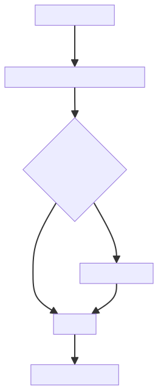
## Module: openai_tools.py
- **Module Name**: openai_tools.py

- **Primary Objectives**: This module aims to interact with OpenAI's API and handle errors, retries, and configurations for different environments (Azure, OpenAI, local). It includes functions for creating chat completions and embeddings, and for configuring the API settings.

- **Critical Functions**:
    - `retry_with_exponential_backoff`: Retries a function with exponential backoff in case of specified errors.
    - `completions_with_backoff`: Handles chat completions with backoff for different environments.
    - `chat_completion_with_backoff`: Configures the API settings and handles chat completions with backoff for different environments.
    - `create_embedding_with_backoff`: Handles the creation of embeddings with backoff.
    - `get_embedding_with_backoff`: Retrieves embeddings with backoff.
    - `using_azure`: Checks if Azure environment variables are set.
    - `configure_azure_support`: Configures OpenAI's API for Azure support.
    - `check_azure_embeddings`: Checks if Azure environment variables for embeddings are set.

- **Key Variables**:
    - `HOST`: The base URL of the OpenAI API.
    - `HOST_TYPE`: The type of backend used.
    - `openai.api_base`: The base URL of the OpenAI API.
    - `azure_openai_key, azure_openai_endpoint, azure_openai_version`: Azure OpenAI environment variables.
    - `kwargs`: Keyword arguments passed to various functions.
    - `MODEL_TO_AZURE_ENGINE`: Dictionary mapping model names to Azure engine names.

- **Interdependencies**: This module interacts with OpenAI's API and potentially with Azure's API, depending on the environment variables set. It also imports and uses functions from other modules such as `memgpt.local_llm.chat_completion_proxy`, `memgpt.utils`, and `memgpt.config`.

- **Core vs. Auxiliary Operations**: Core operations include interacting with the OpenAI API and handling retries and errors. Auxiliary operations include configuring the API for different environments and checking environment variables.

- **Operational Sequence**: The module first checks the environment variables and configures the API accordingly. Then, it performs operations (chat completions, embeddings) with exponential backoff in case of errors.

- **Performance Aspects**: The module uses exponential backoff to handle rate limit errors, improving its robustness and reliability. However, the maximum number of retries is capped, which can limit the module's persistence in case of persistent errors.

- **Reusability**: The module's functions are general enough to be reused in different contexts where interaction with OpenAI's API is required. The module can handle different environments (Azure, OpenAI, local), increasing its reusability.

- **Usage**: This module is used whenever interaction with OpenAI's API is required, such as when creating chat completions or embeddings.

- **Assumptions**: The module assumes that the necessary environment variables are set. It also assumes that the OpenAI API will raise a `RateLimitError` when the rate limit is exceeded, and retries the operation in this case.
## Flow Diagram [via mermaid]
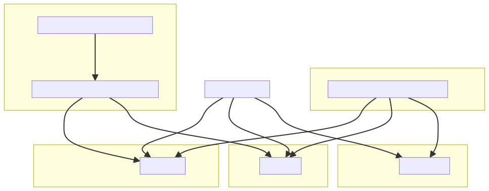
## Module: persistence_manager.py
- **Module Name**: persistence_manager.py

- **Primary Objectives**: This module's primary purpose is to manage the persistence of memory and messages for an AI agent. It provides facilities for saving and loading the state of the agent, as well as manipulating the agent's memory and messages.

- **Critical Functions**: 
   - `trim_messages`: Trims the messages to a specified number.
   - `prepend_to_messages`: Adds messages to the beginning of the list of messages.
   - `append_to_messages`: Adds messages to the end of the list of messages.
   - `swap_system_message`: Replaces the system message with a new one.
   - `update_memory`: Updates the agent's memory with a new one.
   - `save`: Saves the current state to a file.
   - `load`: Loads the state from a file.
   - `init`: Initializes the state manager with an agent object.

- **Key Variables**: 
   - `self.memory`: The agent's memory.
   - `self.messages`: The list of messages.
   - `self.all_messages`: The list of all messages.
   - `self.recall_memory`: The recall memory database.
   - `self.archival_memory_db`: The archival memory database.
   - `self.archival_memory`: The archival memory.

- **Interdependencies**: This module interacts with the following components:
   - `abc`: For abstract base classes.
   - `os`: For interacting with the operating system.
   - `pickle`: For serializing and deserializing Python object structures.
   - `AgentConfig`: For agent configuration.
   - Various memory classes like `DummyRecallMemory`, `DummyArchivalMemory`, etc.
   - `get_local_time` and `printd` from `.utils`.

- **Core vs. Auxiliary Operations**: The core operations of this module include initializing the state manager, updating the memory, and manipulating messages. Auxiliary operations include saving and loading the state.

- **Operational Sequence**: The typical operational sequence involves initializing the state manager with an agent, manipulating the agent's memory and messages as needed, and saving the state to a file.

- **Performance Aspects**: The performance of this module largely depends on the efficiency of the memory management and the speed of the file I/O operations.

- **Reusability**: This module is highly reusable. It provides a generic framework for managing the state of an AI agent, and can be easily adapted for different types of agents and memory structures.

- **Usage**: This module is used in the context of an AI agent that needs to maintain a persistent state across multiple interactions. The state manager is initialized with the agent, and then used to manipulate the agent's memory and messages.

- **Assumptions**: The module assumes that the memory and messages of the agent can be serialized and deserialized using `pickle`. It also assumes that the memory and messages are structured in a way that allows them to be manipulated as lists.
## Flow Diagram [via mermaid]
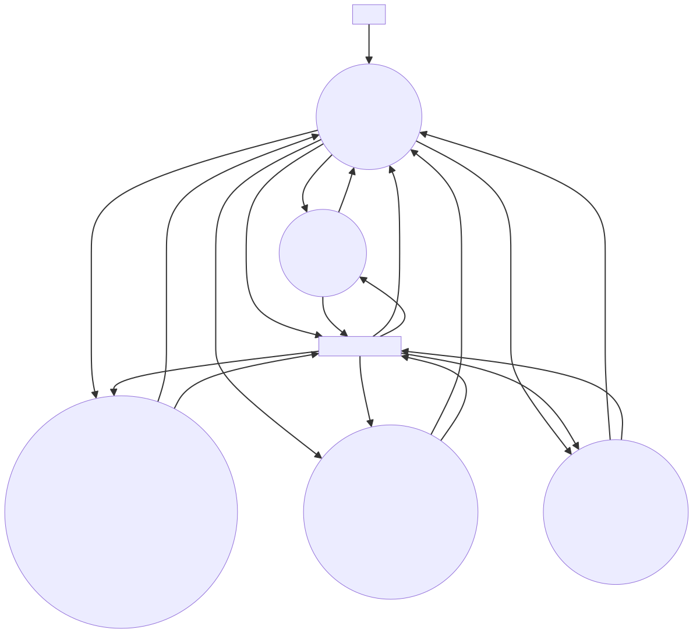
## Module: personas.py
- **Module Name**: The module is named "personas.py".

- **Primary Objectives**: This module's primary purpose is to retrieve persona text from a specified file. If no file path is provided, it will look for the file in the "examples" directory.

- **Critical Functions**: The main function in this module is `get_persona_text(key=DEFAULT, dir=None)`. This function fetches the content of a text file based on the provided key. If the key does not have a ".txt" extension, it appends it. If no directory is specified, the function looks for the file in the "examples" directory. If the file does not exist, it raises a `FileNotFoundError`.

- **Key Variables**: The critical variables in this module are `key`, `dir`, `filename`, and `file_path`. The `key` is the name of the text file, `dir` is the directory where the function looks for the file, `filename` is the full name of the file, and `file_path` is the full path to the file.

- **Interdependencies**: This module depends on the `os` module for interacting with the operating system's file system.

- **Core vs. Auxiliary Operations**: The core operation is the `get_persona_text()` function. There are no auxiliary operations in this module.

- **Operational Sequence**: The function first checks if a directory is provided. If not, it sets the directory to the "examples" folder. It then constructs the filename and the full path to the file. Finally, it tries to open the file and return its content. If the file does not exist, it raises an error.

- **Performance Aspects**: The module's performance depends on the efficiency of the file system operations. Since it involves disk I/O operations, it might be slower than in-memory operations.

- **Reusability**: The `get_persona_text()` function is highly reusable. It can be used to read any text file in any directory, making it a versatile function for file reading operations.

- **Usage**: This module is used when there is a need to fetch persona text from a file. The user can specify the file's name and optionally its directory.

- **Assumptions**: The function assumes that the file exists in the specified directory. If the file does not exist, it will raise a `FileNotFoundError`. It also assumes that the file's content can be read as text.
## Flow Diagram [via mermaid]

## Module: presets.py
- **Module Name**: presets.py
- **Primary Objectives**: This module is used to manage presets, which are combinations of SYSTEM and FUNCTION prompts. It's primarily used for loading and validating presets, and for creating an Agent object with the chosen preset.
- **Critical Functions**: 
  - `use_preset`: This function takes a preset name, agent configuration, model, persona, human, interface, and persistence manager as arguments. It validates the preset, filters the function set based on what the preset requested, and creates an Agent with the specified parameters.
- **Key Variables**: 
  - `DEFAULT_PRESET`: This variable holds the default preset name, "memgpt_chat".
  - `available_presets`: This variable holds all available presets, loaded via the `load_all_presets` function.
  - `preset_options`: This variable holds the keys of all available presets.
- **Interdependencies**: This module interacts with the `utils`, `prompts`, `functions`, and `agent` modules from the same package. It also uses the `printd` function from the `utils` module for debugging purposes.
- **Core vs. Auxiliary Operations**: The core operation of this module is the `use_preset` function, which is used to create an Agent with a specified preset. The loading and validation of presets are auxiliary operations.
- **Operational Sequence**: The `use_preset` function first loads all available functions and presets. It then validates the specified preset and filters the function set based on what the preset requested. Finally, it creates and returns an Agent with the specified parameters.
- **Performance Aspects**: This module is efficient as it only loads and processes the necessary functions based on the specified preset. However, the performance may be affected if the number of available functions and presets is large.
- **Reusability**: This module is highly reusable as it provides a function to create an Agent with any valid preset. The presets can be easily extended or modified for different use cases.
- **Usage**: This module is used whenever an Agent needs to be created with a specific preset. It's typically used in the setup phase of a conversational AI application.
- **Assumptions**: This module assumes that all presets are in YAML format and that all specified functions in a preset are available in the function library.
## Flow Diagram [via mermaid]
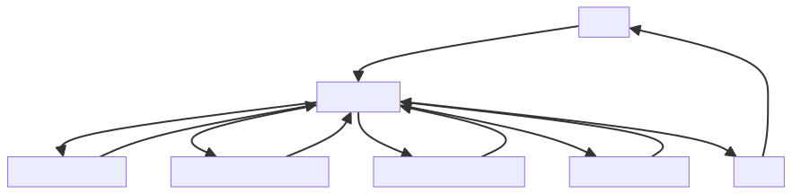
## Module: schema_generator.py
- **Module Name**: The module is named `schema_generator.py`.

- **Primary Objectives**: This module is designed to generate a JSON schema for a given Python function. It uses the function's signature and docstring to create a detailed schema, including the function's name, description, parameters, and their types.

- **Critical Functions**: The main functions in this module are `is_optional`, `optional_length`, `type_to_json_schema_type`, and `generate_schema`. The `generate_schema` function is the core function that generates the JSON schema for a given function.

- **Key Variables**: Some key variables include `NO_HEARTBEAT_FUNCTIONS`, `FUNCTION_PARAM_NAME_REQ_HEARTBEAT`, `FUNCTION_PARAM_TYPE_REQ_HEARTBEAT`, and `FUNCTION_PARAM_DESCRIPTION_REQ_HEARTBEAT`. These variables are related to the heartbeat functionality in the system.

- **Interdependencies**: This module interacts with the `inspect`, `typing`, `docstring_parser`, and `memgpt.constants` modules.

- **Core vs. Auxiliary Operations**: The core operation of this module is to generate a JSON schema for a given function. Auxiliary operations include checking if a type is optional, getting the length of an optional type, and mapping a Python type to a JSON schema type.

- **Operational Sequence**: The `generate_schema` function first gets the signature of the function and parses the docstring. It then prepares the schema dictionary and iterates over the function's parameters, adding their details to the schema. If the function is not in `NO_HEARTBEAT_FUNCTIONS`, it also adds a heartbeat parameter to the schema.

- **Performance Aspects**: This module is designed to be efficient by directly mapping Python types to JSON schema types. However, it may raise errors if a function's parameters lack type annotations or descriptions in the docstring.

- **Reusability**: This module is highly reusable. It can generate a JSON schema for any Python function that has a properly formatted docstring.

- **Usage**: To use this module, import it and call the `generate_schema` function with the function you want to generate a schema for as the argument.

- **Assumptions**: This module assumes that all functions have properly formatted docstrings with parameter descriptions. It also assumes that all parameters have type annotations.
## Flow Diagram [via mermaid]
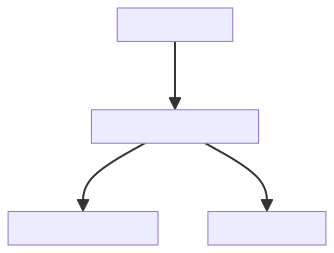
## Module: scrape_docs.py
- **Module Name**: scrape_docs.py

- **Primary Objectives**: The purpose of this module is to extract text from .txt files in a specified directory and its subdirectories, and save the extracted text into a JSON line file. It is particularly designed for processing Sphinx-generated documentation.

- **Critical Functions**: 
  - `extract_text_from_sphinx_txt(file_path)`: This function opens a .txt file, reads it line by line, tokenizes the text, and splits it into passages of a certain length (800 tokens by default). It returns a list of dictionaries, each containing the title of the document, the text of a passage, and the number of tokens in the passage.
  - `os.walk(docs_dir)`: This function is used to iterate over all files in the specified directory and its subdirectories.
  - `json.dumps(p)`: This function is used to convert the dictionaries into JSON formatted strings.

- **Key Variables**:
  - `docs_dir`: The directory where the documentation resides.
  - `encoding`: The encoding used for tokenization, defined for the GPT-4 model.
  - `PASSAGE_TOKEN_LEN`: The maximum length of a passage in tokens.
  - `passages`: A list that stores the passages extracted from all .txt files.
  - `total_files`: A counter for the total number of .txt files processed.

- **Interdependencies**: This module uses the `os`, `re`, `tiktoken`, and `json` libraries.

- **Core vs. Auxiliary Operations**: The core operation of this module is the extraction of text from .txt files and its tokenization into passages. The auxiliary operations include walking through the directory and its subdirectories, counting the total number of .txt files processed, and saving the passages into a JSON line file.

- **Operational Sequence**: The module first defines some variables and the `extract_text_from_sphinx_txt()` function. Then, it iterates over all .txt files in the specified directory and its subdirectories, extracting the text from each file and appending the resulting passages to the `passages` list. Finally, it writes the passages into a JSON line file.

- **Performance Aspects**: The module is designed to handle large amounts of text and to tokenize it efficiently. However, the performance may be affected by the size and number of .txt files, as well as the capacity of the system where it is running.

- **Reusability**: The module is quite adaptable for reuse. The `extract_text_from_sphinx_txt()` function can be used with any .txt file, not just Sphinx-generated documentation. Also, the directory, the encoding, and the maximum passage length can be easily changed to fit different needs.

- **Usage**: This module is used for processing large amounts of text, particularly documentation generated by Sphinx. It can be run as a standalone Python script.

- **Assumptions**: The module assumes that all .txt files in the specified directory and its subdirectories are valid and can be opened and read without issues. It also assumes that the text in the .txt files can be tokenized using the specified encoding.
## Flow Diagram [via mermaid]

## Module: settings.py
- **Module Name**: The module is named as "settings.py".

- **Primary Objectives**: The primary purpose of this module is to define some constants and settings for a language model. These settings include stop tokens, maximum number of tokens the model can generate, whether to use a local model or not, and whether the model should be streamed.

- **Critical Functions**: This module doesn't seem to have any functions or methods. It is primarily used for setting up configurations.

- **Key Variables**: The key variables in this module are `SIMPLE`, which is a dictionary containing various settings for the language model. The settings include "stop" (a list of stop tokens), "max_tokens" (the maximum number of tokens the model can generate, which is commented out), "stream" (a boolean indicating whether the model should be streamed), and "model" (which defines the model to use).

- **Interdependencies**: This module is dependent on the `constants` module from which it imports `LLM_MAX_TOKENS`.

- **Core vs. Auxiliary Operations**: The core operation of this module is to provide a configuration for the language model. There don't appear to be any auxiliary operations.

- **Operational Sequence**: As it is a settings module, it doesn't have an operational sequence. It is likely imported by other modules that use these settings.

- **Performance Aspects**: Performance considerations are not directly addressed in this module. However, the "max_tokens" setting could potentially impact the performance of the language model.

- **Reusability**: This module is highly reusable. It can be imported by any module that requires these settings. The settings can also be easily modified for different use cases.

- **Usage**: This module is used by importing it into another module and using the settings defined in the `SIMPLE` dictionary.

- **Assumptions**: The module assumes that the language model has a context length of 8000 tokens, as indicated by the commented out "max_tokens" setting. It also assumes that the `LLM_MAX_TOKENS` constant is defined in the `constants` module.
## Flow Diagram [via mermaid]

## Module: settings.py
- **Module Name**: The module is named as `settings.py`.

- **Primary Objectives**: The primary purpose of this module is to define certain settings or configurations that are used throughout the program. These settings include a list of stop words and phrases.

- **Critical Functions**: This module does not include any functions or methods. It primarily serves as a configuration file.

- **Key Variables**: The key variable in this module is `SIMPLE`, a dictionary that contains a list of stop words and phrases. These words/phrases are used to determine when certain operations in the program should stop.

- **Interdependencies**: This module imports `LLM_MAX_TOKENS` from a module named `constants`. It suggests that this module interacts with the `constants` module.

- **Core vs. Auxiliary Operations**: As a settings file, this module doesn't perform any operations. It only provides configurations that are used by other modules.

- **Operational Sequence**: There is no distinct operational flow within this module as it only contains a configuration setting.

- **Performance Aspects**: The performance of this module depends on how efficiently the settings it provides are used by other modules. The list of stop words/phrases could potentially be optimized for better performance.

- **Reusability**: The `settings.py` module is highly reusable. It can be imported into any other module that requires its configurations. The stop words/phrases list can be easily modified to adapt to different use cases.

- **Usage**: This module is used by importing it into other modules. The `SIMPLE` dictionary it provides can then be used to access the list of stop words/phrases.

- **Assumptions**: The module assumes that the `constants` module, from which it imports `LLM_MAX_TOKENS`, is available. It also assumes that the stop words/phrases listed in the `SIMPLE` dictionary are sufficient for the program's needs.
## Flow Diagram [via mermaid]

## Module: settings.py
- **Module Name**: The module is named `settings.py`.

- **Primary Objectives**: The main purpose of this module is to configure the settings for a particular application. It includes the stop sequence and maximum length of the context for the application. 

- **Critical Functions**: This module does not contain any specific functions or methods. It mainly consists of a dictionary named `SIMPLE` that holds configuration settings.

- **Key Variables**: 
  - `stop_sequence`: This is a list of strings that signal the end of a sequence.
  - `max_length`: This defines the maximum length of the context.

- **Interdependencies**: This module imports `LLM_MAX_TOKENS` from a module named `constants`.

- **Core vs. Auxiliary Operations**: The core operation of this module is to provide a configuration dictionary. There are no auxiliary operations in this module.

- **Operational Sequence**: There's no distinct flow in this module as it's a settings file and doesn't execute any operations.

- **Performance Aspects**: The performance of the module depends on how the `SIMPLE` dictionary is used in other parts of the application. The `max_length` parameter could potentially affect the performance, as larger contexts may require more processing power.

- **Reusability**: The module is highly reusable. It can be imported into any other Python file that requires these settings.

- **Usage**: This module is used to provide configuration settings to other parts of the application that import it.

- **Assumptions**: The module assumes that the `LLM_MAX_TOKENS` constant is defined in the `constants` module. It also assumes that the `stop_sequence` and `max_length` parameters are sufficient for configuring the application.
## Flow Diagram [via mermaid]
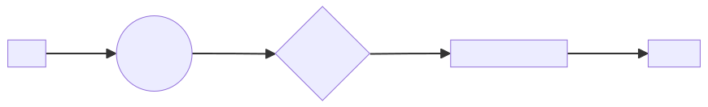
## Module: settings.py
- **Module Name**: The module is named as `settings.py`.

- **Primary Objectives**: The main purpose of this module is to define various settings for a program, specifically related to processing and handling of text data.

- **Critical Functions**: This module does not contain any explicit functions or methods. However, it does define a dictionary `SIMPLE` which seems to be a configuration or settings dictionary.

- **Key Variables**: The key variable in this module is `SIMPLE`. It appears to hold stopping strings that may be used to identify different types of inputs or outputs in a conversation, such as user input, assistant output, function returns, and some special tags.

- **Interdependencies**: This module imports `LLM_MAX_TOKENS` from a module named `constants`. This suggests that it has a dependency on the `constants` module.

- **Core vs. Auxiliary Operations**: As there are no functions or methods defined in this module, it is not possible to differentiate between core and auxiliary operations. However, the setting of the `SIMPLE` dictionary can be considered as the core operation.

- **Operational Sequence**: The `SIMPLE` dictionary is defined once and can be used throughout the program wherever required. There doesn't seem to be a distinct flow in this module.

- **Performance Aspects**: Performance considerations are not explicitly mentioned in this module. However, the commented settings related to `max_tokens` and `truncation_length` might be related to performance considerations in terms of handling and processing large amounts of text data.

- **Reusability**: This module seems to be highly reusable. The `SIMPLE` dictionary can be imported into any other module where these settings are required.

- **Usage**: This module is used to define settings related to text data processing and handling. The `SIMPLE` dictionary can be imported into other modules and its values can be used as per the requirements.

- **Assumptions**: The module assumes that the stopping strings defined in the `SIMPLE` dictionary are sufficient to handle all the required scenarios. Also, it assumes that `LLM_MAX_TOKENS` is defined in the `constants` module.
## Flow Diagram [via mermaid]
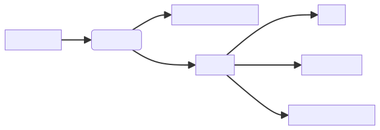
## Module: settings.py
- **Module Name**: This module is named `settings.py`.

- **Primary Objectives**: The main purpose of this module is to configure the settings for a specific application or script. It particularly sets up the options for the stop sequences, streaming, system prompt, template, and context.

- **Critical Functions**: This module doesn't contain any functions or methods, but it does define a dictionary `SIMPLE` that contains the settings.

- **Key Variables**: The key variables in this module include `SIMPLE`, which is a dictionary containing the configuration settings. The elements of this dictionary such as `options`, `stream`, `system`, `template`, and `context` are also key variables.

- **Interdependencies**: This module imports `LLM_MAX_TOKENS` from a module named `constants`. It does not appear to interact with any other system components within the provided code.

- **Core vs. Auxiliary Operations**: The core operation of this module is the definition of the `SIMPLE` dictionary. There are no auxiliary operations in this module.

- **Operational Sequence**: This module does not have a distinct operational sequence as it only defines a dictionary.

- **Performance Aspects**: Performance considerations are not explicitly mentioned in this module. However, the configuration settings defined in this module may impact the performance of the application or script it is used in.

- **Reusability**: This module is highly reusable. The `SIMPLE` dictionary can be imported into other scripts or modules to apply the same configuration settings.

- **Usage**: This module is used by importing it into other scripts or modules. The `SIMPLE` dictionary can then be used to access the configuration settings.

- **Assumptions**: The module assumes that the `constants` module and the `LLM_MAX_TOKENS` variable exist and can be imported. It also assumes that the stop sequences and other elements of the `SIMPLE` dictionary are valid and correctly formatted.
## Flow Diagram [via mermaid]

## Module: simple_summary_wrapper.py
- **Module Name**: simple_summary_wrapper.py
- **Primary Objectives**: This module is designed to generate summaries from a given set of conversations. It's a wrapper class that simplifies the process of summarizing conversations.
- **Critical Functions**: 
  - `__init__`: Initializes the class with certain parameters.
  - `chat_completion_to_prompt`: Converts chat completion to a prompt format.
  - `create_function_call`: Converts ChatCompletion to Airoboros style function trace (in prompt).
  - `output_to_chat_completion_response`: Converts raw LLM output into a ChatCompletion style response.
- **Key Variables**: `simplify_json_content`, `include_assistant_prefix`, `include_section_separators` are the essential variables.
- **Interdependencies**: This module depends on the `LLMChatCompletionWrapper` from the `wrapper_base` module.
- **Core vs. Auxiliary Operations**: Core operations include the conversion of chat completion to a prompt and the conversion of raw LLM output into a ChatCompletion style response. Auxiliary operations include the initialization of the class and the creation of function calls.
- **Operational Sequence**: The sequence begins with the initialization of the class, followed by the conversion of chat completion to a prompt. Then, function calls are created and finally, the raw LLM output is converted into a ChatCompletion style response.
- **Performance Aspects**: The module is designed to be efficient in summarizing conversations, but its performance may depend on the complexity and length of the conversations.
- **Reusability**: The module is highly reusable as it can be used to summarize different types of conversations.
- **Usage**: This module is used to generate summaries from a given set of conversations.
- **Assumptions**: The module assumes that the conversations are provided in a specific format, and that functions are None when converting chat completion to a prompt.
## Flow Diagram [via mermaid]
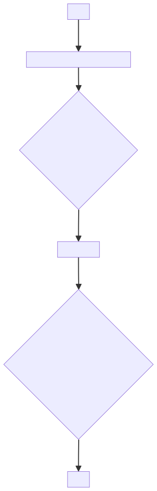
## Module: storage.py
- **Module Name**: storage.py

- **Primary Objectives**: This module is designed to manage storage connectors, allowing for the storage and retrieval of passages of text and their associated embeddings. It provides abstract methods for creating, reading, updating, and deleting these passages, as well as querying them.

- **Critical Functions**:
  - `__init__`: Initializes the Passage class with text, embedding, doc_id, and passage_id.
  - `get_storage_connector`: Returns a storage connector based on the archival storage type specified in the MemGPTConfig.
  - `list_loaded_data`: Lists the data loaded from the specified storage type.
  - `get_all_paginated`: Abstract method to get all passages in a paginated manner.
  - `get_all`: Abstract method to get all passages up to a limit.
  - `get`: Abstract method to get a specific passage by id.
  - `insert`: Abstract method to insert a passage.
  - `insert_many`: Abstract method to insert multiple passages.
  - `query`: Abstract method to query for passages based on a string query and query vector.
  - `save`: Abstract method to save the state of the storage connector.
  - `size`: Abstract method to get the number of passages in storage.

- **Key Variables**:
  - `text`: The text of a passage.
  - `embedding`: The embedding associated with a passage.
  - `doc_id`: The id of the document from which the passage comes.
  - `passage_id`: The id of the passage.
  - `storage_type`: The type of storage being used, which can be local, postgres, or lancedb.

- **Interdependencies**: This module interacts with the LocalStorageConnector, PostgresStorageConnector, and LanceDBConnector modules, which are implementations of the abstract StorageConnector class. It also interacts with the AgentConfig and MemGPTConfig classes from the memgpt.config module.

- **Core vs. Auxiliary Operations**: The core operations of this module are the CRUD operations (create, read, update, delete) on passages. The auxiliary operations include listing loaded data and saving the state of the storage connector.

- **Operational Sequence**: When a storage connector is needed, the `get_storage_connector` method is called, which returns an instance of the appropriate storage connector class based on the storage_type. The returned instance can then be used to perform operations on the passages in storage.

- **Performance Aspects**: Performance considerations would depend on the specific storage connector being used. For example, a database connector might have performance considerations related to database connection and query execution times.

- **Reusability**: This module is highly reusable, as it defines a standard interface for storage connectors. By implementing the abstract methods of the StorageConnector class, new types of storage connectors can be easily added.

- **Usage**: This module is used whenever a storage connector is needed to perform operations on passages. The specific usage would depend on the specific storage connector being used.

- **Assumptions**: The module assumes that the storage_type specified in the MemGPTConfig is one of "local", "postgres", or "lancedb". It also assumes that the appropriate storage connector classes are available for import.
## Flow Diagram [via mermaid]
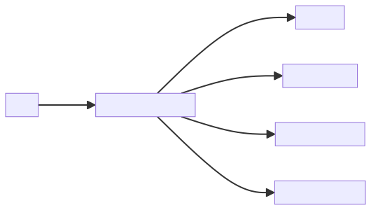
## Module: system.py
- **Module Name**: system.py
- **Primary Objectives**: This module is designed to manage system messages, including initial boot messages, heartbeat messages, login events, user messages, function responses, message summaries, and token limit warnings. It also packages these messages with time and location data.
- **Critical Functions**:
    - `get_initial_boot_messages(version="startup")`: Returns initial boot messages based on the version specified.
    - `get_heartbeat(reason="Automated timer", include_location=False, location_name="San Francisco, CA, USA")`: Packages and returns a heartbeat message.
    - `get_login_event(last_login="Never (first login)", include_location=False, location_name="San Francisco, CA, USA")`: Packages and returns a login event message.
    - `package_user_message(user_message, time=None, include_location=False, location_name="San Francisco, CA, USA")`: Packages and returns a user message.
    - `package_function_response(was_success, response_string, timestamp=None)`: Packages and returns a function response message.
    - `package_summarize_message(summary, summary_length, hidden_message_count, total_message_count, timestamp=None)`: Packages and returns a message summary.
    - `package_summarize_message_no_summary(hidden_message_count, timestamp=None, message=None)`: Packages and returns a message summary without a summary.
    - `get_token_limit_warning()`: Packages and returns a token limit warning message.
- **Key Variables**:
    - `version`: The version of initial boot messages.
    - `reason`: The reason for the heartbeat.
    - `include_location`: A flag indicating whether to include location data in the message.
    - `location_name`: The name of the location to include in the message.
    - `last_login`: The last login time.
    - `user_message`: The user message to package.
    - `was_success`: A flag indicating whether a function was successful.
    - `response_string`: The response string from a function.
    - `summary`: The summary of messages.
    - `summary_length`: The length of the summary.
    - `hidden_message_count`: The count of hidden messages.
    - `total_message_count`: The total count of messages.
- **Interdependencies**: This module interacts with the `utils` module to get local time and the `constants` module to get constant values.
- **Core vs. Auxiliary Operations**: The core operations of this module are the packaging and returning of various system messages. The auxiliary operations include getting local time and constant values from other modules.
- **Operational Sequence**: The functions in this module can be called independently as needed to package and return various types of system messages.
- **Performance Aspects**: The performance of this module depends on the efficiency of JSON operations and the speed of retrieving local time and constant values.
- **Reusability**: This module is highly reusable as it provides a standard way to package and return various types of system messages.
- **Usage**: This module is used whenever a system message needs to be packaged and returned.
- **Assumptions**: This module assumes that the `utils` and `constants` modules are available and functioning correctly. It also assumes that the necessary arguments will be provided when calling its functions.
## Flow Diagram [via mermaid]
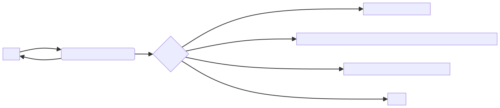
## Module: test_cli.py
- **Module Name**: The module name is `test_cli.py`.

- **Primary Objectives**: The primary purpose of this module is to test the command line interface (CLI) operations of a program. It focuses on testing the configuration, saving, and loading functionalities.

- **Critical Functions**: 
  - `test_configure_memgpt()`: This function tests the configuration of memgpt.
  - `test_save_load()`: This function tests the saving and loading functionality of the program.

- **Key Variables**: 
  - `child`: This is an instance of `pexpect.spawn` class. It is used to spawn and control child applications.
  - `TIMEOUT`: This variable is used to set the timeout for the `expect` method of `child`.

- **Interdependencies**: This module interacts with the `pexpect` library to spawn child applications and control their input/output. It also uses the `constants` and `utils` modules from the same package.

- **Core vs. Auxiliary Operations**: The core operations of this module are the `test_configure_memgpt()` and `test_save_load()` functions. The auxiliary operations include the import statements and the `if __name__ == "__main__":` block which allows the module to be run as a script.

- **Operational Sequence**: The module first configures memgpt, then tests the save and load operations. If the module is run as a script, it executes `test_configure_memgpt()` and `test_save_load()` sequentially.

- **Performance Aspects**: Performance considerations include the timeout for the `expect` method of `child`, which can affect the speed and efficiency of the tests.

- **Reusability**: The module is highly reusable. The test functions can be imported and used in other test suites or modules.

- **Usage**: This module is used for testing purposes. It can be run as a standalone script or imported into another module.

- **Assumptions**: The module assumes that the `memgpt` program responds correctly to the input provided by the `child` instance. It also assumes that the `memgpt` program terminates cleanly after execution.
## Flow Diagram [via mermaid]
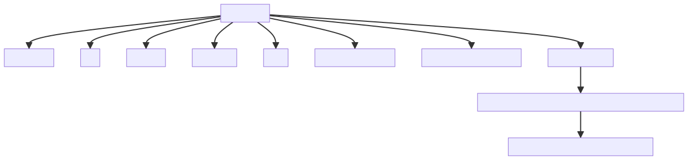
## Module: test_json_parsers.py
- **Module Name**: The module name is `test_json_parsers.py`.

- **Primary Objectives**: This module's purpose is to test the functionality of JSON parsers, particularly their ability to handle and fix broken JSON.

- **Critical Functions**: The main function in this module is `test_json_parsers()`. This function iterates through a list of test strings, each representing a different form of broken JSON. It attempts to parse each string with `json.loads()`, expects a failure, and then tries to repair the string with `json_parser.clean_json()`.

- **Key Variables**: The key variables in this module are `EXAMPLE_MISSING_CLOSING_BRACE`, `EXAMPLE_BAD_TOKEN_END`, `EXAMPLE_DOUBLE_JSON`, `EXAMPLE_HARD_LINE_FEEDS`, and `test_strings`. Each of these variables represents a different form of broken JSON that will be used to test the parsers.

- **Interdependencies**: This module interacts with the `json` module from Python's standard library and `json_parser` from `memgpt.local_llm`.

- **Core vs. Auxiliary Operations**: The core operation is the testing of JSON parsers. Auxiliary operations include the creation of test strings and exception handling.

- **Operational Sequence**: The sequence is as follows: For each test string, the function tries to parse it with `json.loads()`. If an exception is thrown (as expected), it then tries to repair the string with `json_parser.clean_json()`. If this fails, an exception is raised.

- **Performance Aspects**: The performance of this module depends on the efficiency of the JSON parsers it tests, as well as the complexity of the test strings.

- **Reusability**: This module is highly reusable. It can be used to test any JSON parser's ability to handle and fix broken JSON, simply by replacing the test strings.

- **Usage**: This module is used for testing purposes. It is likely invoked during development or in a continuous integration pipeline to ensure that changes to the JSON parsers do not break their functionality.

- **Assumptions**: The module assumes that the JSON parsers should be able to fix any form of broken JSON. It also assumes that `json.loads()` will fail to parse the test strings.
## Flow Diagram [via mermaid]
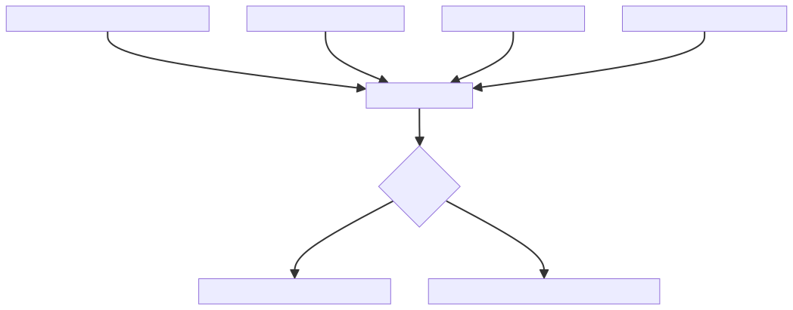
## Module: test_load_archival.py
Here is a comprehensive analysis of the provided code module:

- **Module Name**: test_load_archival.py

- **Primary Objectives**: The purpose of this module is to test the loading and storage of data using different archival storage types such as "postgres", "lancedb", and "chroma".

- **Critical Functions**: The main methods/functions in this module are:
  - `test_postgres()`: Tests the loading and storage of data using the "postgres" archival storage type.
  - `test_lancedb()`: Tests the loading and storage of data using the "lancedb" archival storage type.
  - `test_chroma()`: Tests the loading and storage of data using the "chroma" archival storage type.
  - `test_load_directory()`: Tests the loading of a directory into an index.
  - `test_load_webpage()`: Placeholder function for testing loading a webpage.
  - `test_load_database()`: Tests the loading of a database into an index.

- **Key Variables**: The key variables used in this module are:
  - `name`: Name of the dataset or index.
  - `dataset`: Dataset object loaded from the "MemGPT/example_short_stories" dataset.
  - `cache_dir`: Directory path for caching datasets.
  - `config`: MemGPTConfig object for configuring the archival storage type.
  - `engine`: SQLAlchemy engine object for connecting to a database.
  - `metadata`: SQLAlchemy MetaData object for reflecting the database.
  - `table_names`: List of table names in the reflected database.
  - `query`: SQL query for retrieving data from a table.
  - `df`: Pandas DataFrame object for storing data retrieved from the database.

- **Interdependencies**: This module depends on the following system components:
  - `tempfile`: For temporary file operations.
  - `asyncio`: For running asynchronous functions.
  - `os`: For environment variable operations and file system operations.
  - `datasets`: For loading datasets from Hugging Face.
  - `memgpt`: The main library for MemGPT functionality.
  - `presets`: For using preset configurations.
  - `personas`: For accessing persona-related functions and data.
  - `humans`: For accessing human-related functions and data.
  - `persistence_manager`: For managing the state of the agent.
  - `chromadb`: For interacting with the "chroma" archival storage type.
  - `lancedb`: For interacting with the "lancedb" archival storage type.
  - `subprocess`: For executing subprocess commands.
  - `sys`: For accessing system-specific parameters and functions.
  - `sqlalchemy`: For working with databases.
  - `pandas`: For working with data in tabular form.

- **Core vs. Auxiliary Operations**: The core operations of this module include testing the loading and storage of data using different archival storage types, loading directories, and loading databases. The auxiliary operations include installing dependencies, setting environment variables, and printing debug information.

- **Operational Sequence**: The operational sequence of this module is as follows:
  1. Install dependencies (`lancedb` and `chromadb`) if not already installed.
  2. Set the `MEMGPT_CONFIG_PATH` environment variable to "test_config.cfg".
  3. Test loading and storage of data using the "postgres" archival storage type.
  4. Test loading and storage of data using the "lancedb" archival storage type.
  5. Test loading and storage of data using the "chroma" archival storage type.
  6. Test loading a directory into an index.
  7. Test loading a database into an index.

- **Performance Aspects**: There are no specific performance aspects mentioned in the provided code module.

- **Reusability**: This module can be reused to test the loading and storage of data using different archival storage types, loading directories, and loading databases. However, some parts of the code may need modification depending on the specific use case.

- **Usage**: The module can be executed as a standalone script or imported as a module and used to test the functionality of the MemGPT library for loading and storing data.

- **Assumptions**: Based on the code provided, the assumptions made are:
  - The necessary dependencies (`lancedb`, `chromadb`, etc.) are already installed.
  - The required dataset ("MemGPT/example_short_stories") is available for loading.
  - The necessary configuration files ("test_config.cfg") are present.
  - The database file ("test.db") exists for loading into the index.
## Flow Diagram [via mermaid]
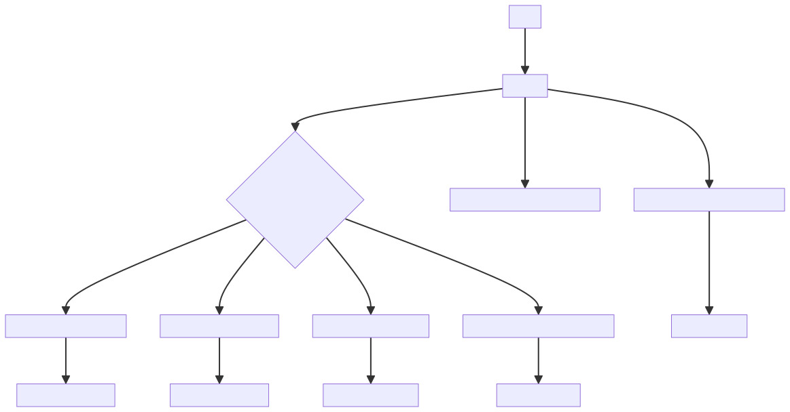
## Module: test_questionary.py
- **Module Name**: The module name is `test_questionary.py`.

- **Primary Objectives**: The purpose of this module is to test the legacy CLI (Command Line Interface) sequence of the `memgpt` program.

- **Critical Functions**: The main function is `test_legacy_cli_sequence()`. This function tests the sequence of prompts and responses in the CLI of the `memgpt` program.

- **Key Variables**: `TIMEOUT` is a key variable that sets the maximum wait time for responses. `child` is another key variable representing the spawned child process.

- **Interdependencies**: This module interacts with the `memgpt` program and the `pexpect` module for spawning child processes and expecting responses.

- **Core vs. Auxiliary Operations**: The core operation of this module is to test the `memgpt` program's CLI sequence. The auxiliary operations include setting up the child process, sending lines to the CLI, expecting responses, and checking the exit status of the child process.

- **Operational Sequence**: The sequence involves spawning a child process, sending commands to the CLI, expecting responses, and finally checking the exit status of the child process.

- **Performance Aspects**: The performance of this module depends on the responsiveness of the `memgpt` program's CLI and the timeout set for responses.

- **Reusability**: This module can be reused for testing different sequences of the `memgpt` program's CLI. However, it may need modifications depending on the specific sequence to be tested.

- **Usage**: This module is used for testing purposes, specifically for validating the correct functioning of the `memgpt` program's CLI sequence.

- **Assumptions**: The module assumes that the `memgpt` program's CLI will respond within the set timeout period. It also assumes that the `memgpt` program's CLI will react as expected to the sent commands.
## Flow Diagram [via mermaid]

## Module: test_schema_generator.py
- **Module Name**: The module name is `test_schema_generator.py`.

- **Primary Objectives**: The primary purpose of this module is to generate and test JSON schemas for various functions. This includes checking whether the schema is correctly converted, handling missing types, and handling missing docstrings.

- **Critical Functions**: 
    - `send_message`: Sends a message to the human user. It returns None as it does not produce a response.
    - `send_message_missing_types`: Similar to `send_message`, but without type annotations, used for testing error handling.
    - `send_message_missing_docstring`: Similar to `send_message`, but without a docstring, used for testing error handling.
    - `test_schema_generator`: Tests the `generate_schema` function with different scenarios.
    - `test_schema_generator_with_old_function_set`: Tests the `generate_schema` function with a set of base functions and extra functions.

- **Key Variables**: 
    - `correct_schema`: The correct JSON schema for comparison.
    - `generated_schema`: The JSON schema generated by the `generate_schema` function.
    - `attr`: The attribute from the base_functions or extras_functions module.
    - `real_schema`: The actual schema for comparison.
    - `function_name`: The name of the function being tested.

- **Interdependencies**: This module interacts with the `inspect`, `base_functions`, `extras_functions`, `FUNCTIONS_CHAINING`, and `generate_schema` modules.

- **Core vs. Auxiliary Operations**: The core operations of this module are the functions `test_schema_generator` and `test_schema_generator_with_old_function_set`, which perform the primary testing. The auxiliary operations include the `send_message`, `send_message_missing_types`, and `send_message_missing_docstring` functions, which are used for testing purposes.

- **Operational Sequence**: The module first defines several functions for sending messages and testing. It then defines two main test functions that generate schemas for the defined functions and compare them against the correct schemas.

- **Performance Aspects**: Performance considerations aren't explicitly mentioned in the module. However, the use of assertions for testing can halt execution as soon as a test fails, which can save time when debugging.

- **Reusability**: The module is designed for testing and can be reused to validate the schema generation of other functions. The `send_message` function can also be reused for sending messages to the user.

- **Usage**: This module is used for testing the `generate_schema` function to ensure it correctly generates JSON schemas for different functions.

- **Assumptions**: The module assumes that the `generate_schema` function will throw an error if types are missing or if the docstring is missing. It also assumes that the `generate_schema` function will correctly generate the schema for the tested functions.
## Flow Diagram [via mermaid]
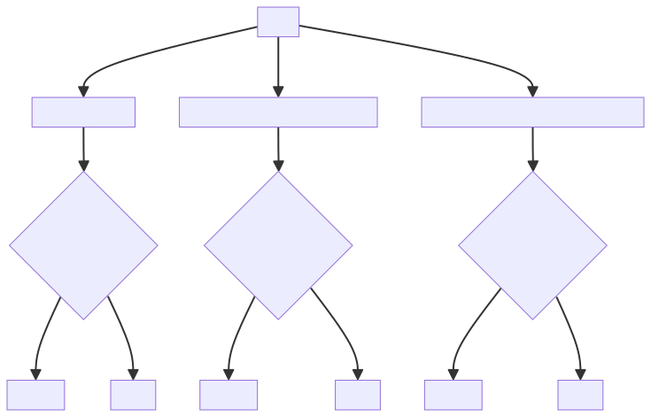
## Module: test_storage.py
- **Module Name**: test_storage.py

- **Primary Objectives**: This module is designed to test the functionalities of storage connectors in the MemGPT application. It verifies the operations of two types of storage connectors: PostgresStorageConnector and LanceDBConnector.

- **Critical Functions**: 
  - `test_postgres_openai()`: This function tests the PostgresStorageConnector with OpenAI.
  - `test_lancedb_openai()`: This function tests the LanceDBConnector with OpenAI.
  - `test_postgres_local()`: This function tests the PostgresStorageConnector with local storage.
  - `test_lancedb_local()`: This function tests the LanceDBConnector with local storage.

- **Key Variables**: 
  - `config`: It holds the configuration settings for the MemGPT application.
  - `embed_model`: It is the embedding model used for text embedding.
  - `passage`: It is the list of text passages to be inserted into the database.
  - `db`: It is the instance of the storage connector.
  - `query`: It is the query text used for testing the query functionality of the storage connector.
  - `query_vec`: It is the vector representation of the query text.
  - `res`: It is the result of the query operation.

- **Interdependencies**: This module interacts with several other modules in the MemGPT application including `memgpt.connectors.storage`, `memgpt.connectors.db`, `memgpt.embeddings`, and `memgpt.config`.

- **Core vs. Auxiliary Operations**: Core operations include testing the functionalities of the storage connectors. Auxiliary operations include setting up the environment and configuration for the tests.

- **Operational Sequence**: The module first checks the environment variables for the required database URLs and OpenAI API keys. Then it configures the MemGPT application and initializes the storage connector. It inserts passages into the database, retrieves all entries, and performs a query operation. Finally, it verifies the results of the query operation.

- **Performance Aspects**: This module uses pytest for testing, which is a robust framework that allows for efficient and effective testing. Performance considerations would be related to the speed and accuracy of the storage connectors and the embedding model.

- **Reusability**: This module can be reused for testing different storage connectors in the MemGPT application. The test functions can be modified to test different functionalities of the storage connectors.

- **Usage**: This module is used for testing the functionalities of storage connectors in the MemGPT application.

- **Assumptions**: The module assumes that the required environment variables for the database URLs and OpenAI API keys are set. It also assumes that the required packages are installed and the necessary modules can be imported.
## Flow Diagram [via mermaid]
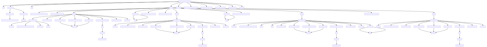
## Module: test_websocket_interface.py
- **Module Name**: The module is `test_websocket_interface.py`.

- **Primary Objectives**: The main purpose of this module is to test the WebSocket interface in the MemGPT system. It mocks the WebSocket connection, registers it, creates an agent, and tests the agent's interaction with the WebSocket interface.

- **Critical Functions**: 
    - `test_dummy()`: A placeholder test function that always passes.
    - `test_websockets()`: The main test function that mocks a WebSocket connection and tests the interaction with the MemGPT agent.

- **Key Variables**: 
    - `mock_websocket`: A mocked WebSocket connection.
    - `ws_interface`: The WebSocket interface to be tested.
    - `persistence_manager`: An in-memory state manager for the agent.
    - `memgpt_agent`: The MemGPT agent.
    - `user_message`: A mocked user message.

- **Interdependencies**: The module interacts with other components of the MemGPT system, including the WebSocket interface, agent presets, personas, humans, and the system package.

- **Core vs. Auxiliary Operations**: The core operation is the testing of the WebSocket interface (`test_websockets()`), while the auxiliary operation is the dummy test function (`test_dummy()`).

- **Operational Sequence**: The operational sequence involves creating a mock WebSocket connection, registering it with the WebSocket interface, creating an agent, packaging a user message, making the agent step through the message, and finally closing the WebSocket interface.

- **Performance Aspects**: The module uses asynchronous functions for testing, which can improve performance by allowing multiple operations to occur concurrently.

- **Reusability**: The module is designed for testing purposes, so it can be reused whenever the WebSocket interface needs to be tested. However, the specific tests and mocks may need to be adjusted based on the specific testing requirements.

- **Usage**: This module is used for testing the WebSocket interface in the MemGPT system.

- **Assumptions**: The module assumes that the WebSocket interface and the MemGPT agent function correctly. It also assumes that the mocked user message and WebSocket connection accurately represent actual user messages and WebSocket connections.
## Flow Diagram [via mermaid]
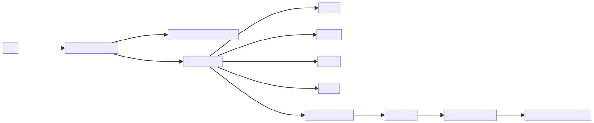
## Module: test_websocket_server.py
- **Module Name**: The module name is `test_websocket_server.py`.

- **Primary Objectives**: This module is designed to test the functionality of a WebSocket server. It involves sending a test configuration to the server and a test message, then waiting for the server's response.

- **Critical Functions**: 
  - `test_dummy()`: A placeholder test function that simply asserts true.
  - `test_websocket_server()`: The main test function that initiates a WebSocket server, sends a configuration and a message, receives responses, and then cancels the server task.

- **Key Variables**: 
  - `server`: An instance of the WebSocketServer.
  - `server_task`: A task created for running the server.
  - `test_config`: A dictionary that holds the configuration details for the test.
  - `uri`: The connection string for the WebSocket.
  - `websocket`: The WebSocket connection.
  - `response`: The response received from the WebSocket server.

- **Interdependencies**: This module interacts with the `WebSocketServer` from the `memgpt.server.websocket_server` module, `AgentConfig` from the `memgpt.config` module, and `DEFAULT_PORT` from the `memgpt.server.constants` module. It also uses the `pytest`, `asyncio`, `json`, and `websockets` libraries.

- **Core vs. Auxiliary Operations**: The core operation is the testing of the WebSocket server using `test_websocket_server()`. The auxiliary operation is the `test_dummy()` function which serves as a placeholder test.

- **Operational Sequence**: The server is initiated, a test configuration is sent, a response is awaited, a message is sent, another response is awaited, and finally, the server task is cancelled.

- **Performance Aspects**: The server task is cancelled after the test to free up resources. Also, asynchronous operations are used to improve performance by allowing other operations to proceed without waiting.

- **Reusability**: The `test_websocket_server()` function can be reused for similar WebSocket server testing scenarios with different configurations and messages.

- **Usage**: This module is used for testing the WebSocket server's handling of configurations and messages. It can be run as part of a test suite to ensure the server behaves as expected.

- **Assumptions**: It is assumed that the server responds appropriately to the sent configuration and message. It is also assumed that the server is running on `localhost` at the `DEFAULT_PORT`.
## Flow Diagram [via mermaid]
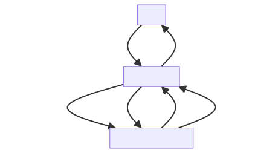
## Module: utils.py
- **Module Name**: The name of the module is `utils.py`.

- **Primary Objectives**: The purpose of this module is to configure the memGPT local language model (LLM) using the `configure_memgpt_localllm()` function. It also contains a placeholder for future implementation of `configure_memgpt()` function with OpenAI and Azure support.

- **Critical Functions**: 
  - `configure_memgpt_localllm()`: This function launches the memGPT configuration process, sends the necessary inputs, and checks for successful completion.
  - `configure_memgpt()`: This function is a wrapper for `configure_memgpt_localllm()`, with placeholders for enabling OpenAI and Azure.

- **Key Variables**: 
  - `child`: This is a pexpect.spawn object that represents the spawned child application (memGPT configuration process).
  - `enable_openai`, `enable_azure`: These are boolean flags to indicate whether to enable OpenAI and Azure support in the `configure_memgpt()` function.

- **Interdependencies**: This module depends on the `pexpect` library for spawning and interacting with child applications, and the `.constants` module for the `TIMEOUT` constant.

- **Core vs. Auxiliary Operations**: The core operation is the `configure_memgpt_localllm()` function, which performs the actual configuration process. The `configure_memgpt()` function serves as an auxiliary operation, providing a more flexible interface with placeholders for future expansions.

- **Operational Sequence**: The `configure_memgpt_localllm()` function sequentially sends inputs to the memGPT configuration process, waits for the expected prompts, and checks for successful completion.

- **Performance Aspects**: The performance of this module primarily depends on the responsiveness of the memGPT configuration process.

- **Reusability**: The `configure_memgpt_localllm()` function can be reused to configure the memGPT LLM, and the `configure_memgpt()` function can be extended to support other LLM providers.

- **Usage**: This module is used for configuring the memGPT LLM. To use it, you would call `configure_memgpt()` with the appropriate flags.

- **Assumptions**: This module assumes that the memGPT configuration process responds as expected to the sent inputs. It also assumes that the configuration process will terminate and that the exit status will be 0 upon successful completion.
## Flow Diagram [via mermaid]

## Module: utils.py
- **Module Name**: The module is named `utils.py`.

- **Primary Objectives**: The main purpose of this module is to provide utility functions and classes that are used across different parts of the system. These include loading grammar files, counting tokens in a string, and getting available wrappers.

- **Critical Functions**:
  - `DotDict`: This class extends the dictionary class to allow dot access on properties. It also includes methods for pickling.
  - `load_grammar_file`: This function loads a grammar file from the "grammars" directory.
  - `count_tokens`: This function counts the number of tokens in a string using a specified model.
  - `get_available_wrappers`: This function returns a dictionary of available wrappers.

- **Key Variables**: 
  - `grammar_file`: The path to the grammar file.
  - `grammar_str`: The string read from the grammar file.
  - `encoding`: The encoding used for token counting.
  - `s`: The string for which tokens are counted.

- **Interdependencies**: This module depends on the `os`, `tiktoken`, and `memgpt.local_llm.llm_chat_completion_wrappers` modules.

- **Core vs. Auxiliary Operations**: 
  - Core: The core operations of this module are loading grammar files, counting tokens, and getting available wrappers.
  - Auxiliary: The auxiliary operations include the `DotDict` class which extends the dictionary class to allow dot access on properties.

- **Operational Sequence**: The `load_grammar_file` function checks if the grammar file exists, reads it if it does, and returns the read string. The `count_tokens` function gets the encoding for a specified model and returns the number of tokens in a string.

- **Performance Aspects**: Performance considerations are not explicitly mentioned in the code. However, the efficiency of the `count_tokens` function would depend on the efficiency of the encoding method used.

- **Reusability**: The utility functions and classes in this module can be reused across different parts of the system.

- **Usage**: This module is used to provide utility functions and classes that are used across different parts of the system. The functions can be imported and used as needed.

- **Assumptions**: The code assumes that the grammar file exists in the specified location. If it does not, a `FileNotFoundError` is raised.
## Flow Diagram [via mermaid]
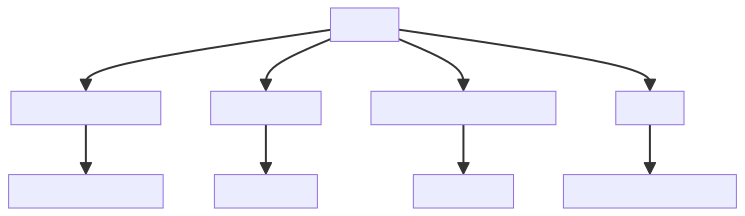
## Module: utils.py
- **Module Name**: The module is named `utils.py`.

- **Primary Objectives**: This module serves two primary purposes. Firstly, it determines when to stop listening to the server through the function `condition_to_stop_receiving(response)`. Secondly, it transforms the server's response from JSON to a more readable format using the function `print_server_response(response)`.

- **Critical Functions**: 
  - `condition_to_stop_receiving(response)`: This function checks the type of the server response and returns True if the response type is either "agent_response_end", "agent_response_error", "command_response", or "server_error". Otherwise, it returns False.
  - `print_server_response(response)`: This function formats and prints the server's response based on its type and message type.

- **Key Variables**: 
  - `response`: It's a dictionary that contains the server's response. It's used in both functions.

- **Interdependencies**: This module doesn't appear to depend on or interact with other system components.

- **Core vs. Auxiliary Operations**: The core operations are the two defined functions, while there don't seem to be any auxiliary operations in this module.

- **Operational Sequence**: The function `condition_to_stop_receiving(response)` should be called first to check if the server's response indicates a stop in listening. Then, the function `print_server_response(response)` can be used to print the server's response.

- **Performance Aspects**: This module doesn't seem to have any specific performance considerations. It's straightforward and doesn't involve any computationally intensive operations.

- **Reusability**: The functions in this module can be reused for any application that needs to listen to a server and print its responses.

- **Usage**: This module is used to handle server responses. It checks if the server indicates a stop in listening and then prints the server's response.

- **Assumptions**: It's assumed that the server's response is a dictionary with keys "type" and potentially "message" and "message_type". It's also assumed that the response types and message types are known and limited to those checked in the functions.
## Flow Diagram [via mermaid]
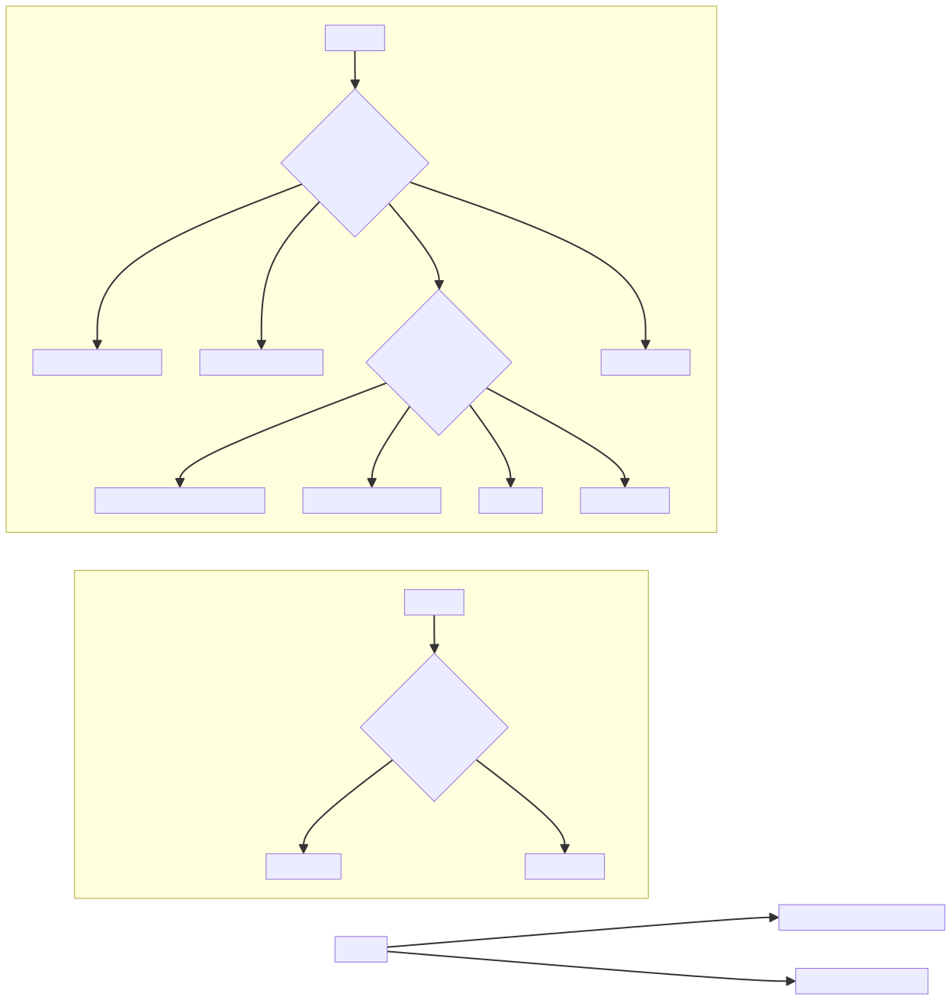
## Module: utils.py
- **Module Name**: utils.py

- **Primary Objectives**: This module provides various utility functions for tasks such as token counting, time retrieval, JSON parsing, file reading, chunking, database reading, cost estimation, file listing, text retrieval, and schema difference calculation.

- **Critical Functions**: 
    - `count_tokens(s: str, model: str = "gpt-4")`: Counts the number of tokens in a string.
    - `get_local_time_military()`, `get_local_time_timezone(timezone="America/Los_Angeles")`, `get_local_time(timezone=None)`: Get the current local time in various formats.
    - `parse_json(string)`: Parses a JSON string.
    - `prepare_archival_index(folder)`: Prepares an archival index from a folder.
    - `read_in_chunks(file_object, chunk_size)`, `read_pdf_in_chunks(file, chunk_size)`, `read_in_rows_csv(file_object, chunk_size)`: Read files in chunks.
    - `prepare_archival_index_from_files(glob_pattern, tkns_per_chunk=300, model="gpt-4")`: Prepares an archival index from files.
    - `estimate_openai_cost(docs)`: Estimates the cost of using OpenAI for embedding.
    - `list_agent_config_files()`, `list_human_files()`, `list_persona_files()`: Lists files in respective directories.
    - `get_human_text(name: str)`, `get_persona_text(name: str)`: Retrieves the text from human and persona files.
    - `get_schema_diff(schema_a, schema_b)`: Computes the difference between two schemas.

- **Key Variables**: 
    - `DEBUG`: A boolean variable used to control the output of debug information.
    - `MEMGPT_DIR`: Directory path for the MemGPT module.

- **Interdependencies**: This module interacts with several other modules including datetime, csv, difflib, demjson3, numpy, json, pytz, os, tiktoken, glob, sqlite3, fitz, tqdm, typer, memgpt, llama_index, faiss, and concurrent.futures.

- **Core vs. Auxiliary Operations**: Core operations include token counting, time retrieval, JSON parsing, file reading, chunking, and database reading. Auxiliary operations include cost estimation, file listing, text retrieval, and schema difference calculation.

- **Operational Sequence**: The operational sequence is not strictly defined and depends on the specific function being called and its requirements.

- **Performance Aspects**: Performance considerations include efficient file reading, token counting, and time retrieval. The module also includes concurrency for processing chunks of data.

- **Reusability**: The utility functions provided in this module are generic and can be reused in different contexts where similar tasks are required.

- **Usage**: This module is used as a utility module, providing helper functions that can be used throughout the project for various tasks.

- **Assumptions**: The module assumes that the file and directory paths provided to the functions exist. It also assumes that the JSON strings provided to the parse_json function are valid JSON strings.
## Flow Diagram [via mermaid]
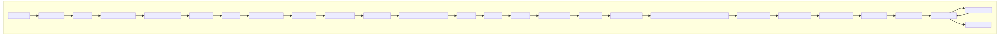
## Module: utils.py
- **Module Name**: The module is named `utils.py`.

- **Primary Objectives**: The primary purpose of this module is to provide utility functions for loading and validating YAML configuration files. These files are used to configure the behavior of the MEMGPT system.

- **Critical Functions**: 
  - `is_valid_yaml_format(yaml_data, function_set)`: This function validates the format of the YAML data and checks if all the functions in the YAML data are part of a specified function set.
  - `load_yaml_file(file_path)`: This function loads a YAML file from a given path and returns the data.
  - `load_all_presets()`: This function loads all preset configurations from the examples directory and the user-provided presets directory.

- **Key Variables**: 
  - `yaml_data`: This variable holds the data loaded from a YAML file.
  - `function_set`: This variable holds a set of valid function names.
  - `file_path`: This variable holds the path to a YAML file.
  - `all_yaml_files`: This variable holds a list of all YAML files from both the examples directory and the user-provided presets directory.
  - `all_yaml_data`: This variable holds a mapping from file name to YAML data.

- **Interdependencies**: This module interacts with the `os`, `glob`, and `yaml` modules to handle file operations and YAML parsing. It also uses constants from the `memgpt.constants` module.

- **Core vs. Auxiliary Operations**: The core operations of this module are the loading and validation of YAML files. The creation of directories and the extraction of file names are auxiliary operations that support the core operations.

- **Operational Sequence**: First, the YAML files are located using the `glob` module. Then, each file is loaded and validated. If a file is valid, its data is stored in a dictionary with the file name as the key.

- **Performance Aspects**: The performance of this module largely depends on the I/O operations for loading the files and the efficiency of the YAML parsing.

- **Reusability**: This module is highly reusable as it provides generic functions for loading and validating YAML files, which are common operations in many software systems.

- **Usage**: This module is used whenever there is a need to load and validate YAML configuration files in the MEMGPT system.

- **Assumptions**: It is assumed that the YAML files follow a specific format and that all function names in the YAML data are part of a predefined set. It is also assumed that the files are located in specific directories.
## Flow Diagram [via mermaid]
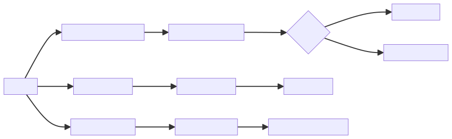
## Module: websocket_client.py
- **Module Name**: websocket_client.py
- **Primary Objectives**: This module is designed to establish a WebSocket connection with a MemGPT server. It can initialize a new agent or load an existing one, send user messages to the agent, and receive responses from the server.
- **Critical Functions**: 
   - `basic_cli_client()`: Main function that establishes the WebSocket connection and handles the communication with the server.
- **Key Variables**: 
   - `DEFAULT_PORT`: The default port for the WebSocket connection.
   - `CLIENT_TIMEOUT`: The maximum time to wait for a server response.
   - `CLEAN_RESPONSES`: A flag to determine whether to print raw server responses or cleaner ones.
   - `LOAD_AGENT`: The ID of an existing agent to load. If `None`, a new agent is created.
- **Interdependencies**: This module interacts with the following components:
   - `websockets`: Used to establish the WebSocket connection.
   - `asyncio`: Used for asynchronous I/O operations.
   - `memgpt.server.websocket_protocol`: Used for creating the load and create commands and user messages.
   - `memgpt.server.websocket_server`: The server with which this client communicates.
   - `memgpt.server.utils`: Used for utility functions like checking the condition to stop receiving responses.
- **Core vs. Auxiliary Operations**: The core operation is the interaction with the MemGPT server, including sending user messages and receiving responses. Auxiliary operations include loading or creating an agent and handling timeouts or connection errors.
- **Operational Sequence**: The module first establishes a WebSocket connection, then either loads an existing agent or creates a new one. It then enters a loop where it sends user messages to the server and waits for responses. This process continues until the connection is closed or an error occurs.
- **Performance Aspects**: The module uses asynchronous operations to avoid blocking while waiting for server responses. It also includes error handling for timeouts and connection errors.
- **Reusability**: This module can be reused to communicate with any MemGPT server. The agent configuration and user messages can be customized as needed.
- **Usage**: This module is used as a client to communicate with a MemGPT server. It can be run as a standalone script.
- **Assumptions**: The module assumes that a MemGPT server is running and accessible at the specified port. It also assumes that the user will input messages when prompted.
## Flow Diagram [via mermaid]
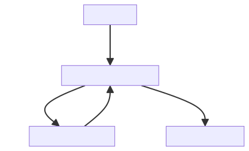
## Module: websocket_interface.py
- **Module Name**: websocket_interface.py

- **Primary Objectives**: This module is designed to facilitate communication between a MemGPT agent and clients over a WebSocket. It supports both synchronous and asynchronous messaging.

- **Critical Functions**: 
  - `register_client(self, websocket)`: Registers a new client connection.
  - `unregister_client(self, websocket)`: Unregisters a client connection.
  - `user_message(self, msg)`: Handles the reception of a user message.
  - `internal_monologue(self, msg)`: Handles the agent's internal monologue.
  - `assistant_message(self, msg)`: Handles the agent sending a message.
  - `function_message(self, msg)`: Handles the agent calling a function.
  - `_run_event_loop(self)`: Runs the dedicated event loop and handles its closure.
  - `_run_async(self, coroutine)`: Schedules coroutine to be run in the dedicated event loop.
  - `_send_to_all_clients(self, clients, msg)`: Asynchronously sends a message to all clients.
  - `close(self)`: Shuts down the WebSocket interface and its event loop.

- **Key Variables**: 
  - `self.clients`: A set of all currently connected clients.
  - `self.loop`: A new event loop created for the synchronous WebSocket interface.
  - `self.thread`: A thread for running the event loop in the synchronous WebSocket interface.

- **Interdependencies**: This module interacts with the `memgpt.interface` and `memgpt.server.websocket_protocol` modules.

- **Core vs. Auxiliary Operations**: The core operations involve handling messages from the user, the agent's internal monologue, the agent sending a message, and the agent calling a function. Auxiliary operations include registering and unregistering clients, running the event loop, and scheduling coroutines.

- **Operational Sequence**: The sequence typically begins with registering a client, then receiving and handling messages from the user or the agent, and sending responses back to the client. For the synchronous interface, an event loop is started in a separate thread.

- **Performance Aspects**: The module is designed to handle multiple clients and messages concurrently, which can improve throughput and responsiveness. However, the performance may be affected by the number of clients and the load on the event loop.

- **Reusability**: The module is highly reusable. It provides a base interface that can be extended to handle different types of messages and protocols. The synchronous and asynchronous interfaces can be used in different scenarios depending on the requirements.

- **Usage**: This module is used to enable communication between a MemGPT agent and clients over a WebSocket. The clients can send messages to the agent, and the agent can send responses back to the clients.

- **Assumptions**: The module assumes that the WebSocket connections are reliable and that the clients and the agent follow the correct message protocols. It also assumes that the event loop in the synchronous interface can handle the load of the tasks scheduled on it.
## Flow Diagram [via mermaid]

## Module: websocket_protocol.py
- **Module Name**: The module is named as `websocket_protocol.py`.

- **Primary Objectives**: The primary objective of this module is to handle the communication between the server and the client using WebSockets. It defines various functions to create and send JSON-based messages for different scenarios.

- **Critical Functions**: 
  - `server_error(msg)`: Sends a server error message.
  - `server_command_response(status)`: Sends a command response with a given status.
  - `server_agent_response_error(msg)`: Sends an agent response error message.
  - `server_agent_response_start()`: Sends a start signal for agent response.
  - `server_agent_response_end()`: Sends an end signal for agent response.
  - `server_agent_internal_monologue(msg)`: Sends an internal monologue message from the agent.
  - `server_agent_assistant_message(msg)`: Sends a message from the assistant agent.
  - `server_agent_function_message(msg)`: Sends a function message from the agent.
  - `client_user_message(msg, agent_name=None)`: Sends a user message, optionally with the agent's name.
  - `client_command_create(config)`: Sends a command to create an agent with a given configuration.
  - `client_command_load(agent_name)`: Sends a command to load an agent with a given name.

- **Key Variables**: The key variables in this module are the message (`msg`), status (`status`), agent name (`agent_name`), and configuration (`config`).

- **Interdependencies**: This module is likely to interact with both the server and client modules in the system.

- **Core vs. Auxiliary Operations**: Core operations include sending and receiving various types of messages between the server and client. Auxiliary operations might include formatting the messages or handling errors.

- **Operational Sequence**: The operational sequence is not explicitly defined in this module. However, it can be inferred that messages are sent and received in response to certain events or commands.

- **Performance Aspects**: Performance considerations are not explicitly mentioned in this module. However, the use of JSON for message formatting suggests a focus on lightweight data interchange.

- **Reusability**: This module appears to be highly reusable. The functions provided can be used to handle a variety of communication scenarios between a server and client.

- **Usage**: This module is used to handle server-client communication in a WebSocket context. The functions can be used to send different types of messages based on the situation.

- **Assumptions**: The code assumes that the server and client are capable of handling JSON-based messages. It also assumes that an appropriate WebSocket connection exists between the server and client.
## Flow Diagram [via mermaid]

## Module: websocket_server.py
- **Module Name**: websocket_server.py

- **Primary Objectives**: This module is designed to create a WebSocket server that can handle various client requests, such as creating a new AI agent, loading an existing agent, and processing user messages. 

- **Critical Functions**: 
    - `__init__(self, host="localhost", port=DEFAULT_PORT)`: Initializes the WebSocket server with default host as localhost and port as DEFAULT_PORT.
    - `run_step(self, user_message, first_message=False, no_verify=False)`: Runs a step in the agent's conversation based on the user's message.
    - `handle_client(self, websocket, path)`: Handles client connections and manages incoming messages from the client.
    - `create_new_agent(self, config)`: Creates a new AI agent based on the provided configuration.
    - `load_agent(self, agent_name)`: Loads an existing AI agent based on the agent's name.
    - `initialize_server(self)`: Initializes the server.
    - `start_server(self)`: Starts the server.
    - `run(self)`: Runs the server.

- **Key Variables**: 
    - `self.host`: The host on which the server is running.
    - `self.port`: The port on which the server is running.
    - `self.interface`: The interface for the server.
    - `self.agent`: The AI agent that the server is currently working with.
    - `self.agent_name`: The name of the AI agent that the server is currently working with.

- **Interdependencies**: This module interacts with several other modules such as `memgpt.server.websocket_interface`, `memgpt.server.constants`, `memgpt.server.websocket_protocol`, `memgpt.system`, and `memgpt.constants`.

- **Core vs. Auxiliary Operations**: Core operations include handling client requests and managing AI agents (creating, loading, and processing user messages). Auxiliary operations include initializing and running the server.

- **Operational Sequence**: The server is initialized, then it starts and waits for client connections. When a client connects, it handles the client's requests which could be creating a new agent, loading an existing agent, or processing a user message.

- **Performance Aspects**: This module uses asynchronous programming (async/await) to handle client requests, which can improve the server's performance by allowing it to handle multiple requests concurrently.

- **Reusability**: This module is highly reusable. The WebSocket server can be used to manage AI agents in different contexts. The methods for creating and loading agents can also be reused in other modules or applications.

- **Usage**: This module is used to create a WebSocket server that can handle various client requests related to AI agents.

- **Assumptions**: The module assumes that the client will send JSON formatted data. It also assumes that the client will send valid commands and that the necessary agent configurations exist when an agent is being created or loaded.
## Flow Diagram [via mermaid]
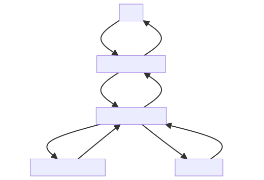
## Module: wrapper_base.py
- **Module Name**: The module is named `wrapper_base.py`.

- **Primary Objectives**: This module is designed to provide an abstract base class (ABC) for a chat completion wrapper. This wrapper is responsible for converting chat completion to a single prompt string and transforming the LLM output string into a chat completion response. 

- **Critical Functions**: The module contains two abstract methods:
  1. `chat_completion_to_prompt(self, messages, functions)`: This method is supposed to convert a ChatCompletion object into a single prompt string.
  2. `output_to_chat_completion_response(self, raw_llm_output)`: This method is supposed to convert the raw output from the LLM into a ChatCompletion response.

- **Key Variables**: The key variables are `messages`, `functions`, and `raw_llm_output`. The `messages` and `functions` are inputs for the `chat_completion_to_prompt` method, and `raw_llm_output` is an input for the `output_to_chat_completion_response` method.

- **Interdependencies**: This module is likely to interact with other modules that implement this abstract base class. The interactions would occur when the abstract methods are called and overridden. In addition, it depends on the `abc` module from Python's standard library.

- **Core vs. Auxiliary Operations**: The core operations of this module are the two abstract methods. There are no auxiliary operations as this is a base class providing an interface for other classes to implement.

- **Operational Sequence**: Being an abstract base class, it doesn't have a distinct operational sequence. The sequence will depend on the specific implementation in the child class.

- **Performance Aspects**: Performance considerations are not directly applicable to this module as it provides abstract methods. However, the performance of the child classes can be affected by how efficiently these methods are implemented.

- **Reusability**: This module is highly reusable. It provides a template for creating new classes that transform chat completion to a single prompt string and LLM output to a chat completion response.

- **Usage**: This module is used by creating a child class and implementing the abstract methods. The child class can then be used to convert between chat completions and LLM outputs.

- **Assumptions**: The module assumes that any class that inherits from it will provide concrete implementations of the abstract methods. It also assumes that the inputs to these methods will be in the expected format.
## Flow Diagram [via mermaid]

## Module: zephyr.py
- **Module Name**: ZephyrMistralWrapper and ZephyrMistralInnerMonologueWrapper

- **Primary Objectives**: The primary purpose of this module is to serve as a wrapper for Zephyr Alpha and Beta, Mistral 7B models. It formats a prompt that generates JSON, with or without inner thoughts.

- **Critical Functions**: 
    - `__init__`: Initializes the wrapper with various parameters.
    - `chat_completion_to_prompt`: Converts the chat messages and functions into a formatted prompt for the model.
    - `create_function_description`: Creates a string description of a function schema.
    - `create_function_call`: Creates a function call in JSON format.
    - `clean_function_args`: Performs some basic cleaning of function arguments.
    - `output_to_chat_completion_response`: Converts the raw output of the model into a formatted response.

- **Key Variables**: 
    - `simplify_json_content`: Determines whether to simplify the JSON content.
    - `clean_func_args`: Determines whether to clean function arguments.
    - `include_assistant_prefix`: Determines whether to include an assistant prefix in the prompt.
    - `include_opening_brance_in_prefix`: Determines whether to include an opening brace in the prefix.
    - `include_section_separators`: Determines whether to include section separators in the prompt.

- **Interdependencies**: This module interacts with other system components like the json parser and the LLMChatCompletionWrapper.

- **Core vs. Auxiliary Operations**: Core operations include the generation of the prompt and the conversion of the model's raw output into a formatted response. Auxiliary operations include the creation of function descriptions and function calls and the cleaning of function arguments.

- **Operational Sequence**: The module first initializes with the given parameters. It then converts chat messages and functions into a formatted prompt, which is fed into the model. The model's raw output is then converted into a formatted response.

- **Performance Aspects**: The module's performance mainly depends on the underlying model's performance. The efficiency of the functions for prompt creation and output formatting also impacts the overall performance.

- **Reusability**: The module is highly reusable. It can be used with any chat data and functions, provided they are in the required format.

- **Usage**: The module is used by initializing it with the required parameters, calling `chat_completion_to_prompt` with the chat messages and functions, running the model with the generated prompt, and then converting the model's output into a response using `output_to_chat_completion_response`.

- **Assumptions**: The module assumes that the chat messages and functions are in a specific format. It also assumes that the model's output is in JSON format.
## Flow Diagram [via mermaid]

