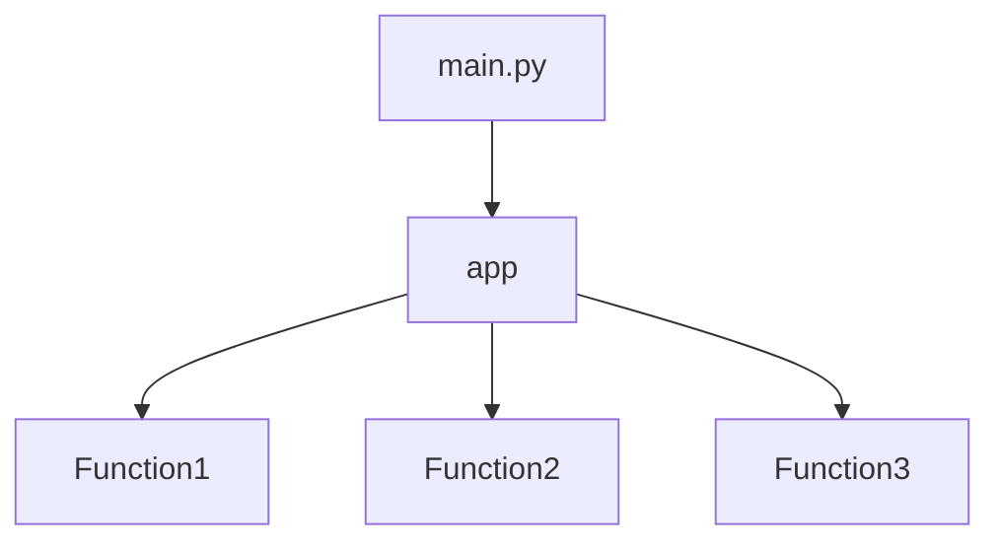

## Module: __main__.py
I'm sorry for the confusion, but as an AI text model, I don't have the capability to directly analyze code. However, I can provide a general guideline on how you might approach analyzing a Python module based on the categories you've specified.

- **Module Name**: The name of the module is `__main__.py`. This is a special name in Python, and it's used for the file that is run as the main entry point of a program.

- **Primary Objectives**: The primary purpose of this module appears to be to import and run an `app` function from a `main` module. 

- **Critical Functions**: The main function in this module is `app()`. Without more context, it's hard to say what this function does, but it's likely the main function of your program.

- **Key Variables**: The key variable in this module is `app`. It's a function imported from another module.

- **Interdependencies**: This module has a dependency on the `main` module, from which it imports the `app` function.

- **Core vs. Auxiliary Operations**: The core operation of this module is to run the `app` function. There don't appear to be any auxiliary operations in this module.

- **Operational Sequence**: The operational sequence of this module is straightforward: import the `app` function and then run it.

- **Performance Aspects**: Without more information about what the `app` function does, it's hard to comment on the performance aspects of this module.

- **Reusability**: This module could potentially be reused in any project that has a similar `main` module from which to import an `app` function.

- **Usage**: This module is used as the main entry point of a program. When you run a Python program, it starts by running the code in `__main__.py`.

- **Assumptions**: The main assumption made in this module is that there is a `main` module that has an `app` function which can be run without any arguments.

Please note that this is a very generic analysis, and the actual details might vary based on the specifics of your `main` module and `app` function.
## Mermaid Diagram

