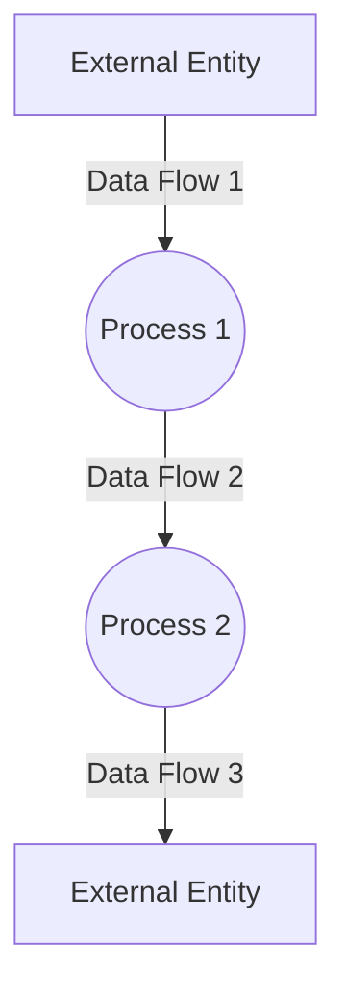

## Module: agent.py
 Here is a comprehensive analysis of the agent.py module:

**Module Name**: agent.py

**Primary Objectives**: Defines the Agent class, which handles conversational interactions between a human and an AI assistant. The agent orchestrates passing messages between the human and AI, calling functions, and maintaining conversation state.

**Critical Functions**:
- `__init__`: Constructor to create an Agent instance, initializing key components like memory, messages, functions, etc.
- `step`: Main method to handle a human message, get AI response, execute any functions, and update state. 
- `get_ai_reply`: Calls API to get AI response.
- `handle_ai_response`: Parses AI response, calls any functions, handles errors.
- `summarize_messages_inplace`: Summarizes old messages to reduce context length.
- `load` and `save`: Load/save agent state to disk.

**Key Variables**:
- `model`: AI model name (e.g. GPT-3) 
- `memory`: CoreMemory object containing persona and dialog history
- `messages`: Full message log between human and AI
- `functions`: Available functions the AI can call

**Interdependencies**:
- `Interface`: Abstract interface for handling messages/functions.
- `PersistenceManager`: Abstract persistence manager for saving/loading state.
- `openai_tools`: Utils for calling OpenAI API.
- `functions/functions.py`: Available functions to call.

**Core vs Auxiliary Operations**:
- Core: `step`, `get_ai_reply`, `handle_ai_response` 
- Auxiliary: `load`, `save`, `summarize_messages_inplace`

**Operational Sequence**:
1. `step` gets user message
2. Passes updated message history to `get_ai_reply` 
3. `get_ai_reply` calls API for AI response
4. `handle_ai_response` parses response, calls functions
5. `step` updates state with new messages

**Performance Aspects**:
- Caching past responses
- Summarizing old messages 
- Configurable context window size

**Reusability**:
- Could be adapted for different AI models
- `Interface` allows different platforms (CLI, web, etc)
- `PersistenceManager` allows different storage backends

**Usage**:
- Create `Agent` with config, model, memory, functions
- Call `agent.step(user_message)` to handle each user interaction

**Assumptions**:
- Stateful conversation with persistent memory
- Messages are text-based
- Using an underlying large language model API
## Mermaid Diagram

