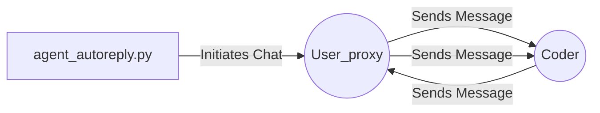

## Module: agent_autoreply.py
- **Module Name**: agent_autoreply.py

- **Primary Objectives**: The purpose of this module is to demonstrate how to integrate the MemGPT model into an AutoGen group chat. It provides an example of how to replace the default "coder" agent in AutoGen with a MemGPT agent.

- **Critical Functions**: 
  - `create_memgpt_autogen_agent_from_config`: This function creates a MemGPT agent with the specified configuration.
  - `UserProxyAgent`: This class creates a user agent that interacts with the other agents.
  - `AssistantAgent`: This class creates an assistant agent that can play the role of a coder.
  - `initiate_chat`: This method starts the group chat with a message from the user.

- **Key Variables**: 
  - `config_list`: This list contains the configuration for the model.
  - `USE_MEMGPT`: This boolean variable determines whether to use the MemGPT model or not.
  - `llm_config`: This dictionary contains the configuration for the language model.
  - `user_proxy`: This is the user agent.
  - `coder`: This is the coder agent, which can either be an AssistantAgent or a MemGPT agent depending on the `USE_MEMGPT` variable.

- **Interdependencies**: This module depends on the `autogen` and `memgpt` packages.

- **Core vs. Auxiliary Operations**: The core operation is the creation and configuration of the agents (either MemGPT or AssistantAgent), and the initiation of the chat. Auxiliary operations include setting up the configuration and environment variables.

- **Operational Sequence**: The module begins by setting up the configuration and creating the user agent. Then, based on the `USE_MEMGPT` variable, it either creates an AssistantAgent or a MemGPT agent. Finally, it initiates the chat with a message from the user.

- **Performance Aspects**: Performance depends on the underlying model (GPT-4 or similar) and the configuration settings. The use of MemGPT may improve performance due to its persistent memory capabilities.

- **Reusability**: The module is highly adaptable for reuse. By changing the configuration, one can use different models or agents. The chat initiation message can also be modified to suit different scenarios.

- **Usage**: This module is used to demonstrate how to integrate a MemGPT agent into an AutoGen group chat. It can be used as a template for similar tasks.

- **Assumptions**: The module assumes that the necessary packages (`autogen` and `memgpt`) are installed and that the OPENAI_API_KEY environment variable is set. It also assumes that the user wants to use a GPT-4 model.
## Mermaid Diagram

