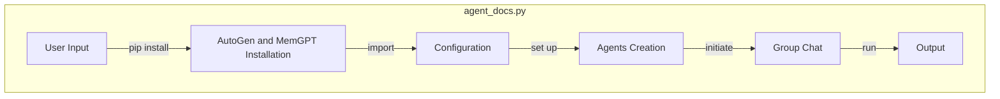

## Module: agent_docs.py
- **Module Name**: The module is named `agent_docs.py`.

- **Primary Objectives**: The purpose of this module is to provide an example of how to integrate MemGPT into an AutoGen group chat and interact with documents. It demonstrates the setup process, how to create a group chat, and how to initiate a chat.

- **Critical Functions**: 
  - `create_autogen_memgpt_agent`: This function creates an AutoGen agent powered by MemGPT.
  - `create_memgpt_autogen_agent_from_config`: This function creates a MemGPT AutoGen agent from a given configuration.
  - `UserProxyAgent`: This class represents a user in the group chat.
  - `GroupChat`: This class represents a group chat between the user and two LLM agents.
  - `GroupChatManager`: This class manages the group chat.

- **Key Variables**: 
  - `config_list` and `config_list_memgpt`: These lists contain the configurations for creating AutoGen agents.
  - `USE_AUTOGEN_WORKFLOW`: This boolean variable determines whether to use the AutoGen workflow or not.
  - `DEBUG`: This boolean variable controls the debug mode.
  - `interface_kwargs`: This dictionary contains interface-related configurations.
  - `llm_config` and `llm_config_memgpt`: These dictionaries contain configurations for creating agents.
  - `user_proxy`: This is an instance of `UserProxyAgent` representing the user in the group chat.
  - `coder`: This is an instance of an AutoGen agent.
  - `groupchat`: This is an instance of `GroupChat` representing the group chat.
  - `manager`: This is an instance of `GroupChatManager` managing the group chat.

- **Interdependencies**: This module depends on the `autogen` and `memgpt` modules to create and manage the AutoGen group chat.

- **Core vs. Auxiliary Operations**: The core operations involve creating the AutoGen agents and initiating the group chat, while auxiliary operations include setting up configurations and debugging options.

- **Operational Sequence**: The module first sets up configurations, creates the user proxy and the coder (AutoGen agent), initializes the group chat, and finally initiates the chat with a message from the user.

- **Performance Aspects**: Performance considerations are not explicitly mentioned in the module. However, the performance could be influenced by the configurations of the AutoGen agents and the debugging options.

- **Reusability**: This module is highly reusable. It can be used as a template to create AutoGen group chats with different configurations and agents.

- **Usage**: This module is used as an example of how to create an AutoGen group chat with MemGPT and documents. It is used by importing the module and running it.

- **Assumptions**: The module assumes that the necessary packages (`autogen` and `memgpt`) are installed and that the environment variable for the OpenAI API key is set. It also assumes that the user wants to initiate the chat with a specific message.
## Mermaid Diagram

