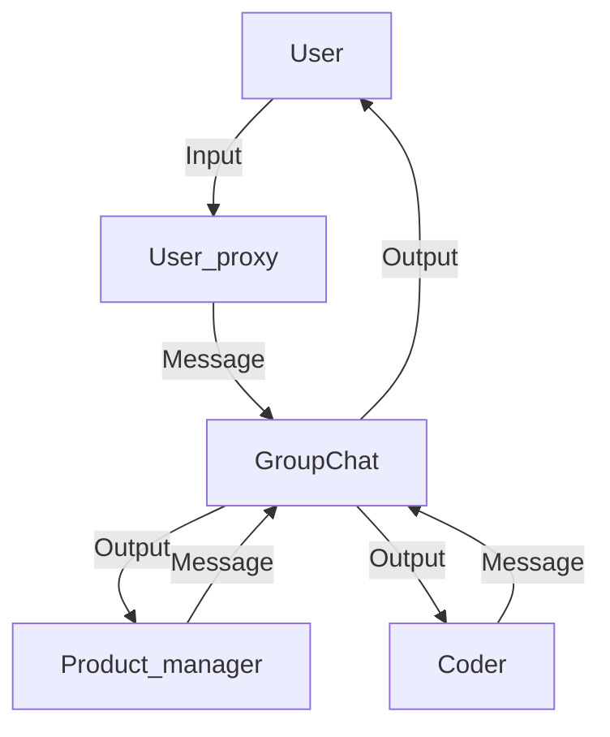

## Module: agent_groupchat.py
- **Module Name**: agent_groupchat.py

- **Primary Objectives**: This module is an example of how to integrate MemGPT into an AutoGen group chat. It sets up a simulated group chat environment where a user interacts with two agents: a product manager and a coder. 

- **Critical Functions**: 
  - `create_autogen_memgpt_agent`: Creates a MemGPT agent for the group chat.
  - `create_memgpt_autogen_agent_from_config`: Creates a MemGPT agent from a given configuration.
  - `autogen.UserProxyAgent`: Creates a user agent.
  - `autogen.AssistantAgent`: Creates an assistant agent.
  - `autogen.GroupChat`: Initializes the group chat.
  - `autogen.GroupChatManager`: Manages the group chat.

- **Key Variables**:
  - `config_list` and `config_list_memgpt`: Configuration lists for AutoGen agents.
  - `USE_MEMGPT`, `USE_AUTOGEN_WORKFLOW`, `DEBUG`: Flags to control the behavior of the program.
  - `interface_kwargs`, `llm_config`, `llm_config_memgpt`: Configuration parameters.
  - `user_proxy`, `pm`, `coder`: Agents participating in the group chat.
  - `groupchat`, `manager`: Handles the group chat.

- **Interdependencies**: This module interacts with the AutoGen and MemGPT libraries.

- **Core vs. Auxiliary Operations**: The core operations involve setting up the group chat and managing the interactions between the user and the agents. Auxiliary operations include setting up the configuration and creating the agents.

- **Operational Sequence**: The module first sets up the configuration and creates the agents. Then, it initializes the group chat and begins the chat with a message from the user.

- **Performance Aspects**: The performance of this module would depend on the efficiency of the AutoGen and MemGPT libraries.

- **Reusability**: This module can be reused to set up different scenarios for a group chat with AutoGen and MemGPT agents. The agents, their roles, and the initial message can be customized.

- **Usage**: This module is used to simulate a group chat environment where a user interacts with two agents: a product manager and a coder.

- **Assumptions**: The module assumes that the necessary libraries are installed and the environment variables are set correctly. It also assumes that the user initiates the chat.
## Mermaid Diagram

