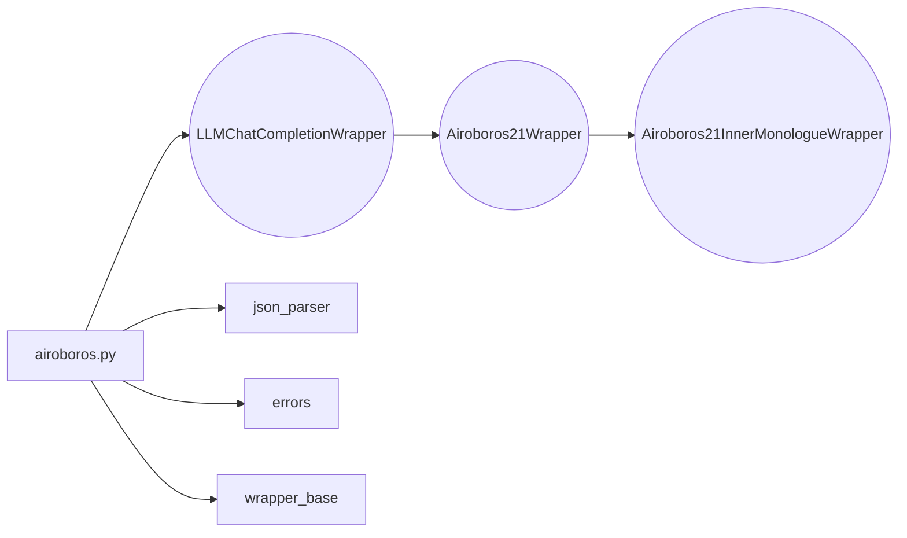

## Module: airoboros.py
- **Module Name**: airoboros.py

- **Primary Objectives**: The purpose of this module is to provide a wrapper for the Airoboros 70b v2.1 model, which only generates JSON and no inner thoughts. The module also contains a class for a wrapper that does include inner monologue as a field.

- **Critical Functions**: 
    - `chat_completion_to_prompt(self, messages, functions)`: This method formats a prompt for the Airoboros model.
    - `clean_function_args(self, function_name, function_args)`: This method cleans function arguments specific to the MemGPT model.
    - `output_to_chat_completion_response(self, raw_llm_output)`: This method transforms raw LLM output into a ChatCompletion style response.

- **Key Variables**: 
    - `simplify_json_content`: This variable determines whether to simplify the JSON content.
    - `clean_func_args`: This variable decides whether to clean function arguments.
    - `include_assistant_prefix`: This variable determines whether to include the assistant prefix.
    - `include_opening_brance_in_prefix`: This variable decides whether to include the opening brace in the prefix.
    - `include_section_separators`: This variable determines whether to include section separators.

- **Interdependencies**: This module interacts with the `wrapper_base` (from which it inherits), `json_parser` for cleaning JSON, and `errors` for handling exceptions.

- **Core vs. Auxiliary Operations**: Core operations include formatting prompts for the Airoboros model, cleaning function arguments, and transforming raw LLM output. Auxiliary operations include the handling of various flags to control aspects of the formatting and cleaning processes.

- **Operational Sequence**: The operational sequence is primarily driven by the `chat_completion_to_prompt` function, which formats the prompt, followed by the `clean_function_args` function to clean function arguments, and finally the `output_to_chat_completion_response` function to transform the output.

- **Performance Aspects**: Performance considerations are not explicitly mentioned in this module. However, the module is designed to handle JSON parsing, formatting, and cleaning efficiently.

- **Reusability**: The module is designed to be reusable, with the ability to handle various formatting and cleaning tasks related to the Airoboros model. It can be adapted for use with other models that require similar tasks.

- **Usage**: This module is used to interact with the Airoboros model, handling tasks such as formatting prompts, cleaning function arguments, and transforming model output.

- **Assumptions**: It is assumed that the first message is always from the system, and the role of the message can only be "user", "assistant", or "function". The module also assumes valid JSON format for the input and output.
## Mermaid Diagram

