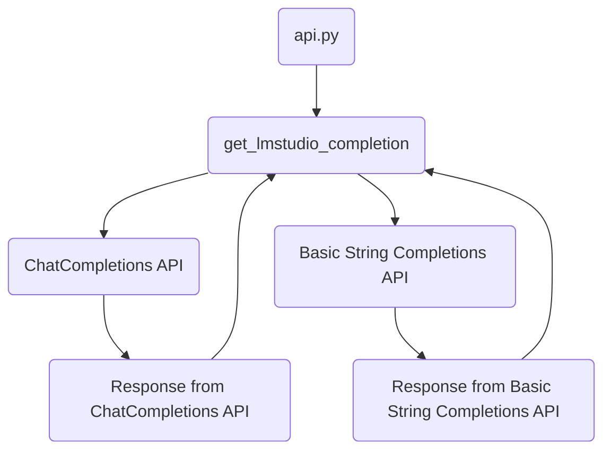
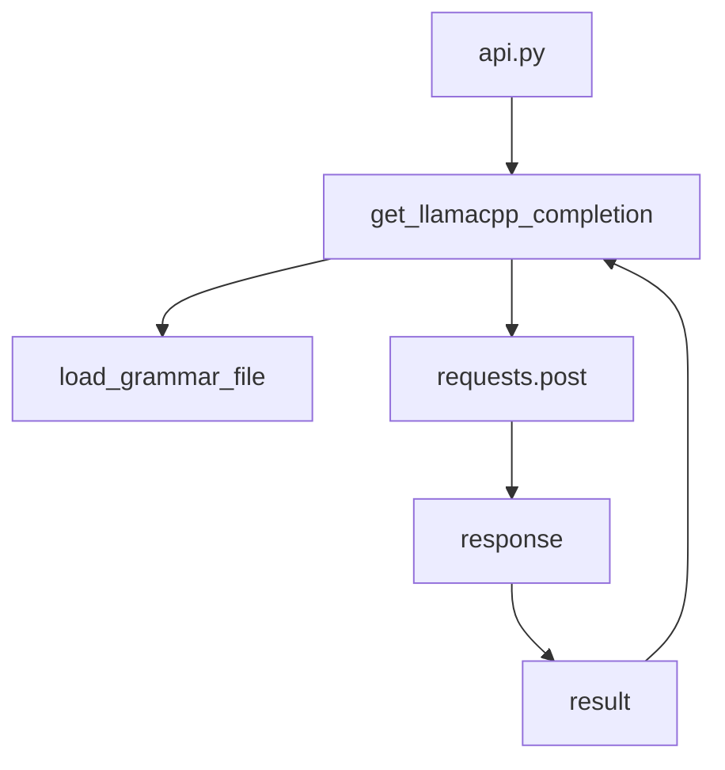
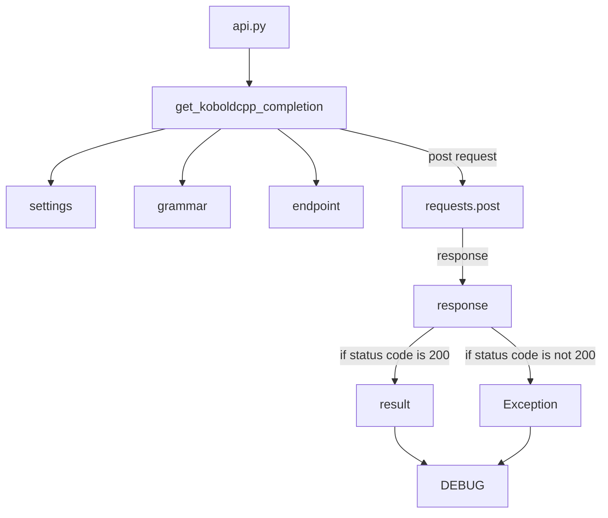
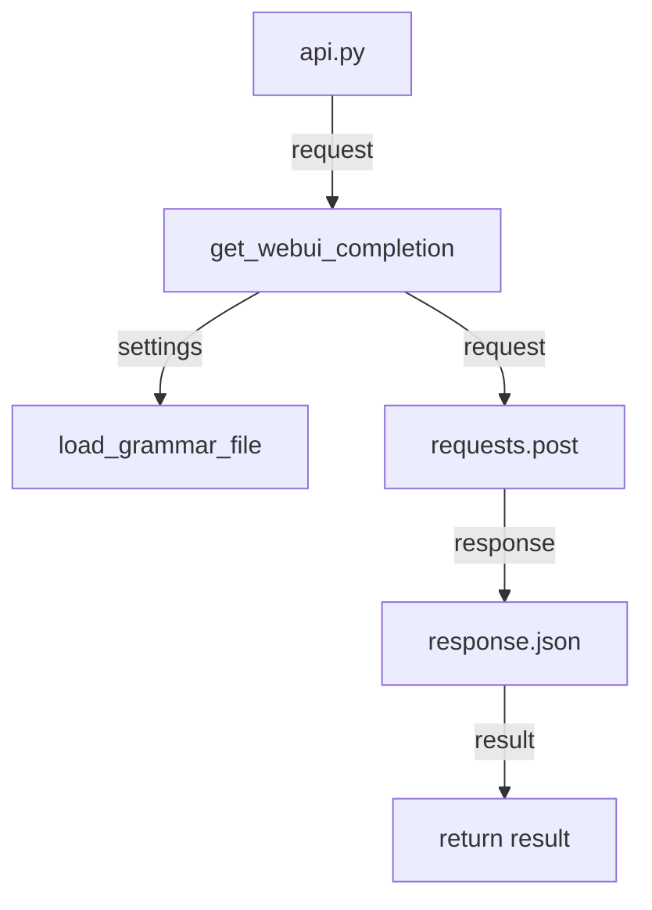
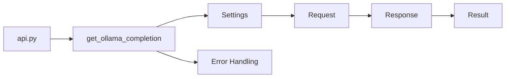

## Module: api.py
- **Module Name**: api.py
- **Primary Objectives**: The module's main purpose is to interact with an external API (LM Studio) to generate responses for prompts. It can either use the ChatCompletions API or the basic string completions API.
- **Critical Functions**: 
    - `get_lmstudio_completion(endpoint, prompt, context_window, settings=SIMPLE, api="chat")`: This function sends a request to the LM Studio API and retrieves the generated completion.
- **Key Variables**: 
    - `LMSTUDIO_API_CHAT_SUFFIX`: Used to construct the endpoint for the ChatCompletions API.
    - `LMSTUDIO_API_COMPLETIONS_SUFFIX`: Used to construct the endpoint for the basic string completions API.
    - `DEBUG`: A flag for debugging.
    - `endpoint`: The base URL for the API.
    - `prompt`: The input for the API to complete.
    - `context_window`: The maximum number of tokens to be generated.
    - `settings`: The settings for the generation.
    - `api`: The type of API to be used.
- **Interdependencies**: This module relies on the 'requests' library to send HTTP requests, the 'urllib.parse' library to join URLs, and the 'os' library to interact with the operating system. It also depends on the '.settings' and '..utils' modules for settings and utility functions respectively.
- **Core vs. Auxiliary Operations**: The core operation of this module is to interact with the LM Studio API to generate completions. The auxiliary operations include error handling and debugging.
- **Operational Sequence**: The function first checks if the number of tokens in the prompt exceeds the context window. Then, it prepares the request and sends it to the appropriate API endpoint based on the 'api' parameter. Finally, it handles the response, including error handling.
- **Performance Aspects**: Performance considerations include the number of tokens in the prompt and the context window, as well as the response time of the API.
- **Reusability**: The module is highly reusable as it provides a function to interact with the LM Studio API, which can be used in different contexts.
- **Usage**: This module is used to generate completions for prompts using the LM Studio API.
- **Assumptions**: The module assumes that the LM Studio API is available and reachable at the provided endpoint. It also assumes that the number of tokens in the prompt does not exceed the context window.
## Mermaid Diagram

## Module: api.py
- **Module Name**: api.py

- **Primary Objectives**: This module is designed to interact with the Llama.cpp API. It sends a POST request to the API with a provided prompt and receives a completion response.

- **Critical Functions**: 
    - `get_llamacpp_completion(endpoint, prompt, context_window, grammar=None, settings=SIMPLE)`: This function sends a POST request to the Llama.cpp API and returns the response. It also handles errors and exceptions related to the request.

- **Key Variables**: 
    - `LLAMACPP_API_SUFFIX`: This is the endpoint suffix for the Llama.cpp API.
    - `SIMPLE`: This is the default settings for the API request.
    - `endpoint`: This is the base URL for the API.
    - `prompt`: This is the input for the API.
    - `context_window`: This is the maximum context length.
    - `grammar`: This is an optional parameter for a grammar file.
    - `settings`: These are the settings for the API request.

- **Interdependencies**: This module depends on the `requests` library for sending HTTP requests, `os` and `urllib.parse` for URL and path handling, and custom modules `.settings` and `..utils` for loading settings and utility functions.

- **Core vs. Auxiliary Operations**: The core operation of this module is the `get_llamacpp_completion` function. The error handling within this function can be considered as auxiliary operations.

- **Operational Sequence**: The module first checks if the prompt exceeds the maximum context length. It then prepares the request with the provided settings and prompt. If a grammar file is provided, it is loaded and added to the request. The module then sends the POST request to the API and returns the response.

- **Performance Aspects**: The module doesn't seem to have any specific performance considerations. However, the performance might be influenced by the response time of the Llama.cpp API.

- **Reusability**: This module is highly reusable as it provides a function to interact with the Llama.cpp API which can be used in different contexts where API interaction is required.

- **Usage**: This module is used by importing it and calling the `get_llamacpp_completion` function with the necessary parameters.

- **Assumptions**: The module assumes that the provided endpoint starts with "http://" or "https://". It also assumes that the Llama.cpp server is running and reachable at the provided endpoint.
## Mermaid Diagram

## Module: api.py
- **Module Name**: The module is named as `api.py`.

- **Primary Objectives**: The purpose of this module is to interact with the Koboldcpp API to generate text completions based on the given prompt and settings. 

- **Critical Functions**: The main function in this module is `get_koboldcpp_completion()`. This function takes in parameters like endpoint, prompt, context_window, grammar, and settings. It sends a POST request to the API and returns the generated text. 

- **Key Variables**: The key variables in this module are `KOBOLDCPP_API_SUFFIX`, `DEBUG`, `SIMPLE`, `endpoint`, `prompt`, `context_window`, `grammar`, `settings`, `request`, `URI`, `response`, and `result`.

- **Interdependencies**: This module interacts with other system components such as `settings` and `utils` modules. It uses the `SIMPLE` settings and the `load_grammar_file` and `count_tokens` functions from these modules.

- **Core vs. Auxiliary Operations**: The core operation is the interaction with the Koboldcpp API to generate text. The auxiliary operations include token counting, grammar file loading, and error handling.

- **Operational Sequence**: The sequence of operation is as follows: 
  1. Count the tokens in the prompt.
  2. Prepare the request with the settings, prompt, and context window.
  3. Load the grammar file if provided.
  4. Send a POST request to the API.
  5. Handle any errors and return the generated text.

- **Performance Aspects**: Performance considerations include ensuring the prompt does not exceed the maximum context length, and handling any non-200 response codes from the API.

- **Reusability**: This module is highly reusable. The `get_koboldcpp_completion()` function can be used to interact with the Koboldcpp API from any part of the system that requires text generation.

- **Usage**: This module is used whenever text generation is required. It is invoked by providing the appropriate parameters to the `get_koboldcpp_completion()` function.

- **Assumptions**: The main assumption made in this module is that the Koboldcpp API is running and reachable at the provided endpoint.
## Mermaid Diagram

## Module: api.py
- **Module Name**: The module is named `api.py`.

- **Primary Objectives**: This module is designed to interact with a web-based API. Specifically, it sends a text prompt to the OpenAI API and retrieves the generated completion. 

- **Critical Functions**: 
  - `get_webui_completion`: This is the main function in the module. It takes in parameters like the endpoint, prompt, context window, settings, and grammar, and it sends a request to the OpenAI API. It then processes the response and returns the generated text.

- **Key Variables**: 
  - `WEBUI_API_SUFFIX`: This variable holds the suffix for the API endpoint.
  - `DEBUG`: This variable is a flag for debugging.
  - `endpoint`: This variable holds the URL of the API endpoint.
  - `prompt`: This variable contains the text prompt to be sent to the API.
  - `context_window`: This variable specifies the maximum number of tokens that the API should consider from the prompt.
  - `settings`: This variable contains settings for the text generation.
  - `grammar`: This variable, if provided, contains grammar rules for the text generation.
  - `request`: This variable holds the request to be sent to the API, including the prompt and settings.
  - `URI`: This variable holds the complete URL of the API endpoint.

- **Interdependencies**: This module depends on the `requests` library for sending HTTP requests, and the `urllib.parse` library for manipulating URLs. It also depends on the `settings` and `utils` modules in the same package.

- **Core vs. Auxiliary Operations**: The core operation of this module is sending the request to the API and processing the response, done in the `get_webui_completion` function. Auxiliary operations include counting tokens in the prompt, loading a grammar file, and validating the endpoint URL.

- **Operational Sequence**: The `get_webui_completion` function first counts the tokens in the prompt and validates the context window. It then prepares the request, including setting the grammar if provided. It validates the endpoint URL, sends the request to the API, and processes the response. If the response is successful, it extracts the generated text and returns it.

- **Performance Aspects**: The performance of this module largely depends on the performance of the OpenAI API. If the API is slow or unresponsive, the module will also be slow. The module also includes some error handling for non-200 response codes.

- **Reusability**: This module is quite reusable. The `get_webui_completion` function can be used with any endpoint and text prompt, and with any settings and grammar that are compatible with the OpenAI API.

- **Usage**: This module is used by importing it and calling the `get_webui_completion` function with the appropriate parameters.

- **Assumptions**: This module assumes that the OpenAI API is available at the provided endpoint and that it responds with a JSON object that includes a `choices` array with a `text` field. It also assumes that the `settings` and `grammar` parameters are compatible with the API.
## Mermaid Diagram

## Module: api.py
- **Module Name**: The module name is `api.py`.

- **Primary Objectives**: This module is designed to send a POST request to a specified API endpoint and return the response. It is particularly designed to work with the Ollama API for text generation.

- **Critical Functions**: 
  - `get_ollama_completion`: This function takes in several parameters including the API endpoint, the model to be used, the prompt, the context window, settings, and grammar. It constructs the API request, sends it, and returns the response.

- **Key Variables**: 
  - `OLLAMA_API_SUFFIX`: This is the suffix for the API endpoint.
  - `DEBUG`: This boolean variable is used for debugging purposes.
  - `request`: This dictionary contains the data to be sent in the API request.

- **Interdependencies**: This module depends on several other modules including `os`, `requests`, `urllib.parse`, and local modules such as `settings` and `utils`.

- **Core vs. Auxiliary Operations**: 
  - Core Operations: The core operation is the `get_ollama_completion` function which sends the API request and returns the response.
  - Auxiliary Operations: Error handling and debugging print statements are auxiliary operations.

- **Operational Sequence**: The function first checks the validity of the inputs, then constructs the API request, sends it, and returns the response.

- **Performance Aspects**: The performance of this module is dependent on the responsiveness of the API it interacts with. Error handling is implemented to manage potential issues.

- **Reusability**: This module is specific to the Ollama API but can be adapted for use with other APIs that require similar request structures.

- **Usage**: This module is used to interact with the Ollama API, sending a POST request and returning the received response.

- **Assumptions**: The module assumes that the API endpoint is correctly formatted and the API server is reachable. It also assumes that the `model` parameter is not `None`.
## Mermaid Diagram

