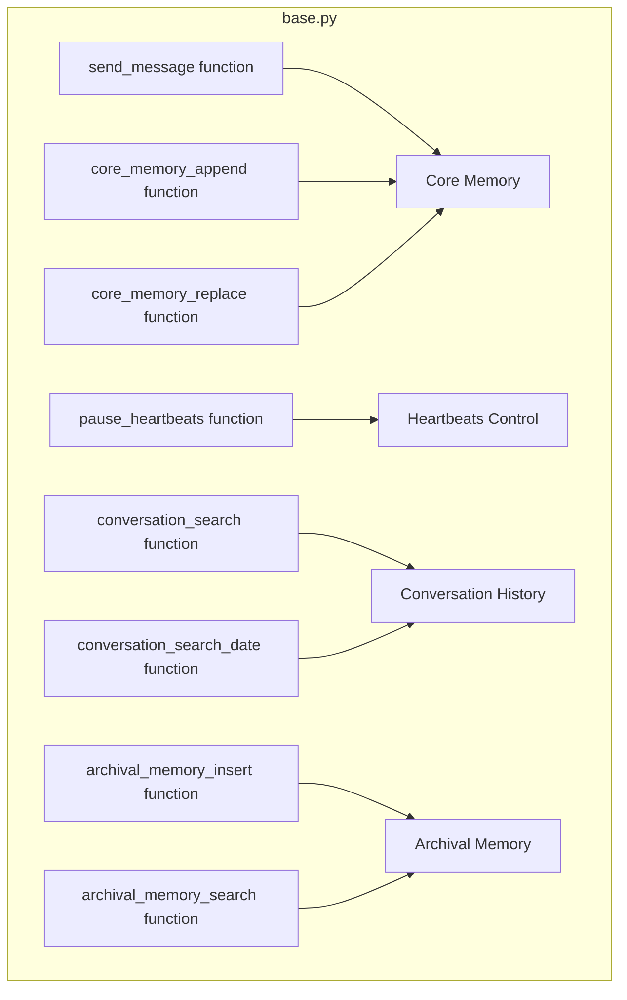

## Module: base.py
- **Module Name**: base.py

- **Primary Objectives**: This module provides a set of functions for interacting with a human user, managing conversation and memory, and performing search operations within the conversation and archival memory.

- **Critical Functions**: 
  1. `send_message()`: Sends a message to the human user.
  2. `pause_heartbeats()`: Temporarily ignore timed heartbeats.
  3. `core_memory_append()`: Appends content to a section of the core memory.
  4. `core_memory_replace()`: Replaces content in a section of the core memory.
  5. `conversation_search()`: Searches prior conversation history using case-insensitive string matching.
  6. `conversation_search_date()`: Searches prior conversation history using a date range.
  7. `archival_memory_insert()`: Adds content to archival memory.
  8. `archival_memory_search()`: Searches archival memory using semantic (embedding-based) search.

- **Key Variables**: 
  1. `message`: The message content to be sent or processed.
  2. `minutes`: The number of minutes to ignore heartbeats for.
  3. `name`, `content`, `old_content`, `new_content`: Variables related to memory management.
  4. `query`, `page`, `start_date`, `end_date`: Variables related to search operations.

- **Interdependencies**: This module interacts with the `interface`, `memory`, and `persistence_manager` components of the system.

- **Core vs. Auxiliary Operations**: Core operations include sending messages, managing memory, and performing search operations. Auxiliary operations include pausing heartbeats and formatting search results.

- **Operational Sequence**: 
  1. A message is sent or a command is given.
  2. The appropriate function is invoked, such as sending a message, updating memory, or performing a search.
  3. The function performs its task and returns a result or status message.

- **Performance Aspects**: This module is designed for efficient memory management and search operations. It uses case-insensitive string matching and semantic search for efficient retrieval of conversation history and archival memory.

- **Reusability**: The functions provided in this module are general-purpose and can be reused across different conversations and sessions.

- **Usage**: This module is used to manage the conversation with the user, update and query the conversation and archival memory, and control the system's responsiveness.

- **Assumptions**: 
  1. It is assumed that the input parameters for each function are provided in the correct format and type.
  2. It is also assumed that the memory management and persistence components are functioning correctly.
## Mermaid Diagram

