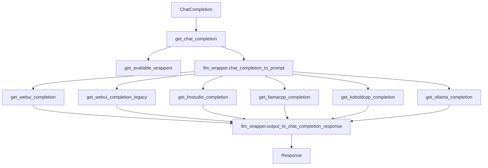

## Module: chat_completion_proxy.py
- **Module Name**: The module name is "chat_completion_proxy.py".

- **Primary Objectives**: The primary purpose of this module is to create a drop-in replacement for an agent's ChatCompletion call that runs on an OpenLLM backend. It facilitates communication with the backend, converts the message sequence into a prompt that the model expects, and processes the response.

- **Critical Functions**:
  - `get_chat_completion`: This is the main function of the module. It requires the model, messages, context_window, endpoint, and endpoint_type. It handles the communication with the backend, the conversion of the message sequence into a prompt, and the processing of the response.
  - `get_available_wrappers`: This function returns all available wrappers.
  - `get_webui_completion`, `get_webui_completion_legacy`, `get_lmstudio_completion`, `get_llamacpp_completion`, `get_koboldcpp_completion`, `get_ollama_completion`: These functions are used to get completions from different types of endpoints.

- **Key Variables**:
  - `endpoint`: This is the base URL of the API.
  - `endpoint_type`: This determines the type of endpoint to be used.
  - `DEBUG`: This is a boolean variable used for debugging.
  - `has_shown_warning`: This is used to control the display of warnings.
  - `available_wrappers`: This is a list of all available wrappers.

- **Interdependencies**: This module interacts with several other system components. It imports functions from other modules such as `webui.api`, `webui.legacy_api`, `lmstudio.api`, `llamacpp.api`, `koboldcpp.api`, `ollama.api`, `llm_chat_completion_wrappers`, `constants`, `utils`, `prompts.gpt_summarize`, and `errors`.

- **Core vs. Auxiliary Operations**: The core operation of this module is the `get_chat_completion` function, which communicates with the backend, converts the message sequence into a prompt, and processes the response. Auxiliary operations include the retrieval of available wrappers and the processing of different types of completions.

- **Operational Sequence**: The operational sequence starts with the `get_chat_completion` function, which checks the validity of the input, determines the wrapper to use, converts the message sequence into a prompt, gets the completion from the appropriate endpoint, and processes the response.

- **Performance Aspects**: The performance of this module depends on the efficiency of the conversion of the message sequence into a prompt, the speed of the communication with the backend, and the processing of the response.

- **Reusability**: This module is highly reusable. It can be used with different models, messages, and endpoints.

- **Usage**: This module is used to create a drop-in replacement for an agent's ChatCompletion call that runs on an OpenLLM backend.

- **Assumptions**: The module assumes that the context_window, endpoint, and endpoint_type are provided for the `get_chat_completion` function. It also assumes that the endpoint is reachable and returns a valid response.
## Mermaid Diagram

