## Module: cli.py
- **Module Name**: cli.py
- **Primary Objectives**: The module is primarily used for running and configuring the MemGPT agent. It also contains functions to attach data to the agent and check the version.
- **Critical Functions**:
    - `run()`: This method is used to start chatting with a MemGPT agent. It includes various parameters like persona, agent, human, model, debug, etc.
    - `attach()`: This method is used to load the data contained in a data source into the agent's memory.
    - `version()`: This method is used to print and return the version of memgpt.
- **Key Variables**:
    - `agent`: Specifies the agent name.
    - `persona`: Specifies the persona.
    - `human`: Specifies the human.
    - `model`: Specifies the LLM model.
    - `debug`: Enables debugging output.
    - `config`: Holds the configuration for MemGPT.
- **Interdependencies**: This module interacts with several other modules such as `memgpt`, `typer`, `json`, `sys`, `io`, `logging`, `os`, `prettytable`, `questionary`, `openai`, `llama_index`, `memgpt.interface`, `memgpt.cli.cli_config`, `memgpt.agent`, `memgpt.system`, `memgpt.presets.presets`, `memgpt.constants`, `memgpt.personas.personas`, `memgpt.humans.humans`, `memgpt.utils`, `memgpt.persistence_manager`, `memgpt.config`, `memgpt.embeddings`, and `memgpt.openai_tools`.
- **Core vs. Auxiliary Operations**: The core operations of this module are running the agent, attaching data to the agent, and checking the version. Auxiliary operations include setting up the logger, loading or creating agent configuration, and pretty printing agent configuration.
- **Operational Sequence**: The module starts with importing necessary libraries and then defines the main functions. The `run` function is the main entry point for running the agent. If the agent config doesn't exist, it will create a new one; otherwise, it will use the existing one. The `attach` function is for attaching data to the agent, and `version` is for checking the memgpt version.
- **Performance Aspects**: The performance of this module largely depends on the configurations set and the data provided. The module uses an efficient way of loading data into the agent's memory in batches to optimize memory usage.
- **Reusability**: The module is highly reusable. It's designed to run different agents with various configurations, attach different data sources to the agents, and check the version.
- **Usage**: This module is used as a command-line interface for interacting with the MemGPT agent.
- **Assumptions**: The module assumes that the necessary libraries are installed and the agent configurations are set correctly. It also assumes that the data source provided in the `attach` function contains the correct data for the agent.
## Mermaid Diagram

```mermaid
graph TD
  User -->|Input| run
  run -->|Processing| typer
  typer -->|Processing| json
  json -->|Processing| sys
  sys -->|Processing| io
  io -->|Processing| logging
  logging -->|Processing| os
  os -->|Processing| PrettyTable
  PrettyTable -->|Processing| questionary
  questionary -->|Processing| openai
  openai -->|Processing| llama_index
  llama_index -->|Processing| VectorStoreIndex
  VectorStoreIndex -->|Processing| SimpleDirectoryReader
  SimpleDirectoryReader -->|Processing| ServiceContext
  ServiceContext -->|Processing| CLIInterface
  CLIInterface -->|Processing| configure
  configure -->|Processing| agent
  agent -->|Processing| system
  system -->|Processing| presets
  presets -->|Processing| constants
  constants -->|Processing| personas
  personas -->|Processing| humans
  humans -->|Processing| utils
  utils -->|Processing| LocalStateManager
  LocalStateManager -->|Processing| MemGPTConfig
  MemGPTConfig -->|Processing| AgentConfig
  AgentConfig -->|Processing| MEMGPT_DIR
  MEMGPT_DIR -->|Processing| Agent
  Agent -->|Processing| embedding_model
  embedding_model -->|Processing| configure_azure_support
  configure_azure_support -->|Processing| check_azure_embeddings
  check_azure_embeddings -->|Output| run
```

