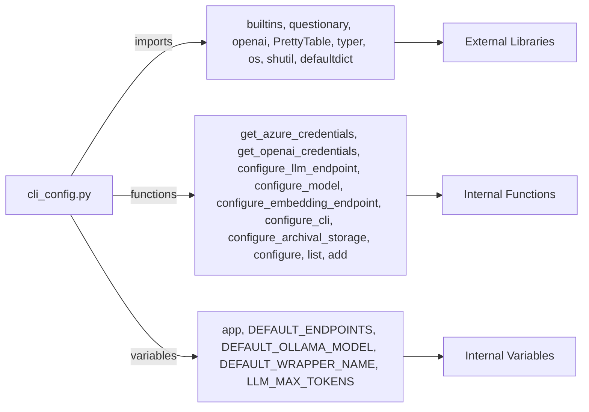

## Module: cli_config.py
- **Module Name**: This is the "cli_config.py" module. 

- **Primary Objectives**: This module is responsible for configuring the MemGPT model and its components. It allows for the setting of various parameters and elements including model endpoints, model types, context window, embedding endpoints, CLI configurations, and archival storage among others. 

- **Critical Functions**: 
  - `get_azure_credentials()`: Retrieves Azure credentials from the environment variables.
  - `get_openai_credentials()`: Retrieves OpenAI credentials from the environment variables.
  - `configure_llm_endpoint(config: MemGPTConfig)`: Configures the model endpoint.
  - `configure_model(config: MemGPTConfig, model_endpoint_type: str)`: Configures the model, model wrapper and context window.
  - `configure_embedding_endpoint(config: MemGPTConfig)`: Configures the embedding endpoint.
  - `configure_cli(config: MemGPTConfig)`: Configures the CLI with preset, persona, human, and agent.
  - `configure_archival_storage(config: MemGPTConfig)`: Configures the archival storage backend.
  - `configure()`: Updates default MemGPT configurations.
  - `list(option: str)`: Lists all agents, humans, personas or data sources.
  - `add(option: str, name: str, text: str, filename: str)`: Adds a persona or human.

- **Key Variables**: 
  - `app`: Instance of the Typer application.
  - `azure_key`, `azure_endpoint`, `azure_version`, `azure_deployment`, `azure_embedding_deployment`: Azure credentials.
  - `openai_key`: OpenAI API key.
  - `model_endpoint_type`, `model_endpoint`: Model endpoint configurations.
  - `model`, `model_wrapper`, `context_window`: Model configurations.
  - `embedding_endpoint_type`, `embedding_endpoint`, `embedding_dim`: Embedding configurations.
  - `default_preset`, `default_persona`, `default_human`, `default_agent`: CLI configurations.
  - `archival_storage_type`, `archival_storage_uri`: Archival storage configurations.

- **Interdependencies**: This module interacts with other system components such as the `questionary`, `typer`, `os`, `shutil`, `openai`, `prettytable`, `memgpt` and other utility modules.

- **Core vs. Auxiliary Operations**: The core operations of this module are the configuration of the model, embedding endpoint, CLI, and archival storage. Auxiliary operations include retrieving Azure and OpenAI credentials, listing agents, humans, personas or data sources, and adding a persona or human.

- **Operational Sequence**: The sequence starts with retrieving credentials, then configuring the model endpoint, model, embedding endpoint, CLI, and archival storage. After configuration, the module can list or add agents, humans, personas, or data sources.

- **Performance Aspects**: The performance of this module depends on the successful retrieval of credentials and configuration of the different components. Errors in any of these steps can lead to performance issues.

- **Reusability**: This module is highly reusable as it provides a standardized way to configure the MemGPT model and its components, which can be used across different projects and applications.

- **Usage**: This module is used to configure the MemGPT model and its components. It can be used by calling the `configure()` function, after which the model can be used as per the set configurations.

- **Assumptions**: The module assumes that the necessary environment variables for Azure and OpenAI are set. It also assumes that the directories for personas and humans exist.
## Mermaid Diagram

