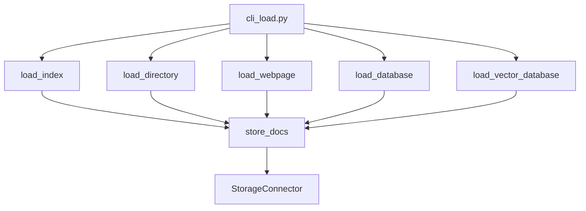

## Module: cli_load.py
- **Module Name**: cli_load.py
- **Primary Objectives**: This Python module is designed to load data into MemGPT's archival storage. It supports loading data from different sources such as directories, webpages, databases, and vector databases.
- **Critical Functions**: 
  - `store_docs(name, docs, show_progress=True)`: This function embeds and stores documents.
  - `load_index(name: str, dir: str)`: This function loads a LlamaIndex saved VectorIndex into MemGPT.
  - `load_directory(name: str, input_dir: str, input_files: List[str], recursive: bool)`: This function loads data from a directory.
  - `load_webpage(name: str, urls: List[str])`: This function loads data from webpages.
  - `load_database(name: str, query: str, dump_path: str, scheme: str, host: str, port: int, user: str, password: str, dbname: str)`: This function loads data from a database.
  - `load_vector_database(name: str, uri: str, table_name: str, text_column: str, embedding_column: str)`: This function loads pre-computed embeddings into MemGPT from a database.
- **Key Variables**: 
  - `name`: The name of the dataset to load.
  - `docs`: The documents to be embedded and stored.
  - `dir`: The path to the directory containing the index.
  - `input_dir`, `input_files`: The path to the directory or files containing the dataset.
  - `urls`: The list of URLs to load.
  - `query`, `dump_path`, `scheme`, `host`, `port`, `user`, `password`, `dbname`: The parameters for database connection.
  - `uri`, `table_name`, `text_column`, `embedding_column`: The parameters for vector database connection.
- **Interdependencies**: This module interacts with other system components such as `memgpt.embeddings`, `memgpt.connectors.storage`, `memgpt.config`, and `llama_index`.
- **Core vs. Auxiliary Operations**: The core operations of this module are the loading of data from different sources and storing them. The auxiliary operations include the embedding of documents and creating storage connectors.
- **Operational Sequence**: The sequence of operations depends on the source of the data. The general sequence is to load the data, embed the documents, and store them into the storage.
- **Performance Aspects**: Performance considerations include the efficiency of data loading, embedding, and storing. The module uses tqdm for progress bars to provide feedback on long-running operations.
- **Reusability**: This module is highly reusable as it provides a generic framework for loading data from different sources. The loading functions can be easily adapted for different sources or datasets.
- **Usage**: The module is used by calling the appropriate load function with the necessary arguments. For example, to load data from a directory, you would call `load_directory()` with the name of the dataset and the directory path.
- **Assumptions**: The module assumes that the provided data is in a suitable format for the chosen load function. For example, when loading data from a database, it assumes that the database connection parameters are correct. It also assumes that the embedding dimension of the loaded data matches the configuration.
## Mermaid Diagram

