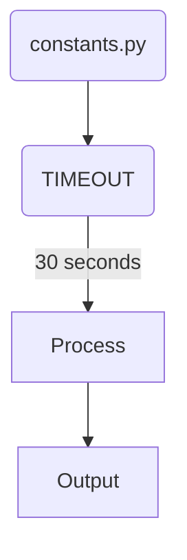
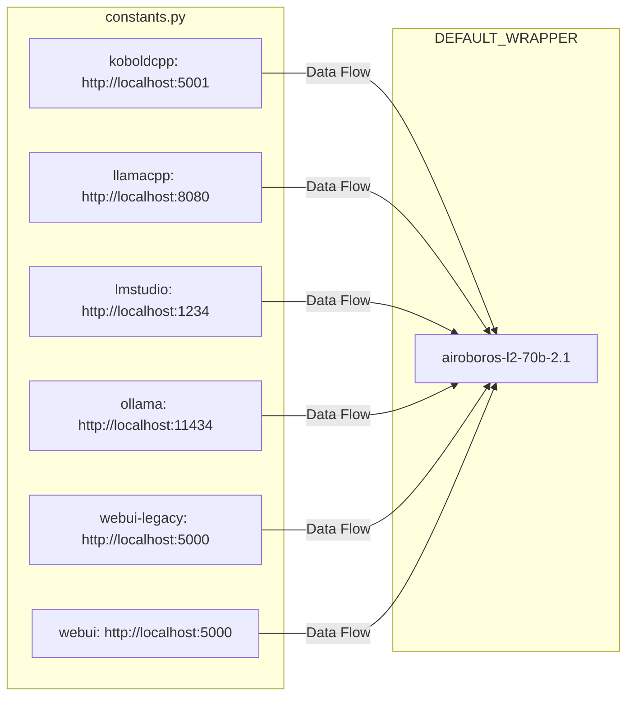
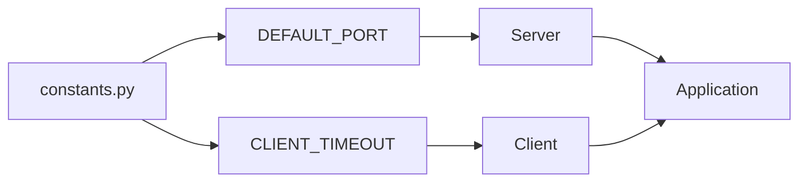

```mermaid
graph TB
    A((User)) -->|Request| B[constants.py]
    B --> C{MEMGPT_DIR}
    B --> D{DEFAULT_MEMGPT_MODEL}
    B --> E{FIRST_MESSAGE_ATTEMPTS}
    B --> F{INITIAL_BOOT_MESSAGE}
    B --> G{INITIAL_BOOT_MESSAGE_SEND_MESSAGE_THOUGHT}
    B --> H{STARTUP_QUOTES}
    B --> I{INITIAL_BOOT_MESSAGE_SEND_MESSAGE_FIRST_MSG}
    B --> J{LLM_MAX_TOKENS}
    B --> K{MESSAGE_SUMMARY_WARNING_FRAC}
    B --> L{MESSAGE_SUMMARY_WARNING_STR}
    B --> M{MESSAGE_SUMMARY_TRUNC_TOKEN_FRAC}
    B --> N{MESSAGE_SUMMARY_TRUNC_KEEP_N_LAST}
    B --> O{CORE_MEMORY_PERSONA_CHAR_LIMIT}
    B --> P{CORE_MEMORY_HUMAN_CHAR_LIMIT}
    B --> Q{MAX_PAUSE_HEARTBEATS}
    B --> R{MESSAGE_CHATGPT_FUNCTION_MODEL}
    B --> S{MESSAGE_CHATGPT_FUNCTION_SYSTEM_MESSAGE}
    B --> T{REQ_HEARTBEAT_MESSAGE}
    B --> U{FUNC_FAILED_HEARTBEAT_MESSAGE}
    B --> V{FUNCTION_PARAM_NAME_REQ_HEARTBEAT}
    B --> W{FUNCTION_PARAM_TYPE_REQ_HEARTBEAT}
    B --> X{FUNCTION_PARAM_DESCRIPTION_REQ_HEARTBEAT}
    B --> Y{RETRIEVAL_QUERY_DEFAULT_PAGE_SIZE}
    B -->|Response| A
```

## Module: constants.py
- **Module Name**: The module name is "constants.py".

- **Primary Objectives**: The primary purpose of this module is to define constants that are used throughout the application. In this case, it defines a single constant, TIMEOUT, which presumably is used to set a time limit for some operation or operations.

- **Critical Functions**: This module does not contain any functions or methods. It only defines a constant.

- **Key Variables**: The key variable in this module is TIMEOUT. It is set to 30, which is presumably a time in seconds. 

- **Interdependencies**: As a constants module, it may not have dependencies of its own, but other modules in the system might depend on the constants it defines. Any module that needs to use a timeout of 30 seconds would likely import this constant from this module.

- **Core vs. Auxiliary Operations**: This module does not perform any operations, core or auxiliary. It simply provides a value that other modules can use.

- **Operational Sequence**: There is no operational sequence in this module, as it does not perform operations.

- **Performance Aspects**: There are no direct performance aspects to this module as it simply defines a constant. However, the value of the TIMEOUT constant could indirectly affect performance in other modules that use it. For example, if TIMEOUT is used as a limit for a network operation, setting it to a higher value could slow down the application, while setting it to a lower value could lead to incomplete operations or errors.

- **Reusability**: This module is highly reusable. Any part of the system that needs to use a timeout of 30 seconds can import the TIMEOUT constant from this module. Furthermore, if the need arises for a different timeout value in the future, a new constant can be added to this module.

- **Usage**: To use this module, other modules would import it and then use the TIMEOUT constant. For example, in Python, this might look like: `from constants import TIMEOUT`.

- **Assumptions**: The main assumption here is that TIMEOUT is a suitable name for this constant, and that a value of 30 seconds is appropriate for the timeout in question. Further assumptions might depend on how and where the TIMEOUT constant is used in the rest of the system.
## Mermaid Diagram

## Module: constants.py
- **Module Name**: The module is named "constants.py".

- **Primary Objectives**: This module's purpose is to define the default endpoints for different services and the default AI model and wrapper. It serves as a centralized place for managing these constants, which are used throughout the application.

- **Critical Functions**: This module does not contain any functions or methods. It only defines constant values.

- **Key Variables**: 
    - `DEFAULT_ENDPOINTS`: This is a dictionary that maps service names to their default endpoints.
    - `DEFAULT_OLLAMA_MODEL`: This is a string that specifies the default AI model.
    - `DEFAULT_WRAPPER`: This is an instance of the default wrapper class.
    - `DEFAULT_WRAPPER_NAME`: This is a string that specifies the name of the default wrapper.

- **Interdependencies**: This module is dependent on the `airoboros` module from `memgpt.local_llm.llm_chat_completion_wrappers`.

- **Core vs. Auxiliary Operations**: As this module only defines constants, it does not have any operations.

- **Operational Sequence**: There is no operational sequence in this module as it only defines constants.

- **Performance Aspects**: Since this module only contains constant definitions, it does not have significant performance considerations.

- **Reusability**: This module is highly reusable. The constants defined in this module can be imported and used in any other module that requires these values.

- **Usage**: Other modules import this module when they need to use the constants it defines. For example, a module that needs to make a request to one of the services would import `DEFAULT_ENDPOINTS` and use it to get the endpoint for the service.

- **Assumptions**: It is assumed that the endpoints and the AI model specified in this module are correct and available. If these values are incorrect or the services or model are not available, it could cause errors in other parts of the application that use these constants.
## Mermaid Diagram

## Module: constants.py
- **Module Name**: constants.py

- **Primary Objectives**: This module is designed to store and manage constants, including directory paths, model names, message strings, token limits, memory limits, and function parameters. It provides a centralized location for managing these constants, reducing the likelihood of errors and making the code easier to maintain.

- **Critical Functions**: This module does not contain any functions. It only declares and initializes constants.

- **Key Variables**: Some of the key variables include:
  - `MEMGPT_DIR`: Directory path for memgpt.
  - `DEFAULT_MEMGPT_MODEL`: Default model used for memgpt.
  - `LLM_MAX_TOKENS`: Dictionary that maps models to their maximum token limit.
  - `MESSAGE_SUMMARY_WARNING_FRAC`, `MESSAGE_SUMMARY_TRUNC_TOKEN_FRAC`, and `MESSAGE_SUMMARY_TRUNC_KEEP_N_LAST`: Constants for conversation length and truncation.
  - `CORE_MEMORY_PERSONA_CHAR_LIMIT` and `CORE_MEMORY_HUMAN_CHAR_LIMIT`: Constants for memory limits.
  - `RETRIEVAL_QUERY_DEFAULT_PAGE_SIZE`: Default page size for retrieval queries.

- **Interdependencies**: This module does not interact with other system components directly. However, the constants defined here are likely used across the system, creating indirect dependencies.

- **Core vs. Auxiliary Operations**: All operations in this module are auxiliary since they support the core functionalities of the system by providing constants.

- **Operational Sequence**: Not applicable as this module does not contain any operational flow.

- **Performance Aspects**: This module does not have any direct impact on performance. However, the constants defined here, such as token limits or memory limits, can indirectly affect the system's performance.

- **Reusability**: This module is highly reusable. The constants defined here can be imported and used in any other module in the system.

- **Usage**: This module is used to provide constants to the rest of the system. Other modules import the required constants from this module.

- **Assumptions**: The module assumes that the directory in which memgpt is stored and the default model will not change. It also assumes that the token limits for the models are fixed.
## Mermaid Diagram

## Module: constants.py
**Module Name**: constants.py

**Primary Objectives**: This module is designed to store constant values that are used throughout the application. This can include configuration settings, default values, and any other values that remain consistent across the application.

**Critical Functions**: As this is a constants file, it does not contain any functions or methods. Its primary role is to store static data.

**Key Variables**: 
- `DEFAULT_PORT`: This variable is used to define the default port on which the application will run.
- `CLIENT_TIMEOUT`: This variable is used to define the maximum amount of time the application will wait for a client response before timing out.

**Interdependencies**: This module interacts with any other modules or components that require the use of these constants. These could be networking modules, client modules, server modules, etc.

**Core vs. Auxiliary Operations**: The operations of this module are auxiliary, as it does not perform any core functionalities but provides support to them by supplying constant values.

**Operational Sequence**: There is no distinct flow in this module as it only contains static data.

**Performance Aspects**: This module does not have any direct impact on performance. However, the values of the constants can indirectly affect the performance of the modules that use them. For example, a lower `CLIENT_TIMEOUT` could make the application seem more responsive at the risk of prematurely timing out slower clients.

**Reusability**: This module is highly reusable. The constants defined in this module can be imported and used in any other module within the application. Changes to the constants will also be reflected in all modules that import them.

**Usage**: This module is used by importing the required constants into another module. For example, `from constants import DEFAULT_PORT`.

**Assumptions**: It is assumed that the values of `DEFAULT_PORT` and `CLIENT_TIMEOUT` are suitable for the application's needs and that any changes to these values are made with an understanding of their impact on the rest of the application.
## Mermaid Diagram

