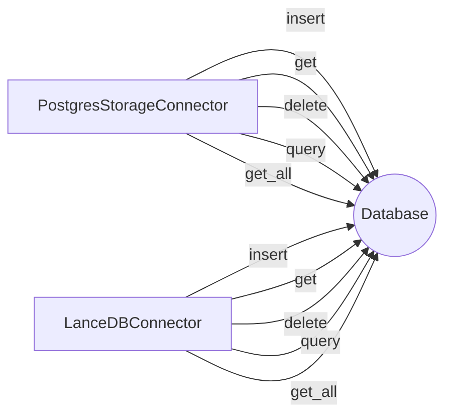

## Module: db.py
- **Module Name**: db.py

- **Primary Objectives**: This module is designed to provide database connectivity and operations for a system, likely an AI model, that works with textual passages. It supports two types of database connectors: PostgresStorageConnector and LanceDBConnector.

- **Critical Functions**: 
   - `get_db_model(table_name: str)`: Generates a SQLAlchemy model for the provided table name.
   - `PostgresStorageConnector`: A class that provides methods for connecting to a PostgreSQL database and performing CRUD operations.
   - `LanceDBConnector`: A class that provides methods for connecting to a LanceDB database and performing CRUD operations.

- **Key Variables**: 
   - `table_name`: The name of the table in the database.
   - `config`: An instance of the MemGPTConfig class.
   - `engine`: SQLAlchemy engine instance for database connectivity.
   - `Session`: SQLAlchemy sessionmaker instance for database session management.

- **Interdependencies**: This module relies on several external libraries such as SQLAlchemy, psycopg, pgvector, and lancedb for database operations. It also uses MemGPTConfig and StorageConnector from the memgpt module.

- **Core vs. Auxiliary Operations**: Core operations include creating database models, establishing database connections, and performing CRUD operations. Auxiliary operations include sanitizing table names and listing loaded data.

- **Operational Sequence**: The typical sequence of operations would involve initializing a database connector (either PostgresStorageConnector or LanceDBConnector), specifying the table name, and then performing the desired database operations (insertion, retrieval, deletion, etc.).

- **Performance Aspects**: The module uses pagination to retrieve records, which can help manage memory usage when dealing with large datasets. It also uses SQLAlchemy's sessionmaker for efficient database session management.

- **Reusability**: The module is highly reusable. The database model and connector classes can be used with different table names and configurations, making them adaptable for various database schemas and systems.

- **Usage**: This module is used whenever the system needs to interact with a database, whether it's to store, retrieve, update, or delete data. 

- **Assumptions**: The module assumes that the database URI is provided in the MemGPTConfig. It also assumes that the Postgres database has the vector extension installed, and that the LanceDB database is accessible via the provided URI.
## Mermaid Diagram

