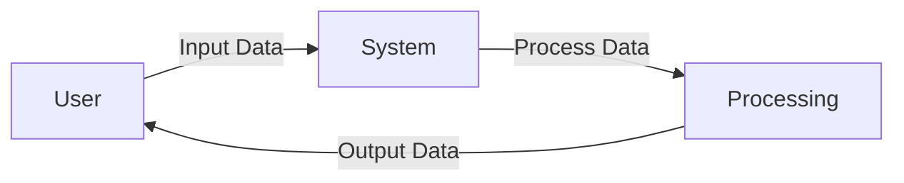

## Module: dolphin.py
- **Module Name**: dolphin.py

- **Primary Objectives**: This module is a wrapper for Dolphin 2.1 Mistral 7b, which is a language model. The module is designed to format prompts that only generate JSON and no inner thoughts. 

- **Critical Functions**: 
  - `__init__`: Initializes the Dolphin21MistralWrapper class with several parameters.
  - `chat_completion_to_prompt`: Converts chat completion to a prompt.
  - `create_function_description`: Creates a function description in airorobos style.
  - `create_function_call`: Converts ChatCompletion to Airoboros style function trace (in prompt).
  - `clean_function_args`: Cleans function arguments.
  - `output_to_chat_completion_response`: Turns raw LLM output into a ChatCompletion style response.

- **Key Variables**: 
  - `simplify_json_content`: Simplify the JSON content or not.
  - `clean_func_args`: Clean function arguments or not.
  - `include_assistant_prefix`: Include assistant prefix or not.
  - `include_opening_brance_in_prefix`: Include opening brace in prefix or not.
  - `include_section_separators`: Include section separators or not.

- **Interdependencies**: This module interacts with the wrapper_base and json_parser modules, as well as the errors module in the parent directory.

- **Core vs. Auxiliary Operations**: Core operations include creating function descriptions, cleaning function arguments, and converting outputs to chat completion responses. Auxiliary operations include initializing the class and formatting the prompt.

- **Operational Sequence**: The module begins by initializing the class and its parameters. It then converts chat completions to prompts, creates function descriptions, cleans function arguments, and finally converts outputs to chat completion responses.

- **Performance Aspects**: This module is designed for performance and efficiency, as it includes functions for cleaning arguments and simplifying JSON content.

- **Reusability**: This module can be reused in different contexts where Dolphin 2.1 Mistral 7b wrapper is needed. 

- **Usage**: The module is used by calling the Dolphin21MistralWrapper class and using its functions to work with the Dolphin 2.1 Mistral 7b language model.

- **Assumptions**: The module assumes that the input will be in a specific format, and it includes error handling to deal with scenarios where the input does not meet these assumptions.
## Mermaid Diagram

