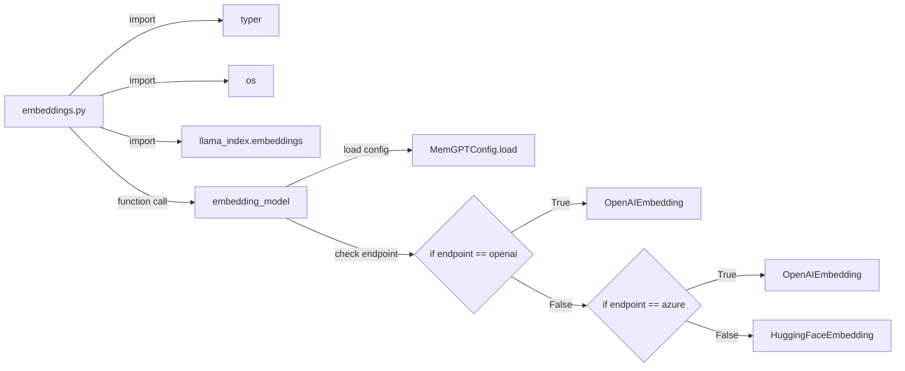

## Module: embeddings.py
- **Module Name**: The module name is `embeddings.py`.

- **Primary Objectives**: The purpose of this module is to return the LlamaIndex embedding model to be used for embeddings. It supports different types of embedding endpoints including OpenAI, Azure, and Hugging Face.

- **Critical Functions**: The main function in this module is `embedding_model()`. This function loads the configuration, checks the type of embedding endpoint (OpenAI, Azure, or default to Hugging Face), and returns the corresponding embedding model.

- **Key Variables**: 
    - `config`: Holds the loaded configuration.
    - `endpoint`: Stores the type of embedding endpoint.
    - `model`: The embedding model to be used.

- **Interdependencies**: This module interacts with other system components such as `typer`, `os`, `llama_index.embeddings`, `memgpt.config`, and potentially `HuggingFaceEmbedding`.

- **Core vs. Auxiliary Operations**: The core operation is the creation and return of the appropriate embedding model based on the configuration. The auxiliary operations include loading the configuration and setting the environment variable for Hugging Face.

- **Operational Sequence**: The function first loads the configuration, then checks the type of embedding endpoint. If it's OpenAI or Azure, it returns the corresponding embedding model. If not, it defaults to the Hugging Face model.

- **Performance Aspects**: The performance of this module depends on the efficiency of the chosen embedding model and the speed of the API endpoints.

- **Reusability**: This module is highly reusable as it allows for the flexible selection of an embedding model based on the configuration.

- **Usage**: This module is used whenever an embedding model is needed. The type of model returned is determined by the `embedding_endpoint_type` in the configuration.

- **Assumptions**: The module assumes that the configuration loaded correctly and that the specified embedding endpoint type is supported. It also assumes that the necessary API keys and endpoints are correctly provided in the configuration.
## Mermaid Diagram

