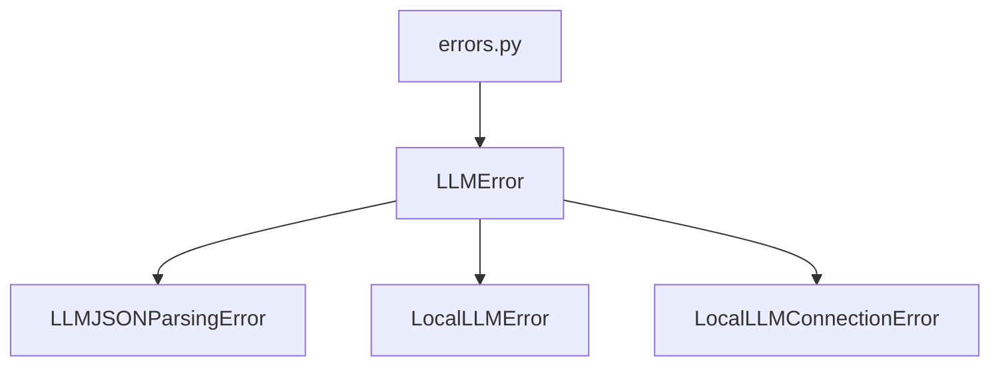

## Module: errors.py
- **Module Name**: The module is named `errors.py`.

- **Primary Objectives**: The primary purpose of this module is to define and handle various types of errors related to LLM (Local Link Manager). It provides a mechanism to raise and catch specific exceptions in the LLM context.

- **Critical Functions**: The main functions are the constructors (`__init__`) of the exception classes `LLMError`, `LLMJSONParsingError`, `LocalLLMError`, and `LocalLLMConnectionError`. They initialize the error messages for their respective exceptions.

- **Key Variables**: The key variable in this module is `self.message`, which stores the error message for each exception.

- **Interdependencies**: This module does not appear to interact directly with other system components, but it can be imported and used wherever error handling is necessary in the larger system context.

- **Core vs. Auxiliary Operations**: The core operations of this module are defining and initializing the exceptions. There do not appear to be any auxiliary operations.

- **Operational Sequence**: When an exception is raised, its `__init__` method is called, setting the `message` attribute. When the exception is caught, this message can be accessed and logged or displayed to provide information about the error.

- **Performance Aspects**: As this module is primarily related to error handling, its performance impact should be minimal. The main performance consideration is ensuring that exceptions are handled efficiently to avoid unnecessary disruptions to the program flow.

- **Reusability**: This module is highly reusable. The defined exceptions can be imported and used in any part of the system where LLM-related errors need to be handled.

- **Usage**: To use this module, import the required exceptions at the top of the Python file. When an error condition is detected, raise the appropriate exception. In the try/except block where the LLM operation is performed, catch the exception and handle it appropriately, such as by logging the error message and terminating the operation.

- **Assumptions**: The main assumption is that these exceptions will be raised and caught correctly in the rest of the system. It is also assumed that the error messages provided are sufficient to understand and address the error.
## Mermaid Diagram

