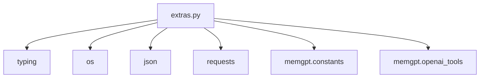

## Module: extras.py
- **Module Name**: extras.py

- **Primary Objectives**: This module is primarily designed to provide additional utility functions for interacting with the AI model, file handling, and generating HTTP requests.

- **Critical Functions**: 
  - `message_chatgpt`: This function sends a message to a basic AI, ChatGPT, and gets a reply. It does not retain memory of previous interactions.
  - `read_from_text_file`: This function reads lines from a text file, given a filename, starting line, and the number of lines to read.
  - `append_to_text_file`: This function appends content to a text file.
  - `http_request`: This function generates an HTTP request and returns the response.

- **Key Variables**: 
  - `message_sequence` in `message_chatgpt`: It's a list that holds system and user messages.
  - `filename`, `line_start`, `num_lines` in `read_from_text_file`: These variables are used to specify the file and the lines to read.
  - `filename`, `content` in `append_to_text_file`: These are used to specify the file and the content to append.
  - `method`, `url`, `payload_json` in `http_request`: These are used to specify the HTTP request details.

- **Interdependencies**: This module depends on the `os`, `json`, `requests`, `typing.Optional` libraries, and `memgpt.constants` and `memgpt.openai_tools` modules.

- **Core vs. Auxiliary Operations**: Core operations include sending messages to ChatGPT, reading from a text file, appending to a text file, and generating HTTP requests. Auxiliary operations include validation and error handling within these operations.

- **Operational Sequence**: Each function in the module can be used independently as per requirements. The sequence of operations would depend on the specific use case.

- **Performance Aspects**: The performance of this module depends on the efficiency of the I/O operations (file and HTTP requests) and the response time of the ChatGPT model.

- **Reusability**: Each function in the module is designed to be reusable in various scenarios - interacting with ChatGPT, handling text files, and making HTTP requests.

- **Usage**: This module is used when there's a need to interact with the ChatGPT model, perform file operations, or generate HTTP requests.

- **Assumptions**: 
  - The file paths provided exist and are accessible.
  - The message sent to ChatGPT is a full English sentence.
  - The HTTP method provided is valid and the URL is accessible.
  - For GET requests, the payload is ignored.
  - The payload for non-GET requests is a valid JSON string.
## Mermaid Diagram

