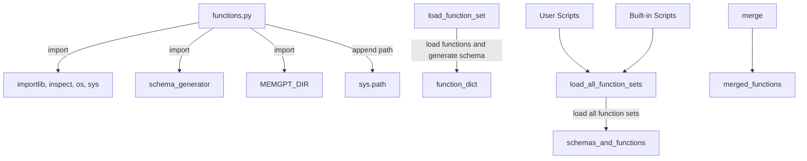

## Module: functions.py
- **Module Name**: The module name is `functions.py`.

- **Primary Objectives**: This module's purpose is to load and manage sets of functions. It provides a way to load functions from a module, generate a JSON schema for them, and handle them in a dictionary. It also allows loading all function sets from a directory, including user-provided and built-in ones.

- **Critical Functions**: 
  - `load_function_set(module)`: This function loads the functions from a given module and generates a schema for each of them.
  - `load_all_function_sets(merge=True)`: This function loads all function sets from a directory. It can merge all functions from all sets into the same level dict or return a nested dict where the top level is organized by the function set name.

- **Key Variables**: 
  - `function_dict`: A dictionary that stores the functions and their generated schema from a module.
  - `schemas_and_functions`: A dictionary that stores the function sets and their associated functions and schemas.

- **Interdependencies**: This module interacts with other components such as `schema_generator` from `memgpt.functions` and `MEMGPT_DIR` from `memgpt.constants`. It also interacts with Python's built-in modules like `os`, `sys`, `importlib`, and `inspect`.

- **Core vs. Auxiliary Operations**: The core operations include loading function sets from a module and generating their schemas. Auxiliary operations include handling exceptions and validating the uniqueness of function names.

- **Operational Sequence**: The module first defines the paths of the scripts and function sets directories. It then lists all Python files in these directories. The module then iterates over these files, imports the modules, and loads the function sets. If the `merge` parameter is set to `True`, it will merge all functions from all sets into the same level dict.

- **Performance Aspects**: The module is designed to efficiently load and manage function sets. However, the performance may be affected when dealing with a large number of function sets or large modules.

- **Reusability**: The module is highly reusable. The functions `load_function_set` and `load_all_function_sets` can be used to load and manage function sets from any module or directory.

- **Usage**: This module is used to load and manage function sets. It is particularly useful in projects where functions are organized in modules and directories, and there is a need to dynamically load and handle these functions.

- **Assumptions**: The module assumes that all function names within a set are unique. It also assumes that the directories and files it interacts with exist and are accessible.
## Mermaid Diagram

