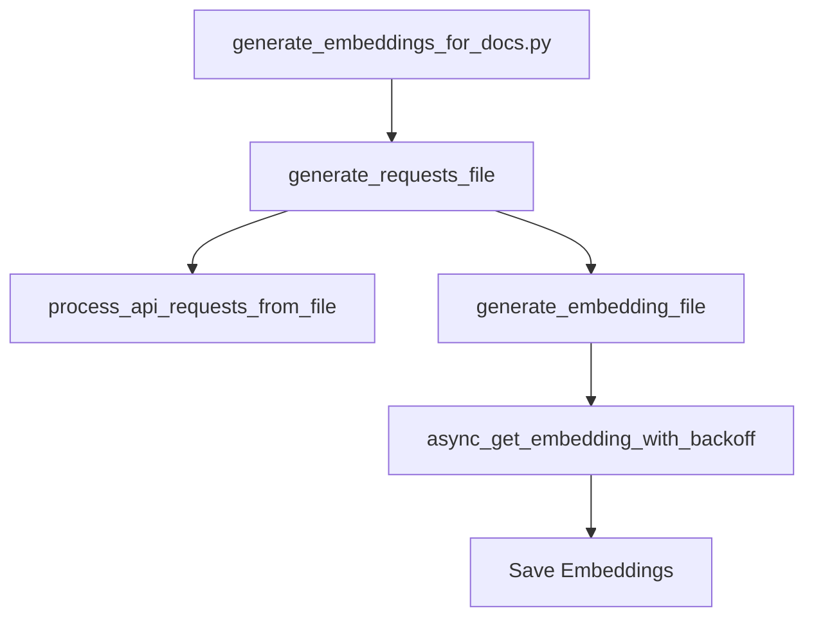

## Module: generate_embeddings_for_docs.py
- **Module Name**: The module name is `generate_embeddings_for_docs.py`.

- **Primary Objectives**: The primary objective of this module is to generate embeddings for documents. It reads the documents from a file, processes them, and generates embeddings using OpenAI's API.

- **Critical Functions**: 
    - `generate_requests_file(filename)`: This function generates a file of requests which can be fed to the OpenAI API to generate embeddings.
    - `generate_embedding_file(filename, parallel_mode)`: This function generates the embeddings for the documents in the file. It can work in parallel mode or sequential mode.
    - `main()
## Mermaid Diagram

