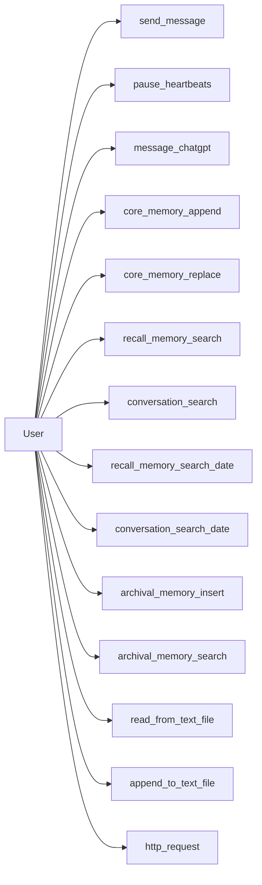

## Module: gpt_functions.py

## Mermaid Diagram

```mermaid
graph LR
    User --> send_message
    User --> pause_heartbeats
    User --> message_chatgpt
    User --> core_memory_append
    User --> core_memory_replace
    User --> recall_memory_search
    User --> conversation_search
    User --> recall_memory_search_date
    User --> conversation_search_date
    User --> archival_memory_insert
    User --> archival_memory_search
    User --> read_from_text_file
    User --> append_to_text_file
    User --> http_request
```
