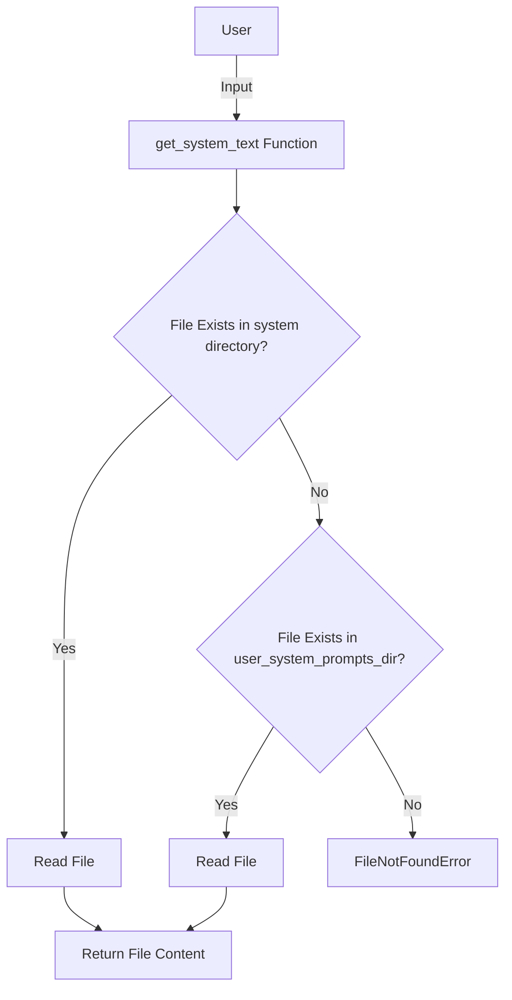

## Module: gpt_system.py
Module Name: gpt_system.py

Primary Objectives: The primary objective of this module is to retrieve system text based on a given key.

Critical Functions:
1. `get_system_text(key)`: This function takes a key as input and retrieves the corresponding system text. It first checks if the text file exists in the "prompts/system/" directory. If the file exists, it reads the content of the file and returns it. If the file does not exist in the "prompts/system/" directory, it checks in the "~/.memgpt/system_prompts/" directory. If the file is found in the "~/.memgpt/system_prompts/" directory, it reads the content of the file and returns it. If the file is not found in either directory, it raises a FileNotFoundError.

Key Variables:
- `filename`: Stores the name of the text file based on the given key.
- `file_path`: Stores the path of the text file.
- `user_system_prompts_dir`: Stores the path of the "~/.memgpt/system_prompts/" directory.

Interdependencies: This module depends on the `os` module and the `MEMGPT_DIR` constant from the `memgpt.constants` module.

Core vs. Auxiliary Operations: The core operation of this module is the `get_system_text()` function, which retrieves the system text. There are no auxiliary operations in this module.

Operational Sequence: The operational sequence of this module is as follows:
1. Check if the text file exists in the "prompts/system/" directory.
2. If the file exists, read the content and return it.
3. If the file does not exist in the "prompts/system/" directory, check in the "~/.memgpt/system_prompts/" directory.
4. If the file is found, read the content and return it.
5. If the file is not found in either directory, raise a FileNotFoundError.

Performance Aspects: The performance of this module depends on the size of the text files and the efficiency of file operations. Reading the content of large text files may impact performance.

Reusability: This module can be reused in any system that requires retrieving system text based on keys. It can be easily integrated into different codebases.

Usage: This module is used to retrieve system text by providing a key as input. It can be used in various applications where dynamic system text is required.

Assumptions: This module assumes that the text files exist in either the "prompts/system/" directory or the "~/.memgpt/system_prompts/" directory. It also assumes that the user has the necessary permissions to read the files.
## Mermaid Diagram

