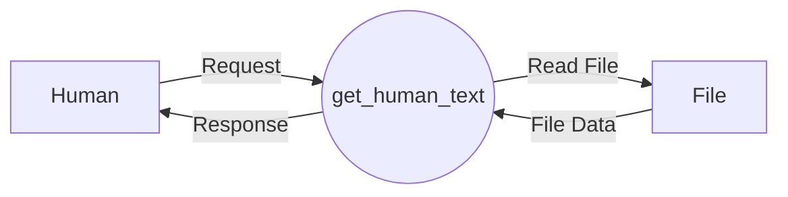

## Module: humans.py
- **Module Name**: The module is named humans.py.

- **Primary Objectives**: The purpose of this module is to fetch and return the contents of a text file given its key. If the key does not include a .txt extension, it appends it before trying to open the file. 

- **Critical Functions**: The main function in this module is `get_human_text(key=DEFAULT, dir=None)`. This function takes in a key and a directory. If no directory is provided, it sets the directory to the examples folder in the current file's directory. It then constructs a file path and attempts to open and read the file at that path. If the file does not exist, it raises a FileNotFoundError.

- **Key Variables**: 
  - `key`: This is the name of the text file to be read. 
  - `dir`: This is the directory where the file is located. 
  - `DEFAULT`: This is the default key used if no key is provided.
  - `file_path`: This is the full path to the file constructed using `dir` and `key`.

- **Interdependencies**: This module depends on the os module for interacting with the file system.

- **Core vs. Auxiliary Operations**: The core operation of this module is reading a file and returning its contents. The construction of the file path and the handling of the FileNotFoundError are auxiliary operations that support the core operation.

- **Operational Sequence**: The function first checks if a directory is provided, if not it sets the directory to the examples folder. It then constructs the file path using the directory and key. It then tries to open and read the file, returning the contents if successful and raising a FileNotFoundError if not.

- **Performance Aspects**: The performance of this module depends on the file system's speed and the size of the text file being read.

- **Reusability**: This module is highly reusable. It can be used in any situation where you need to read the contents of a text file given its name and optionally its directory.

- **Usage**: This module can be used by importing it and calling the `get_human_text` function with the appropriate arguments.

- **Assumptions**: This module assumes that the file to be read is a text file and is located either in the provided directory or the examples directory in the current file's directory. It also assumes that the file exists, and if it doesn't, it raises a FileNotFoundError.
## Mermaid Diagram

