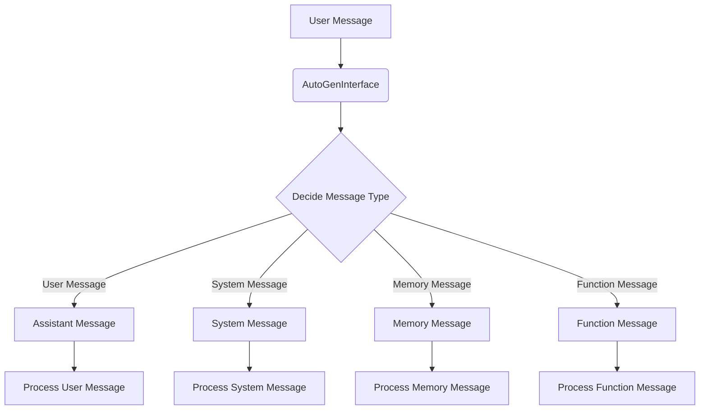

```mermaid
graph TD;
    A[interface.py] --> B[abc];
    A --> C[json];
    A --> D[re];
    A --> E[colorama];
    A --> F[memgpt.utils];
    A --> G[printd];
    A --> H[init];
    A --> I[STRIP_UI];
    A --> J[AgentInterface];
    A --> K[CLIInterface];
    B --> L[ABC];
    C --> M[abstract];
    C --> N[re];
    E --> O[Fore];
    E --> P[Style];
    H --> Q[autoreset];
    J --> R[user_message];
    J --> S[internal_monologue];
    J --> T[assistant_message];
    J --> U[function_message];
    K --> V[important_message];
    K --> W[warning_message];
    K --> X[internal_monologue];
    K --> Y[assistant_message];
    K --> Z[memory_message];
    K --> AA[system_message];
    K --> AB[user_message];
    K --> AC[function_message];
```

## Module: interface.py
- **Module Name**: interface.py

- **Primary Objectives**: This module primarily serves as an interface for handling MemGPT-related events, including user messages, internal monologue, assistant messages, and function calls. It also includes a command-line interface for dumping agent events.

- **Critical Functions**: 
    - `user_message(self, msg)`: Handles the receipt of a user message.
    - `internal_monologue(self, msg)`: Handles the generation of some internal monologue.
    - `assistant_message(self, msg)`: Handles the use of send_message.
    - `function_message(self, msg)`: Handles the call of a function.
    - `print_messages(message_sequence, dump=False)`: Prints a sequence of messages.
    - `print_messages_simple(message_sequence)`: Prints a simple sequence of messages.
    - `print_messages_raw(message_sequence)`: Prints a raw sequence of messages.

- **Key Variables**: 
    - `DEBUG`: A boolean variable that controls the level of message output in the terminal.
    - `STRIP_UI`: A boolean variable that controls whether to strip the user interface.
    - `msg`: A string or dictionary representing a message.

- **Interdependencies**: This module interacts with the `abc`, `json`, `re`, `colorama`, and `memgpt.utils` modules. 

- **Core vs. Auxiliary Operations**: Core operations involve handling different types of messages (user, assistant, function, etc.) and printing them. Auxiliary operations involve formatting and color-coding the messages for better readability.

- **Operational Sequence**: When a message is received, the appropriate handler function is called based on the type of the message. If the message is to be printed, it is passed to one of the print_messages functions, which formats the message and prints it to the console.

- **Performance Aspects**: This module primarily involves I/O operations, so its performance depends on the efficiency of these operations. 

- **Reusability**: This module is highly reusable. The `AgentInterface` class can be subclassed to create new interfaces for handling MemGPT-related events. The `CLIInterface` class provides a basic command-line interface that can be used in any program that needs to dump agent events to the console.

- **Usage**: This module is used to handle and display MemGPT-related events in a user-friendly manner.

- **Assumptions**: The module assumes that all messages are either strings or dictionaries. It also assumes that all messages can be formatted and color-coded for display in the console.
## Mermaid Diagram

## Module: interface.py
- **Module Name**: interface.py

- **Primary Objectives**: The module is designed to manage and display messages in a chat-based interface. It provides a way to handle different types of messages (such as user messages, system messages, assistant messages, memory messages, and function messages), format them for display, and manage a buffer for these messages.

- **Critical Functions**: 
    - `set_message_list`: Sets the message list for the DummyInterface.
    - `internal_monologue`: Handles internal monologue messages.
    - `assistant_message`: Handles assistant messages.
    - `memory_message`: Handles memory messages.
    - `system_message`: Handles system messages.
    - `user_message`: Handles user messages.
    - `function_message`: Handles function messages.
    - `reset_message_list`: Clears the buffer, called before every step when using MemGPT+AutoGen.
    - `__init__`: Initializes the AutoGenInterface with various parameters.

- **Key Variables**: 
    - `message_list`: A list holding all the messages.
    - `fancy`: A boolean variable to control the display of colored outputs and emoji prefixes.
    - `show_user_message`, `show_inner_thoughts`, `show_function_outputs`: Booleans to control the display of different types of messages.
    - `debug`: A boolean to control the debug mode.

- **Interdependencies**: The module relies on the `json` and `re` modules for parsing and regular expression operations, and `colorama` for colored terminal text.

- **Core vs. Auxiliary Operations**: Core operations include handling and displaying different types of messages. Auxiliary operations include managing the message buffer and controlling the display settings.

- **Operational Sequence**: The module defines two classes: DummyInterface and AutoGenInterface. The DummyInterface provides a basic structure for message handling, while the AutoGenInterface extends this with additional functionality. The AutoGenInterface initializes with various parameters, handles different types of messages, and manages a buffer for these messages.

- **Performance Aspects**: The module is designed for efficient handling and display of messages. The use of a buffer helps to manage the flow of messages and the various display options allow for flexible and efficient use.

- **Reusability**: The module is highly reusable. The classes defined can be used as a base for any chat-based interface that needs to handle and display a variety of message types.

- **Usage**: The module is used to handle and display messages in a chat-based interface. It is used by creating an instance of the AutoGenInterface class and calling the appropriate methods to handle different types of messages.

- **Assumptions**: It is assumed that messages are provided in a specific format (e.g., as a string or a dictionary). It's also assumed that the colorama module is available for colored terminal text.
## Mermaid Diagram

