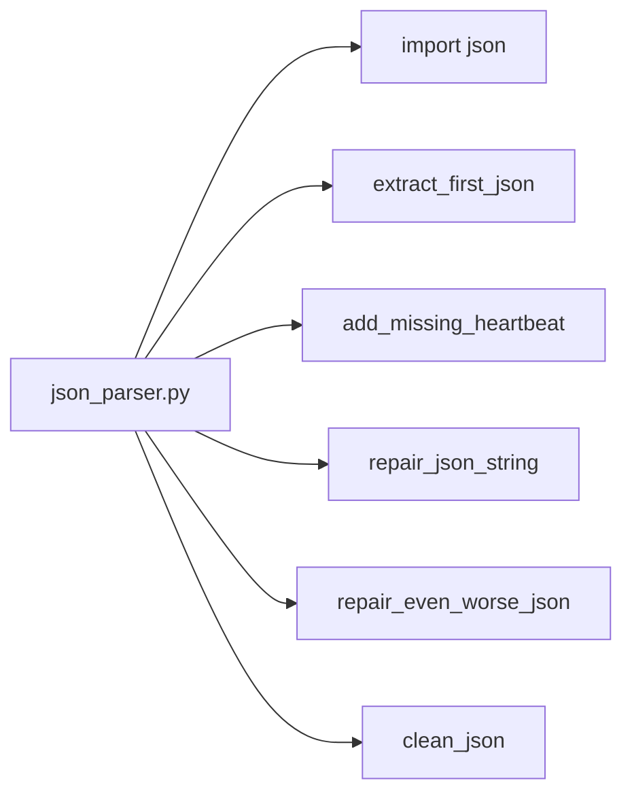

## Module: json_parser.py
- **Module Name**: json_parser.py

- **Primary Objectives**: This module is designed to parse JSON data, handle errors, and repair malformed JSON strings. It is intended to extract information from JSON strings and deal with any inconsistencies or errors that may occur during the extraction process.

- **Critical Functions**: 
  - `extract_first_json(string)`: Extracts the first JSON object from a string.
  - `add_missing_heartbeat(llm_json)`: Inserts heartbeat requests into messages that should have them.
  - `repair_json_string(json_string)`: Repairs a JSON string where line feeds were accidentally added within string literals.
  - `repair_even_worse_json(json_string)`: Repairs a malformed JSON string where string literals are broken up and not properly enclosed in quotes.
  - `clean_json(raw_llm_output, messages=None, functions=None)`: Tries a bunch of hacks to parse the data coming out of the LLM.

- **Key Variables**: 
  - `depth` and `start_index` in `extract_first_json(string)`: Used to track the depth of nested JSON objects and the start index of the first JSON object.
  - `new_string`, `in_string`, and `escape` in `repair_json_string(json_string)`: Used to create the repaired JSON string and track the current state of the string parsing.
  - `in_message`, `in_string`, `escape`, `message_content`, and `new_json_parts` in `repair_even_worse_json(json_string)`: Used to track the current state of the string parsing and store the parts of the repaired JSON string.
  - `data` in `clean_json(raw_llm_output, messages=None, functions=None)`: Stores the parsed JSON data.

- **Interdependencies**: This module seems to be independent of other system components, but it imports the `json` module for JSON operations and `memgpt.utils` for debugging purposes.

- **Core vs. Auxiliary Operations**: The core operations of this module include the extraction, repair, and cleaning of JSON strings. Auxiliary operations include error handling and debugging.

- **Operational Sequence**: The `clean_json` function attempts to parse the JSON data and, if it encounters errors, it tries various methods to repair the JSON string until it succeeds or exhausts all possibilities.

- **Performance Aspects**: The module's performance may be affected by the size of the input JSON string and the extent of its malformation. More complex or larger JSON strings may require more processing time.

- **Reusability**: The functions in this module are highly reusable for any tasks that involve parsing and repairing JSON strings.

- **Usage**: This module is used to parse and repair JSON strings in a larger system, likely as part of data preprocessing or cleanup.

- **Assumptions**: The module assumes that the input is a JSON string or can be converted into one. It also assumes that any errors encountered during parsing are due to malformation of the JSON string and can be fixed by one of the repair methods.
## Mermaid Diagram

