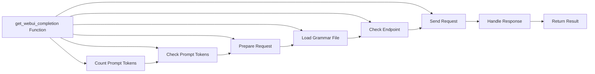

## Module: legacy_api.py
- **Module Name**: The module is named as `legacy_api.py`.

- **Primary Objectives**: The purpose of this module is to interact with a web server to generate text based on the provided prompt and settings. It also validates the input and handles the response from the server.

- **Critical Functions**: The main function in this module is `get_webui_completion()`. This function makes a POST request to the specified endpoint with the given prompt and settings, and returns the generated text.

- **Key Variables**: 
  - `endpoint`: The API endpoint to which the request is sent.
  - `prompt`: The text prompt for the text generation.
  - `context_window`: The maximum number of tokens that the context can contain.
  - `settings`: The settings for the text generation.
  - `grammar`: The grammar file to be used for text generation.
  - `request`: The request object containing the prompt and settings.
  - `URI`: The full URL of the API endpoint.
  - `response`: The response received from the server.
  - `result`: The generated text.

- **Interdependencies**: This module interacts with the `requests` library for making HTTP requests, the `urllib.parse` library for URL manipulation, and the `legacy_settings` and `utils` modules from the same project.

- **Core vs. Auxiliary Operations**: The core operation of this module is making the POST request to the server and handling the response. The auxiliary operations include validating the input, constructing the URL, and loading the grammar file.

- **Operational Sequence**: The function first validates the input, constructs the request object and the URL, and then makes the POST request. It then checks the response status code and returns the generated text if the request was successful.

- **Performance Aspects**: The performance of this module depends on the efficiency of the network request and the server's response time. In addition, the `count_tokens()` function and the loading of the grammar file can also affect the performance.

- **Reusability**: This module is highly reusable as it provides a generic function for making POST requests to a text generation server. The function can be used with different prompts, settings, and grammar files.

- **Usage**: This module can be used in any project that requires text generation based on a prompt and specific settings. The user needs to provide the server endpoint, the prompt, and the settings.

- **Assumptions**: The module assumes that the server endpoint starts with "http://" or "https://", and that the server is running and reachable. It also assumes that the prompt does not exceed the maximum context length.
## Mermaid Diagram

