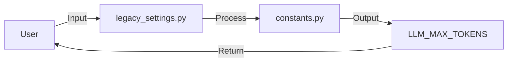

## Module: legacy_settings.py
- **Module Name**: The module name is `legacy_settings.py`.

- **Primary Objectives**: This module seems to handle settings related to text processing and tokenization in a legacy system. It defines stopping strings and maximum new tokens, which are likely used for parsing or generating text.

- **Critical Functions**: The module does not seem to contain any functions or methods. It appears to be a configuration file.

- **Key Variables**: 
  - `stopping_strings`: A list of strings that signal the end of a text segment.
  - `max_new_tokens`: The maximum number of new tokens that can be generated, set to 3072.
  - `truncation_length`: This variable seems to be commented out but it likely sets the maximum length of a text segment. It appears to be set to a constant `LLM_MAX_TOKENS` imported from another module.

- **Interdependencies**: The module imports `LLM_MAX_TOKENS` from a `constants` module. It likely interacts with other parts of the system that require these settings, including text parsing and generating components.

- **Core vs. Auxiliary Operations**: As a configuration file, it does not seem to have core or auxiliary operations. All the settings it provides are essential for the components that depend on it.

- **Operational Sequence**: There doesn't appear to be a distinct operational sequence in this module as it is a configuration file.

- **Performance Aspects**: The settings in this module likely affect the system's performance. For example, `max_new_tokens` could limit the size of generated text, and `stopping_strings` could impact the speed of text parsing.

- **Reusability**: This module seems highly reusable. The settings it provides could be used by any component that needs to parse or generate text.

- **Usage**: This module is likely used by importing it into other parts of the system. The importing components can then access the settings it provides.

- **Assumptions**: The module seems to assume that the `stopping_strings` are sufficient to signal the end of a text segment. It also assumes that `max_new_tokens` is an appropriate limit for the size of generated text. The commented-out `truncation_length` suggests that there may be an assumption about the maximum length of a text segment.
## Mermaid Diagram

