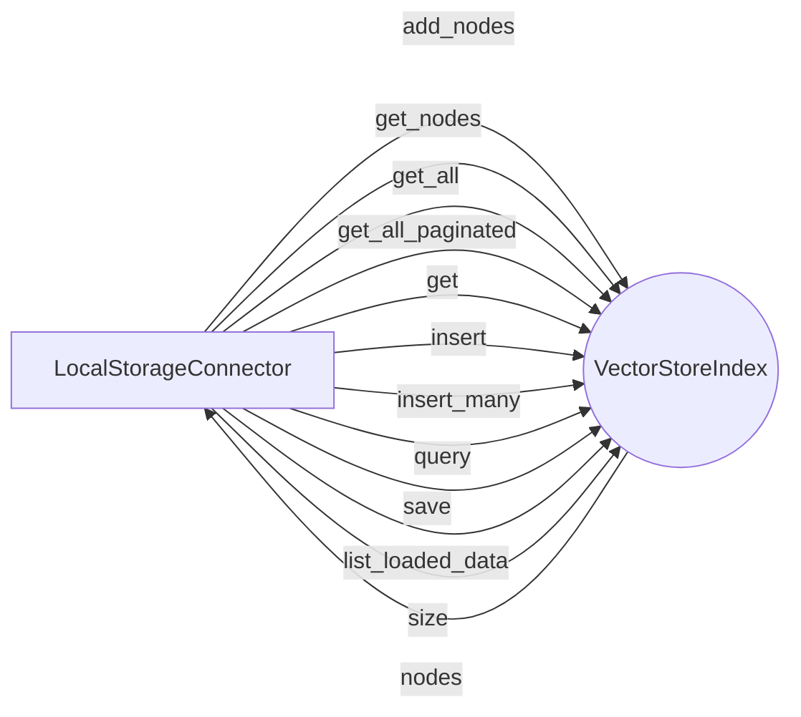

## Module: local.py
- **Module Name**: The module is named 'local.py'.

- **Primary Objectives**: The module's primary purpose is to handle data storage and retrieval operations locally, using the LlamaIndex library for data indexing and storage.

- **Critical Functions**: 
  - `__init__`: Initializes the LocalStorageConnector class, sets up the context, and loads or creates the index.
  - `get_nodes`: Returns the nodes in the Llama index.
  - `add_nodes`: Adds nodes to the Llama index.
  - `get_all_paginated`: Returns all passages in the index, paginated.
  - `get_all`: Returns all passages up to a specified limit.
  - `get`: Placeholder function to get a specific passage by id.
  - `insert`: Inserts a passage into the index.
  - `insert_many`: Inserts multiple passages into the index.
  - `query`: Queries the index for passages based on a given query and vector.
  - `save`: Saves the current state of the nodes to a pickle file.
  - `list_loaded_data`: Lists all the data sources currently loaded.
  - `size`: Returns the size of the index.

- **Key Variables**: 
  - `self.name`: The name of the storage connector.
  - `self.save_directory`: The directory where the index is saved.
  - `self.embed_model`: The embedding model used.
  - `self.service_context`: The service context for the Llama index.
  - `self.save_path`: The path where the nodes pickle file is saved.
  - `self.nodes`: The list of nodes in the index.
  - `self.index`: The Llama index itself.

- **Interdependencies**: This module interacts with other system components such as the `memgpt` and `llama_index` modules for configurations, constants, storage, and indexing.

- **Core vs. Auxiliary Operations**: Core operations include initializing the class, getting and adding nodes, and querying the index. Auxiliary operations include saving the index, listing loaded data, and getting the size of the index.

- **Operational Sequence**: The module initializes the class and loads or creates the index. It then provides functions to add nodes, get nodes, query the index, and save the index.

- **Performance Aspects**: The module uses Llama index for efficient storage and retrieval of data. However, the `query` function may be slow due to the retrieval process.

- **Reusability**: The module is highly reusable, as it provides a generic local storage connector that can be used with any data that can be indexed with Llama index.

- **Usage**: The module is used to handle local data storage and retrieval operations. It is used to add nodes to the index, get nodes from the index, query the index, and save the index.

- **Assumptions**: The module assumes that the embedding model and service context are set up correctly. It also assumes that the nodes pickle file exists if the save path exists.
## Mermaid Diagram

