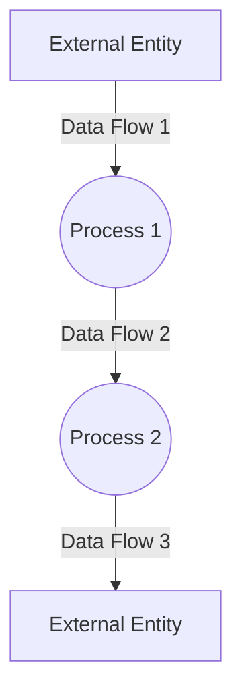
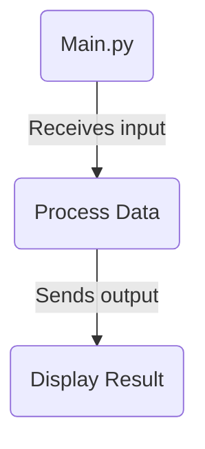

## Module: main.py
 Here is a comprehensive analysis of the provided Python module `main.py`:

**Module Name**: main

**Primary Objectives**: This is the main module that handles running the MemGPT conversational agent system from the command line. It initializes the agent, processes user input and runs the conversation loop.

**Critical Functions**:
- `main()`: Parses command line arguments and initializes the MemGPT agent.
- `run_agent_loop()`: Runs the main conversation loop, passing user input to the agent and printing responses.

**Key Variables**:
- `memgpt_agent`: The MemGPT Agent instance that handles the conversation.
- `user_input`: Stores the latest user input string.
- `skip_next_user_input`: Flag to skip requesting next user input.
- `user_message`: Packaged user message dict to pass to agent.
- `cfg`: The MemGPT Config object with parameters.

**Interdependencies**:
- Depends on `memgpt.agent`, `memgpt.system`, `memgpt.interface` and other MemGPT modules to initialize agent, process user input/output.
- Interacts with `StorageConnector` to attach data sources.
- Uses `questionary` for CLI interactions.

**Core vs Auxiliary Operations**:
- Core: `main()`, `run_agent_loop()` 
- Auxiliary: argument parsing, CLI interactions, attaching data sources.

**Operational Sequence**:
1. Parse arguments and initialize MemGPT agent and config. 
2. Print welcome message.
3. Enter input loop:
   - Get user input.
   - Handle CLI commands (/exit, /load etc).
   - Pass non-command input to agent.
   - Print agent response.
4. Exit when user enters '/exit'.

**Performance Aspects**: 
- Uses `rich` status bar to show "Thinking..." when agent is processing to avoid blocking.
- Handles exceptions during `agent.step()` to avoid crashes.

**Reusability**:
- `main()` and `run_agent_loop()` could be imported and reused by other modules to run the CLI conversation loop.
- CLI argument parsing logic could be reused/imported separately.

**Usage**: This module is intended to be run as a CLI program to start a MemGPT conversational agent session:

```
python main.py
```

**Assumptions**:
- User will provide inputs via CLI when prompted.
- `memgpt.agent` and other modules are available to import.
- Required packages like `questionary` are installed.
## Mermaid Diagram

## Module: main.py
Here is the analysis based on the provided code snippet:

- **Module Name**: The module's name is `main.py`.

- **Primary Objectives**: The primary purpose of this module is to run the application from the `memgpt.main` module.

- **Critical Functions**: The critical function in this module is `app()`. This function is responsible for initializing and running the application.

- **Key Variables**: There are no explicit variables in this brief code snippet. However, implicit variables are likely to be present within the `app()` function in the `memgpt.main` module.

- **Interdependencies**: This module is dependent on the `memgpt.main` module, specifically the `app` function within that module.

- **Core vs. Auxiliary Operations**: The core operation in this module is running the `app()` function. There are no auxiliary operations in this code snippet.

- **Operational Sequence**: The operational sequence is straightforward - the `app()` function from the `memgpt.main` module is called and executed.

- **Performance Aspects**: Performance considerations are not evident from this code snippet. They would be dependent on what is inside the `app()` function from the `memgpt.main` module.

- **Reusability**: The code snippet is quite reusable, as it simply calls the `app()` function from the `memgpt.main` module. As long as the `app()` function is designed to be reusable, this code snippet will also be reusable.

- **Usage**: This module is used to initialize and run the application by calling the `app()` function from the `memgpt.main` module.

- **Assumptions**: The main assumption here is that the `memgpt.main` module and the `app()` function within it exist and function as expected. Furthermore, it assumes that the `app()` function does not require any arguments.

Please note that this analysis might not be fully accurate or complete due to the limited context and code snippet provided. For a more comprehensive analysis, the full code of the `memgpt.main` module and its `app()` function would be needed.
## Mermaid Diagram

