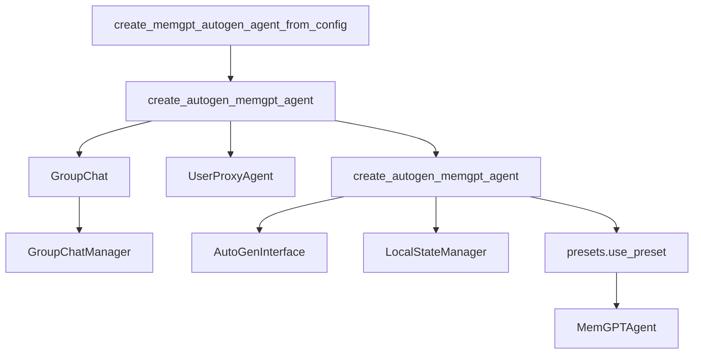

## Module: memgpt_agent.py
- **Module Name**: memgpt_agent.py

- **Primary Objectives**: This module defines the MemGPTAgent class and its associated methods. It is designed to create a GPT-based agent that can interact in a conversational manner, load and attach data, and handle various types of user messages.

- **Critical Functions**:
  - `create_memgpt_autogen_agent_from_config`: This function creates an AutoGen agent from a given configuration.
  - `create_autogen_memgpt_agent`: This function creates an AutoGen MemGPT agent with specified parameters.
  - `load`: This function loads data based on given type.
  - `attach`: This function attaches new data to the agent.
  - `load_and_attach`: This function loads and attaches data to the agent.
  - `_generate_reply_for_user_message`: This function generates a reply for a user message.
  - `pretty_concat`: This function concatenates all of MemGPT's steps into one and returns as a single message.

- **Key Variables**:
  - `name`: The name of the agent.
  - `system_message`: A system message to initialize the agent.
  - `is_termination_msg`: A function to determine if a message should terminate the conversation.
  - `max_consecutive_auto_reply`: The maximum number of consecutive automatic replies.
  - `human_input_mode`: The mode of human input.
  - `function_map`: A map of functions.
  - `code_execution_config`: The configuration for code execution.
  - `llm_config`: The configuration for the language model.
  - `default_auto_reply`: The default automatic reply.
  - `interface_kwargs`: Arguments for the interface.

- **Interdependencies**: This module interacts with several other modules such as `autogen.agentchat`, `memgpt.agent`, `memgpt.autogen.interface`, `memgpt.persistence_manager`, `memgpt.system`, `memgpt.constants`, `memgpt.presets.presets`, `memgpt.personas`, `memgpt.humans`, `memgpt.config`, `memgpt.cli.cli`, `memgpt.cli.cli_load`, and `memgpt.connectors.storage`.

- **Core vs. Auxiliary Operations**: The core operations are the creation and interaction of the MemGPT agent, including loading and attaching data, and generating replies for user messages. Auxiliary operations include formatting other agent messages, finding the last user message, finding new messages, and pretty concatenating messages.

- **Operational Sequence**: The module first creates an agent with a given configuration. Then, it loads and attaches data to the agent. After that, it generates replies for user messages and formats the messages.

- **Performance Aspects**: The module uses a GPT model, which can be computationally intensive. It also handles data loading and attachment, which might be IO-bound.

- **Reusability**: The module is highly reusable. It can be used to create various types of conversational agents with different configurations.

- **Usage**: This module is used to create a conversational agent that can interact with users, load and attach data, and handle various types of user messages.

- **Assumptions**: The module assumes that the data to be loaded and attached is available and in the correct format. It also assumes that the GPT model is available and properly configured.
## Mermaid Diagram

