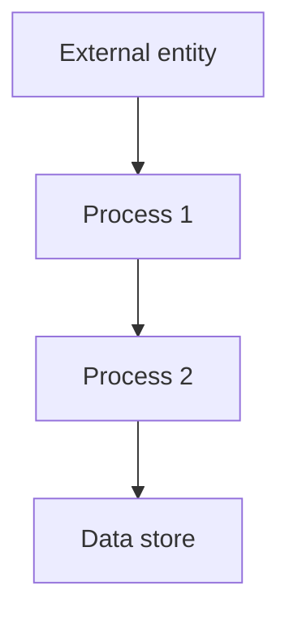

## Module: memory.py
 Here is a comprehensive analysis of the memory.py module:

**Module Name**: memory.py

**Primary Objectives**: Provides implementations for the core memory, archival memory, and recall memory components of an AI assistant agent. Enables editing, querying, and persistence of memories.

**Critical Functions**:
- CoreMemory: Manages the core persona and human memories. Allows editing with character limits.
- ArchivalMemory (interface): Defines interface for archival memories.
- DummyArchivalMemory: Simple in-memory archival memory with text search.
- DummyArchivalMemoryWithEmbeddings: Adds embedding based search to dummy archival. 
- DummyArchivalMemoryWithFaiss: Uses Faiss for fast nearest neighbors search.
- RecallMemory (interface): Defines interface for recall memories.
- DummyRecallMemory: Simple in-memory recall memory with text and date search.
- DummyRecallMemoryWithEmbeddings: Adds embedding based search.
- LocalArchivalMemory: Archival memory using Llama Index for search.
- EmbeddingArchivalMemory: Archival memory using custom storage and embeddings.

**Key Variables**:
- self._archive: Holds documents in dummy archival memories. 
- self._message_logs: Holds message logs in dummy recall memories.
- self.index: Llama Index object for search in LocalArchivalMemory.
- self.storage: Custom storage connector in EmbeddingArchivalMemory.

**Interdependencies**:
- Integrates with other system components like agent config, persistence manager, embeddings module. 
- Relies on external libraries like Llama Index, Faiss, Storage Connectors.

**Core vs Auxiliary Operations**:
- Core operations involve managing and editing the memories, inserting documents, and querying.
- Auxiliary operations are things like date validation, embedding management.

**Operational Sequence**:
1. Memories initialized with config parameters and optional existing data.
2. Core memory edited via wrapper methods.  
3. New info inserted into archival memories.
4. Queries executed on archival and recall memories.
5. Results returned.

**Performance Aspects**:
- Llama Index and Faiss provide optimized search performance.
- Caching embeddings and search results avoids repeat expensive computations. 
- Chunking strings for embedding improves efficiency.

**Reusability**: 
- Interfaces allow swapping underlying implementation.
- Config driven design allows reuse across agents.

**Usage**:
- Used by agent during conversations to manage memory.
- Persistence manager handles loading and saving memory state.

**Assumptions**:
- Agent config and parameters are provided.
- External libs like Llama Index are installed.
- Appropriate storage backends exist if configured.

In summary, the memory module provides key capabilities for an AI agent to manage both short-term and long-term memories in a performant and reusable manner. The interfaces and config driven design allow flexibility in the underlying implementations.
## Mermaid Diagram

