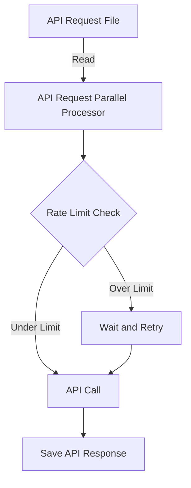

## Module: openai_parallel_request_processor.py
- **Module Name**: openai_parallel_request_processor.py

- **Primary Objectives**: 
This module is designed to process a large number of API requests in parallel while staying under the rate limits set by OpenAI. It provides a way to efficiently handle a high volume of requests without exceeding the rate limits and without causing the system to run out of memory.

- **Critical Functions**: 
The main function, `process_api_requests_from_file()`, reads API requests from a file, processes them in parallel, and saves the results. The `APIRequest` class represents an API request and contains a method, `call_api()`, to make an API call and save the results. The `StatusTracker` class stores metadata about the script's progress. The `append_to_jsonl()` function appends a JSON payload to the end of a JSONL file.

- **Key Variables**: 
The module uses several key variables such as `requests_filepath`, `save_filepath`, `request_url`, `api_key`, `max_requests_per_minute`, `max_tokens_per_minute`, `token_encoding_name`, `max_attempts`, and `logging_level`.

- **Interdependencies**: 
This module relies on several Python libraries including `aiohttp` for making API calls concurrently, `argparse` for running the script from the command line, `asyncio` for running API calls concurrently, `json` for saving results to a JSONL file, `logging` for logging rate limit warnings and other messages, `os` for reading the API key, `re` for matching the endpoint from the request URL, `tiktoken` for counting tokens, and `time` for sleeping after a rate limit is hit.

- **Core vs. Auxiliary Operations**: 
The core operation of this module is to process API requests in parallel while staying under the rate limits. Auxiliary operations include reading API requests from a file, saving results to a file, logging rate limit warnings and other messages, and counting tokens.

- **Operational Sequence**: 
The script first initializes variables and opens the file containing the API requests. It then enters a main loop where it updates the available capacity, gets the next request, checks if there's enough capacity to call the API, and calls the API if there is enough capacity. If a rate limit error is hit, the script pauses to cool down. The loop breaks when no tasks remain.

- **Performance Aspects**: 
The script is designed to maximize throughput while staying under rate limits. It makes requests concurrently to maximize throughput and throttles request and token usage to stay under rate limits. It also retries failed requests to avoid missing data.

- **Reusability**: 
The module is highly reusable as it is designed to process any number of API requests in parallel. It can be used with different API endpoints, different rate limits, and different token encodings. It can also be used with different logging levels to control the amount of logging.

- **Usage**: 
The module is designed to be used from the command line. It takes several command line arguments including the path to the file containing the requests to be processed, the path to the file where the results will be saved, the URL of the API endpoint to call, the API key to use, the target number of requests to make per minute, the target number of tokens to use per minute, the name of the token encoding used, the number of times to retry a failed request before giving up, and the level of logging to use.

- **Assumptions**: 
The script assumes that the API requests are stored in a JSONL file and that each line of the file is a JSON object with API parameters and an optional metadata field. It also assumes that the API key is stored in an environment variable if it is not provided as a command line argument.
## Mermaid Diagram

