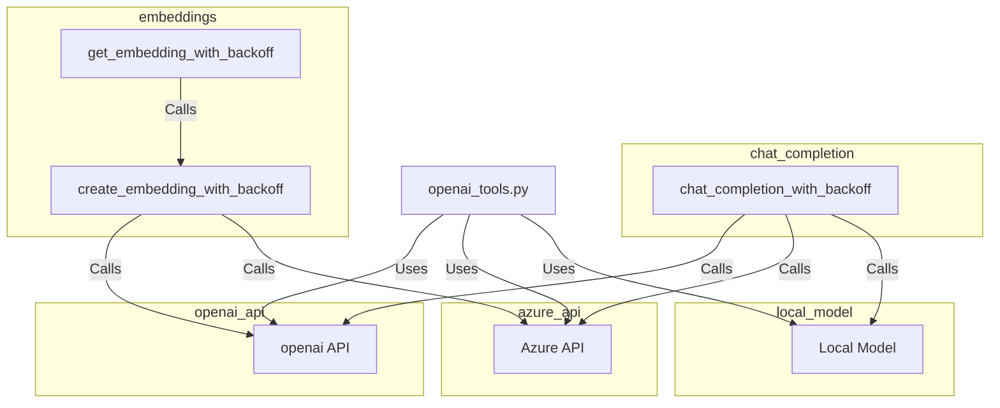

## Module: openai_tools.py
- **Module Name**: openai_tools.py

- **Primary Objectives**: This module aims to interact with OpenAI's API and handle errors, retries, and configurations for different environments (Azure, OpenAI, local). It includes functions for creating chat completions and embeddings, and for configuring the API settings.

- **Critical Functions**:
    - `retry_with_exponential_backoff`: Retries a function with exponential backoff in case of specified errors.
    - `completions_with_backoff`: Handles chat completions with backoff for different environments.
    - `chat_completion_with_backoff`: Configures the API settings and handles chat completions with backoff for different environments.
    - `create_embedding_with_backoff`: Handles the creation of embeddings with backoff.
    - `get_embedding_with_backoff`: Retrieves embeddings with backoff.
    - `using_azure`: Checks if Azure environment variables are set.
    - `configure_azure_support`: Configures OpenAI's API for Azure support.
    - `check_azure_embeddings`: Checks if Azure environment variables for embeddings are set.

- **Key Variables**:
    - `HOST`: The base URL of the OpenAI API.
    - `HOST_TYPE`: The type of backend used.
    - `openai.api_base`: The base URL of the OpenAI API.
    - `azure_openai_key, azure_openai_endpoint, azure_openai_version`: Azure OpenAI environment variables.
    - `kwargs`: Keyword arguments passed to various functions.
    - `MODEL_TO_AZURE_ENGINE`: Dictionary mapping model names to Azure engine names.

- **Interdependencies**: This module interacts with OpenAI's API and potentially with Azure's API, depending on the environment variables set. It also imports and uses functions from other modules such as `memgpt.local_llm.chat_completion_proxy`, `memgpt.utils`, and `memgpt.config`.

- **Core vs. Auxiliary Operations**: Core operations include interacting with the OpenAI API and handling retries and errors. Auxiliary operations include configuring the API for different environments and checking environment variables.

- **Operational Sequence**: The module first checks the environment variables and configures the API accordingly. Then, it performs operations (chat completions, embeddings) with exponential backoff in case of errors.

- **Performance Aspects**: The module uses exponential backoff to handle rate limit errors, improving its robustness and reliability. However, the maximum number of retries is capped, which can limit the module's persistence in case of persistent errors.

- **Reusability**: The module's functions are general enough to be reused in different contexts where interaction with OpenAI's API is required. The module can handle different environments (Azure, OpenAI, local), increasing its reusability.

- **Usage**: This module is used whenever interaction with OpenAI's API is required, such as when creating chat completions or embeddings.

- **Assumptions**: The module assumes that the necessary environment variables are set. It also assumes that the OpenAI API will raise a `RateLimitError` when the rate limit is exceeded, and retries the operation in this case.
## Mermaid Diagram

