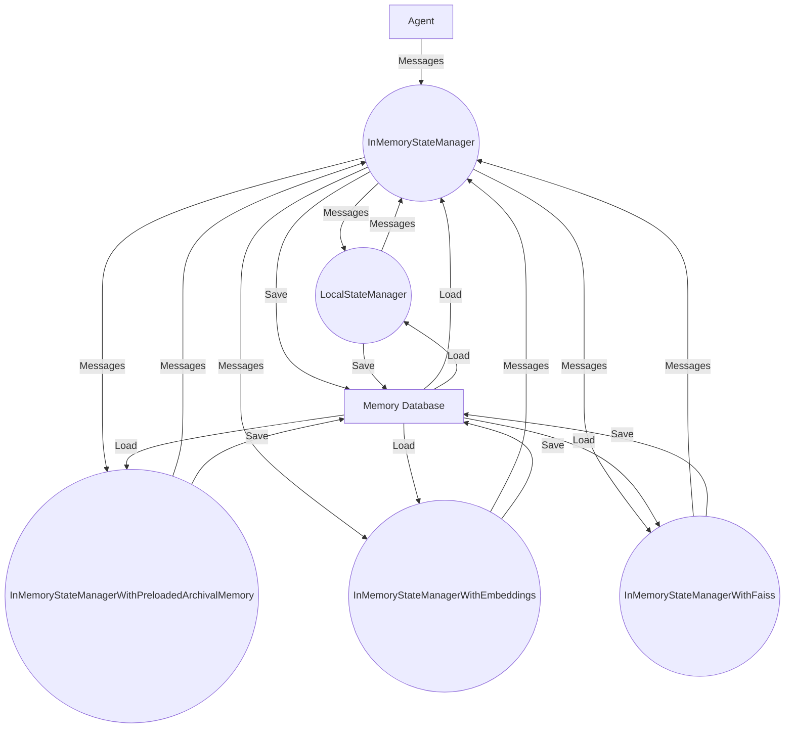

## Module: persistence_manager.py
- **Module Name**: persistence_manager.py

- **Primary Objectives**: This module's primary purpose is to manage the persistence of memory and messages for an AI agent. It provides facilities for saving and loading the state of the agent, as well as manipulating the agent's memory and messages.

- **Critical Functions**: 
   - `trim_messages`: Trims the messages to a specified number.
   - `prepend_to_messages`: Adds messages to the beginning of the list of messages.
   - `append_to_messages`: Adds messages to the end of the list of messages.
   - `swap_system_message`: Replaces the system message with a new one.
   - `update_memory`: Updates the agent's memory with a new one.
   - `save`: Saves the current state to a file.
   - `load`: Loads the state from a file.
   - `init`: Initializes the state manager with an agent object.

- **Key Variables**: 
   - `self.memory`: The agent's memory.
   - `self.messages`: The list of messages.
   - `self.all_messages`: The list of all messages.
   - `self.recall_memory`: The recall memory database.
   - `self.archival_memory_db`: The archival memory database.
   - `self.archival_memory`: The archival memory.

- **Interdependencies**: This module interacts with the following components:
   - `abc`: For abstract base classes.
   - `os`: For interacting with the operating system.
   - `pickle`: For serializing and deserializing Python object structures.
   - `AgentConfig`: For agent configuration.
   - Various memory classes like `DummyRecallMemory`, `DummyArchivalMemory`, etc.
   - `get_local_time` and `printd` from `.utils`.

- **Core vs. Auxiliary Operations**: The core operations of this module include initializing the state manager, updating the memory, and manipulating messages. Auxiliary operations include saving and loading the state.

- **Operational Sequence**: The typical operational sequence involves initializing the state manager with an agent, manipulating the agent's memory and messages as needed, and saving the state to a file.

- **Performance Aspects**: The performance of this module largely depends on the efficiency of the memory management and the speed of the file I/O operations.

- **Reusability**: This module is highly reusable. It provides a generic framework for managing the state of an AI agent, and can be easily adapted for different types of agents and memory structures.

- **Usage**: This module is used in the context of an AI agent that needs to maintain a persistent state across multiple interactions. The state manager is initialized with the agent, and then used to manipulate the agent's memory and messages.

- **Assumptions**: The module assumes that the memory and messages of the agent can be serialized and deserialized using `pickle`. It also assumes that the memory and messages are structured in a way that allows them to be manipulated as lists.
## Mermaid Diagram

