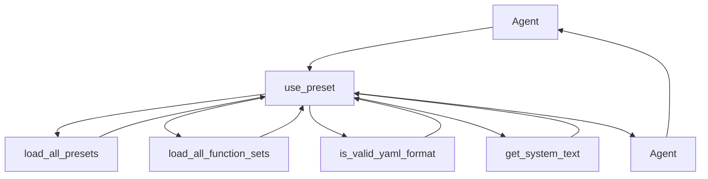

## Module: presets.py
- **Module Name**: presets.py
- **Primary Objectives**: This module is used to manage presets, which are combinations of SYSTEM and FUNCTION prompts. It's primarily used for loading and validating presets, and for creating an Agent object with the chosen preset.
- **Critical Functions**: 
  - `use_preset`: This function takes a preset name, agent configuration, model, persona, human, interface, and persistence manager as arguments. It validates the preset, filters the function set based on what the preset requested, and creates an Agent with the specified parameters.
- **Key Variables**: 
  - `DEFAULT_PRESET`: This variable holds the default preset name, "memgpt_chat".
  - `available_presets`: This variable holds all available presets, loaded via the `load_all_presets` function.
  - `preset_options`: This variable holds the keys of all available presets.
- **Interdependencies**: This module interacts with the `utils`, `prompts`, `functions`, and `agent` modules from the same package. It also uses the `printd` function from the `utils` module for debugging purposes.
- **Core vs. Auxiliary Operations**: The core operation of this module is the `use_preset` function, which is used to create an Agent with a specified preset. The loading and validation of presets are auxiliary operations.
- **Operational Sequence**: The `use_preset` function first loads all available functions and presets. It then validates the specified preset and filters the function set based on what the preset requested. Finally, it creates and returns an Agent with the specified parameters.
- **Performance Aspects**: This module is efficient as it only loads and processes the necessary functions based on the specified preset. However, the performance may be affected if the number of available functions and presets is large.
- **Reusability**: This module is highly reusable as it provides a function to create an Agent with any valid preset. The presets can be easily extended or modified for different use cases.
- **Usage**: This module is used whenever an Agent needs to be created with a specific preset. It's typically used in the setup phase of a conversational AI application.
- **Assumptions**: This module assumes that all presets are in YAML format and that all specified functions in a preset are available in the function library.
## Mermaid Diagram

