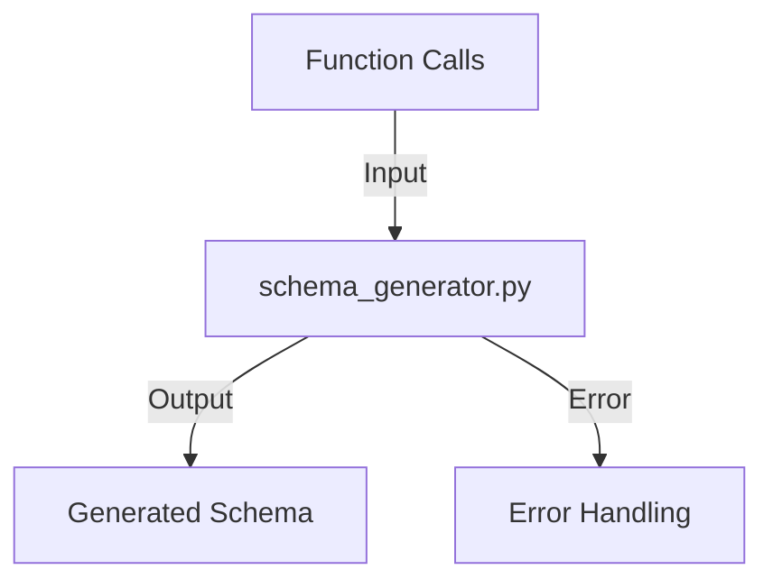

## Module: schema_generator.py
- **Module Name**: The module is named `schema_generator.py`.

- **Primary Objectives**: This module is designed to generate a JSON schema for a given Python function. It uses the function's signature and docstring to create a detailed schema, including the function's name, description, parameters, and their types.

- **Critical Functions**: The main functions in this module are `is_optional`, `optional_length`, `type_to_json_schema_type`, and `generate_schema`. The `generate_schema` function is the core function that generates the JSON schema for a given function.

- **Key Variables**: Some key variables include `NO_HEARTBEAT_FUNCTIONS`, `FUNCTION_PARAM_NAME_REQ_HEARTBEAT`, `FUNCTION_PARAM_TYPE_REQ_HEARTBEAT`, and `FUNCTION_PARAM_DESCRIPTION_REQ_HEARTBEAT`. These variables are related to the heartbeat functionality in the system.

- **Interdependencies**: This module interacts with the `inspect`, `typing`, `docstring_parser`, and `memgpt.constants` modules.

- **Core vs. Auxiliary Operations**: The core operation of this module is to generate a JSON schema for a given function. Auxiliary operations include checking if a type is optional, getting the length of an optional type, and mapping a Python type to a JSON schema type.

- **Operational Sequence**: The `generate_schema` function first gets the signature of the function and parses the docstring. It then prepares the schema dictionary and iterates over the function's parameters, adding their details to the schema. If the function is not in `NO_HEARTBEAT_FUNCTIONS`, it also adds a heartbeat parameter to the schema.

- **Performance Aspects**: This module is designed to be efficient by directly mapping Python types to JSON schema types. However, it may raise errors if a function's parameters lack type annotations or descriptions in the docstring.

- **Reusability**: This module is highly reusable. It can generate a JSON schema for any Python function that has a properly formatted docstring.

- **Usage**: To use this module, import it and call the `generate_schema` function with the function you want to generate a schema for as the argument.

- **Assumptions**: This module assumes that all functions have properly formatted docstrings with parameter descriptions. It also assumes that all parameters have type annotations.
## Mermaid Diagram

