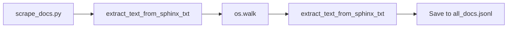

## Module: scrape_docs.py
- **Module Name**: scrape_docs.py

- **Primary Objectives**: The purpose of this module is to extract text from .txt files in a specified directory and its subdirectories, and save the extracted text into a JSON line file. It is particularly designed for processing Sphinx-generated documentation.

- **Critical Functions**: 
  - `extract_text_from_sphinx_txt(file_path)`: This function opens a .txt file, reads it line by line, tokenizes the text, and splits it into passages of a certain length (800 tokens by default). It returns a list of dictionaries, each containing the title of the document, the text of a passage, and the number of tokens in the passage.
  - `os.walk(docs_dir)`: This function is used to iterate over all files in the specified directory and its subdirectories.
  - `json.dumps(p)`: This function is used to convert the dictionaries into JSON formatted strings.

- **Key Variables**:
  - `docs_dir`: The directory where the documentation resides.
  - `encoding`: The encoding used for tokenization, defined for the GPT-4 model.
  - `PASSAGE_TOKEN_LEN`: The maximum length of a passage in tokens.
  - `passages`: A list that stores the passages extracted from all .txt files.
  - `total_files`: A counter for the total number of .txt files processed.

- **Interdependencies**: This module uses the `os`, `re`, `tiktoken`, and `json` libraries.

- **Core vs. Auxiliary Operations**: The core operation of this module is the extraction of text from .txt files and its tokenization into passages. The auxiliary operations include walking through the directory and its subdirectories, counting the total number of .txt files processed, and saving the passages into a JSON line file.

- **Operational Sequence**: The module first defines some variables and the `extract_text_from_sphinx_txt()` function. Then, it iterates over all .txt files in the specified directory and its subdirectories, extracting the text from each file and appending the resulting passages to the `passages` list. Finally, it writes the passages into a JSON line file.

- **Performance Aspects**: The module is designed to handle large amounts of text and to tokenize it efficiently. However, the performance may be affected by the size and number of .txt files, as well as the capacity of the system where it is running.

- **Reusability**: The module is quite adaptable for reuse. The `extract_text_from_sphinx_txt()` function can be used with any .txt file, not just Sphinx-generated documentation. Also, the directory, the encoding, and the maximum passage length can be easily changed to fit different needs.

- **Usage**: This module is used for processing large amounts of text, particularly documentation generated by Sphinx. It can be run as a standalone Python script.

- **Assumptions**: The module assumes that all .txt files in the specified directory and its subdirectories are valid and can be opened and read without issues. It also assumes that the text in the .txt files can be tokenized using the specified encoding.
## Mermaid Diagram

