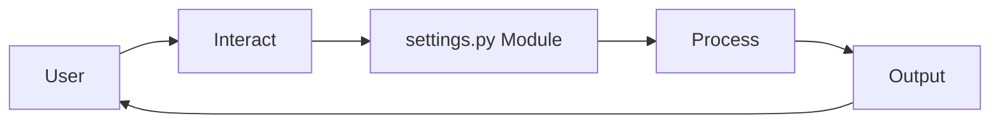
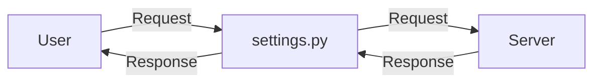
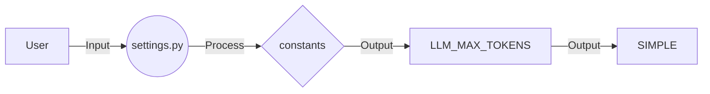
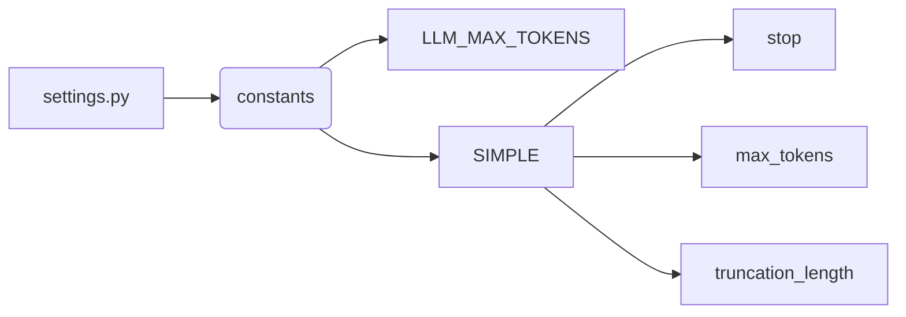
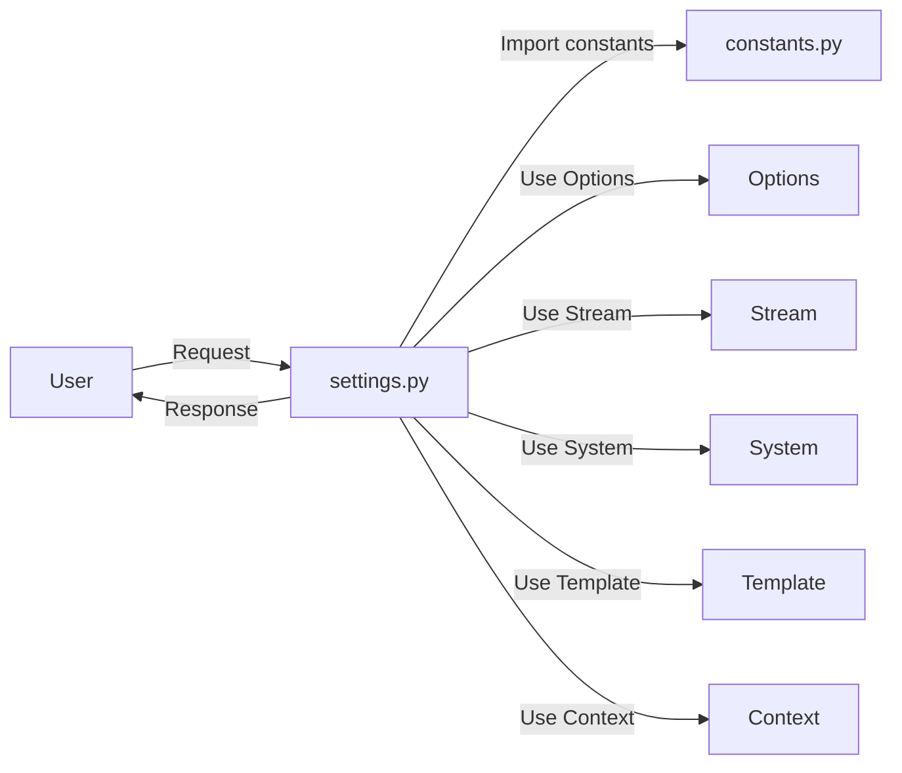

## Module: settings.py
- **Module Name**: The module is named as "settings.py".

- **Primary Objectives**: The primary purpose of this module is to define some constants and settings for a language model. These settings include stop tokens, maximum number of tokens the model can generate, whether to use a local model or not, and whether the model should be streamed.

- **Critical Functions**: This module doesn't seem to have any functions or methods. It is primarily used for setting up configurations.

- **Key Variables**: The key variables in this module are `SIMPLE`, which is a dictionary containing various settings for the language model. The settings include "stop" (a list of stop tokens), "max_tokens" (the maximum number of tokens the model can generate, which is commented out), "stream" (a boolean indicating whether the model should be streamed), and "model" (which defines the model to use).

- **Interdependencies**: This module is dependent on the `constants` module from which it imports `LLM_MAX_TOKENS`.

- **Core vs. Auxiliary Operations**: The core operation of this module is to provide a configuration for the language model. There don't appear to be any auxiliary operations.

- **Operational Sequence**: As it is a settings module, it doesn't have an operational sequence. It is likely imported by other modules that use these settings.

- **Performance Aspects**: Performance considerations are not directly addressed in this module. However, the "max_tokens" setting could potentially impact the performance of the language model.

- **Reusability**: This module is highly reusable. It can be imported by any module that requires these settings. The settings can also be easily modified for different use cases.

- **Usage**: This module is used by importing it into another module and using the settings defined in the `SIMPLE` dictionary.

- **Assumptions**: The module assumes that the language model has a context length of 8000 tokens, as indicated by the commented out "max_tokens" setting. It also assumes that the `LLM_MAX_TOKENS` constant is defined in the `constants` module.
## Mermaid Diagram

## Module: settings.py
- **Module Name**: The module is named as `settings.py`.

- **Primary Objectives**: The primary purpose of this module is to define certain settings or configurations that are used throughout the program. These settings include a list of stop words and phrases.

- **Critical Functions**: This module does not include any functions or methods. It primarily serves as a configuration file.

- **Key Variables**: The key variable in this module is `SIMPLE`, a dictionary that contains a list of stop words and phrases. These words/phrases are used to determine when certain operations in the program should stop.

- **Interdependencies**: This module imports `LLM_MAX_TOKENS` from a module named `constants`. It suggests that this module interacts with the `constants` module.

- **Core vs. Auxiliary Operations**: As a settings file, this module doesn't perform any operations. It only provides configurations that are used by other modules.

- **Operational Sequence**: There is no distinct operational flow within this module as it only contains a configuration setting.

- **Performance Aspects**: The performance of this module depends on how efficiently the settings it provides are used by other modules. The list of stop words/phrases could potentially be optimized for better performance.

- **Reusability**: The `settings.py` module is highly reusable. It can be imported into any other module that requires its configurations. The stop words/phrases list can be easily modified to adapt to different use cases.

- **Usage**: This module is used by importing it into other modules. The `SIMPLE` dictionary it provides can then be used to access the list of stop words/phrases.

- **Assumptions**: The module assumes that the `constants` module, from which it imports `LLM_MAX_TOKENS`, is available. It also assumes that the stop words/phrases listed in the `SIMPLE` dictionary are sufficient for the program's needs.
## Mermaid Diagram

## Module: settings.py
- **Module Name**: The module is named `settings.py`.

- **Primary Objectives**: The main purpose of this module is to configure the settings for a particular application. It includes the stop sequence and maximum length of the context for the application. 

- **Critical Functions**: This module does not contain any specific functions or methods. It mainly consists of a dictionary named `SIMPLE` that holds configuration settings.

- **Key Variables**: 
  - `stop_sequence`: This is a list of strings that signal the end of a sequence.
  - `max_length`: This defines the maximum length of the context.

- **Interdependencies**: This module imports `LLM_MAX_TOKENS` from a module named `constants`.

- **Core vs. Auxiliary Operations**: The core operation of this module is to provide a configuration dictionary. There are no auxiliary operations in this module.

- **Operational Sequence**: There's no distinct flow in this module as it's a settings file and doesn't execute any operations.

- **Performance Aspects**: The performance of the module depends on how the `SIMPLE` dictionary is used in other parts of the application. The `max_length` parameter could potentially affect the performance, as larger contexts may require more processing power.

- **Reusability**: The module is highly reusable. It can be imported into any other Python file that requires these settings.

- **Usage**: This module is used to provide configuration settings to other parts of the application that import it.

- **Assumptions**: The module assumes that the `LLM_MAX_TOKENS` constant is defined in the `constants` module. It also assumes that the `stop_sequence` and `max_length` parameters are sufficient for configuring the application.
## Mermaid Diagram

## Module: settings.py
- **Module Name**: The module is named as `settings.py`.

- **Primary Objectives**: The main purpose of this module is to define various settings for a program, specifically related to processing and handling of text data.

- **Critical Functions**: This module does not contain any explicit functions or methods. However, it does define a dictionary `SIMPLE` which seems to be a configuration or settings dictionary.

- **Key Variables**: The key variable in this module is `SIMPLE`. It appears to hold stopping strings that may be used to identify different types of inputs or outputs in a conversation, such as user input, assistant output, function returns, and some special tags.

- **Interdependencies**: This module imports `LLM_MAX_TOKENS` from a module named `constants`. This suggests that it has a dependency on the `constants` module.

- **Core vs. Auxiliary Operations**: As there are no functions or methods defined in this module, it is not possible to differentiate between core and auxiliary operations. However, the setting of the `SIMPLE` dictionary can be considered as the core operation.

- **Operational Sequence**: The `SIMPLE` dictionary is defined once and can be used throughout the program wherever required. There doesn't seem to be a distinct flow in this module.

- **Performance Aspects**: Performance considerations are not explicitly mentioned in this module. However, the commented settings related to `max_tokens` and `truncation_length` might be related to performance considerations in terms of handling and processing large amounts of text data.

- **Reusability**: This module seems to be highly reusable. The `SIMPLE` dictionary can be imported into any other module where these settings are required.

- **Usage**: This module is used to define settings related to text data processing and handling. The `SIMPLE` dictionary can be imported into other modules and its values can be used as per the requirements.

- **Assumptions**: The module assumes that the stopping strings defined in the `SIMPLE` dictionary are sufficient to handle all the required scenarios. Also, it assumes that `LLM_MAX_TOKENS` is defined in the `constants` module.
## Mermaid Diagram

## Module: settings.py
- **Module Name**: This module is named `settings.py`.

- **Primary Objectives**: The main purpose of this module is to configure the settings for a specific application or script. It particularly sets up the options for the stop sequences, streaming, system prompt, template, and context.

- **Critical Functions**: This module doesn't contain any functions or methods, but it does define a dictionary `SIMPLE` that contains the settings.

- **Key Variables**: The key variables in this module include `SIMPLE`, which is a dictionary containing the configuration settings. The elements of this dictionary such as `options`, `stream`, `system`, `template`, and `context` are also key variables.

- **Interdependencies**: This module imports `LLM_MAX_TOKENS` from a module named `constants`. It does not appear to interact with any other system components within the provided code.

- **Core vs. Auxiliary Operations**: The core operation of this module is the definition of the `SIMPLE` dictionary. There are no auxiliary operations in this module.

- **Operational Sequence**: This module does not have a distinct operational sequence as it only defines a dictionary.

- **Performance Aspects**: Performance considerations are not explicitly mentioned in this module. However, the configuration settings defined in this module may impact the performance of the application or script it is used in.

- **Reusability**: This module is highly reusable. The `SIMPLE` dictionary can be imported into other scripts or modules to apply the same configuration settings.

- **Usage**: This module is used by importing it into other scripts or modules. The `SIMPLE` dictionary can then be used to access the configuration settings.

- **Assumptions**: The module assumes that the `constants` module and the `LLM_MAX_TOKENS` variable exist and can be imported. It also assumes that the stop sequences and other elements of the `SIMPLE` dictionary are valid and correctly formatted.
## Mermaid Diagram

