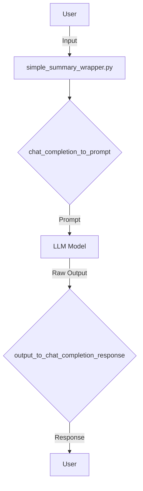

## Module: simple_summary_wrapper.py
- **Module Name**: simple_summary_wrapper.py
- **Primary Objectives**: This module is designed to generate summaries from a given set of conversations. It's a wrapper class that simplifies the process of summarizing conversations.
- **Critical Functions**: 
  - `__init__`: Initializes the class with certain parameters.
  - `chat_completion_to_prompt`: Converts chat completion to a prompt format.
  - `create_function_call`: Converts ChatCompletion to Airoboros style function trace (in prompt).
  - `output_to_chat_completion_response`: Converts raw LLM output into a ChatCompletion style response.
- **Key Variables**: `simplify_json_content`, `include_assistant_prefix`, `include_section_separators` are the essential variables.
- **Interdependencies**: This module depends on the `LLMChatCompletionWrapper` from the `wrapper_base` module.
- **Core vs. Auxiliary Operations**: Core operations include the conversion of chat completion to a prompt and the conversion of raw LLM output into a ChatCompletion style response. Auxiliary operations include the initialization of the class and the creation of function calls.
- **Operational Sequence**: The sequence begins with the initialization of the class, followed by the conversion of chat completion to a prompt. Then, function calls are created and finally, the raw LLM output is converted into a ChatCompletion style response.
- **Performance Aspects**: The module is designed to be efficient in summarizing conversations, but its performance may depend on the complexity and length of the conversations.
- **Reusability**: The module is highly reusable as it can be used to summarize different types of conversations.
- **Usage**: This module is used to generate summaries from a given set of conversations.
- **Assumptions**: The module assumes that the conversations are provided in a specific format, and that functions are None when converting chat completion to a prompt.
## Mermaid Diagram

