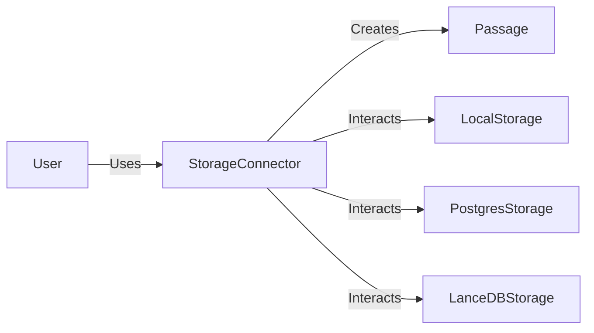

## Module: storage.py
- **Module Name**: storage.py

- **Primary Objectives**: This module is designed to manage storage connectors, allowing for the storage and retrieval of passages of text and their associated embeddings. It provides abstract methods for creating, reading, updating, and deleting these passages, as well as querying them.

- **Critical Functions**:
  - `__init__`: Initializes the Passage class with text, embedding, doc_id, and passage_id.
  - `get_storage_connector`: Returns a storage connector based on the archival storage type specified in the MemGPTConfig.
  - `list_loaded_data`: Lists the data loaded from the specified storage type.
  - `get_all_paginated`: Abstract method to get all passages in a paginated manner.
  - `get_all`: Abstract method to get all passages up to a limit.
  - `get`: Abstract method to get a specific passage by id.
  - `insert`: Abstract method to insert a passage.
  - `insert_many`: Abstract method to insert multiple passages.
  - `query`: Abstract method to query for passages based on a string query and query vector.
  - `save`: Abstract method to save the state of the storage connector.
  - `size`: Abstract method to get the number of passages in storage.

- **Key Variables**:
  - `text`: The text of a passage.
  - `embedding`: The embedding associated with a passage.
  - `doc_id`: The id of the document from which the passage comes.
  - `passage_id`: The id of the passage.
  - `storage_type`: The type of storage being used, which can be local, postgres, or lancedb.

- **Interdependencies**: This module interacts with the LocalStorageConnector, PostgresStorageConnector, and LanceDBConnector modules, which are implementations of the abstract StorageConnector class. It also interacts with the AgentConfig and MemGPTConfig classes from the memgpt.config module.

- **Core vs. Auxiliary Operations**: The core operations of this module are the CRUD operations (create, read, update, delete) on passages. The auxiliary operations include listing loaded data and saving the state of the storage connector.

- **Operational Sequence**: When a storage connector is needed, the `get_storage_connector` method is called, which returns an instance of the appropriate storage connector class based on the storage_type. The returned instance can then be used to perform operations on the passages in storage.

- **Performance Aspects**: Performance considerations would depend on the specific storage connector being used. For example, a database connector might have performance considerations related to database connection and query execution times.

- **Reusability**: This module is highly reusable, as it defines a standard interface for storage connectors. By implementing the abstract methods of the StorageConnector class, new types of storage connectors can be easily added.

- **Usage**: This module is used whenever a storage connector is needed to perform operations on passages. The specific usage would depend on the specific storage connector being used.

- **Assumptions**: The module assumes that the storage_type specified in the MemGPTConfig is one of "local", "postgres", or "lancedb". It also assumes that the appropriate storage connector classes are available for import.
## Mermaid Diagram

