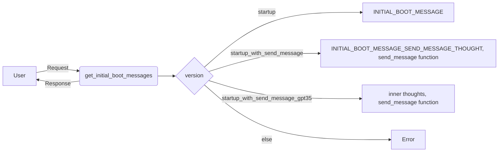

## Module: system.py
- **Module Name**: system.py
- **Primary Objectives**: This module is designed to manage system messages, including initial boot messages, heartbeat messages, login events, user messages, function responses, message summaries, and token limit warnings. It also packages these messages with time and location data.
- **Critical Functions**:
    - `get_initial_boot_messages(version="startup")`: Returns initial boot messages based on the version specified.
    - `get_heartbeat(reason="Automated timer", include_location=False, location_name="San Francisco, CA, USA")`: Packages and returns a heartbeat message.
    - `get_login_event(last_login="Never (first login)", include_location=False, location_name="San Francisco, CA, USA")`: Packages and returns a login event message.
    - `package_user_message(user_message, time=None, include_location=False, location_name="San Francisco, CA, USA")`: Packages and returns a user message.
    - `package_function_response(was_success, response_string, timestamp=None)`: Packages and returns a function response message.
    - `package_summarize_message(summary, summary_length, hidden_message_count, total_message_count, timestamp=None)`: Packages and returns a message summary.
    - `package_summarize_message_no_summary(hidden_message_count, timestamp=None, message=None)`: Packages and returns a message summary without a summary.
    - `get_token_limit_warning()`: Packages and returns a token limit warning message.
- **Key Variables**:
    - `version`: The version of initial boot messages.
    - `reason`: The reason for the heartbeat.
    - `include_location`: A flag indicating whether to include location data in the message.
    - `location_name`: The name of the location to include in the message.
    - `last_login`: The last login time.
    - `user_message`: The user message to package.
    - `was_success`: A flag indicating whether a function was successful.
    - `response_string`: The response string from a function.
    - `summary`: The summary of messages.
    - `summary_length`: The length of the summary.
    - `hidden_message_count`: The count of hidden messages.
    - `total_message_count`: The total count of messages.
- **Interdependencies**: This module interacts with the `utils` module to get local time and the `constants` module to get constant values.
- **Core vs. Auxiliary Operations**: The core operations of this module are the packaging and returning of various system messages. The auxiliary operations include getting local time and constant values from other modules.
- **Operational Sequence**: The functions in this module can be called independently as needed to package and return various types of system messages.
- **Performance Aspects**: The performance of this module depends on the efficiency of JSON operations and the speed of retrieving local time and constant values.
- **Reusability**: This module is highly reusable as it provides a standard way to package and return various types of system messages.
- **Usage**: This module is used whenever a system message needs to be packaged and returned.
- **Assumptions**: This module assumes that the `utils` and `constants` modules are available and functioning correctly. It also assumes that the necessary arguments will be provided when calling its functions.
## Mermaid Diagram

