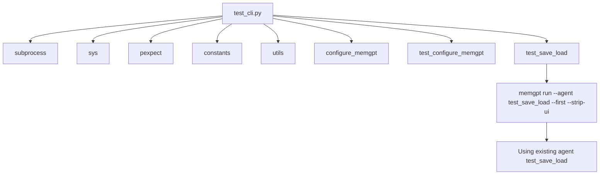

## Module: test_cli.py
- **Module Name**: The module name is `test_cli.py`.

- **Primary Objectives**: The primary purpose of this module is to test the command line interface (CLI) operations of a program. It focuses on testing the configuration, saving, and loading functionalities.

- **Critical Functions**: 
  - `test_configure_memgpt()`: This function tests the configuration of memgpt.
  - `test_save_load()`: This function tests the saving and loading functionality of the program.

- **Key Variables**: 
  - `child`: This is an instance of `pexpect.spawn` class. It is used to spawn and control child applications.
  - `TIMEOUT`: This variable is used to set the timeout for the `expect` method of `child`.

- **Interdependencies**: This module interacts with the `pexpect` library to spawn child applications and control their input/output. It also uses the `constants` and `utils` modules from the same package.

- **Core vs. Auxiliary Operations**: The core operations of this module are the `test_configure_memgpt()` and `test_save_load()` functions. The auxiliary operations include the import statements and the `if __name__ == "__main__":` block which allows the module to be run as a script.

- **Operational Sequence**: The module first configures memgpt, then tests the save and load operations. If the module is run as a script, it executes `test_configure_memgpt()` and `test_save_load()` sequentially.

- **Performance Aspects**: Performance considerations include the timeout for the `expect` method of `child`, which can affect the speed and efficiency of the tests.

- **Reusability**: The module is highly reusable. The test functions can be imported and used in other test suites or modules.

- **Usage**: This module is used for testing purposes. It can be run as a standalone script or imported into another module.

- **Assumptions**: The module assumes that the `memgpt` program responds correctly to the input provided by the `child` instance. It also assumes that the `memgpt` program terminates cleanly after execution.
## Mermaid Diagram

