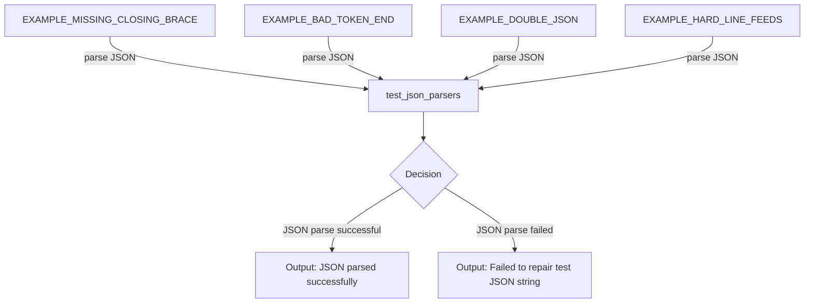

## Module: test_json_parsers.py
- **Module Name**: The module name is `test_json_parsers.py`.

- **Primary Objectives**: This module's purpose is to test the functionality of JSON parsers, particularly their ability to handle and fix broken JSON.

- **Critical Functions**: The main function in this module is `test_json_parsers()`. This function iterates through a list of test strings, each representing a different form of broken JSON. It attempts to parse each string with `json.loads()`, expects a failure, and then tries to repair the string with `json_parser.clean_json()`.

- **Key Variables**: The key variables in this module are `EXAMPLE_MISSING_CLOSING_BRACE`, `EXAMPLE_BAD_TOKEN_END`, `EXAMPLE_DOUBLE_JSON`, `EXAMPLE_HARD_LINE_FEEDS`, and `test_strings`. Each of these variables represents a different form of broken JSON that will be used to test the parsers.

- **Interdependencies**: This module interacts with the `json` module from Python's standard library and `json_parser` from `memgpt.local_llm`.

- **Core vs. Auxiliary Operations**: The core operation is the testing of JSON parsers. Auxiliary operations include the creation of test strings and exception handling.

- **Operational Sequence**: The sequence is as follows: For each test string, the function tries to parse it with `json.loads()`. If an exception is thrown (as expected), it then tries to repair the string with `json_parser.clean_json()`. If this fails, an exception is raised.

- **Performance Aspects**: The performance of this module depends on the efficiency of the JSON parsers it tests, as well as the complexity of the test strings.

- **Reusability**: This module is highly reusable. It can be used to test any JSON parser's ability to handle and fix broken JSON, simply by replacing the test strings.

- **Usage**: This module is used for testing purposes. It is likely invoked during development or in a continuous integration pipeline to ensure that changes to the JSON parsers do not break their functionality.

- **Assumptions**: The module assumes that the JSON parsers should be able to fix any form of broken JSON. It also assumes that `json.loads()` will fail to parse the test strings.
## Mermaid Diagram

