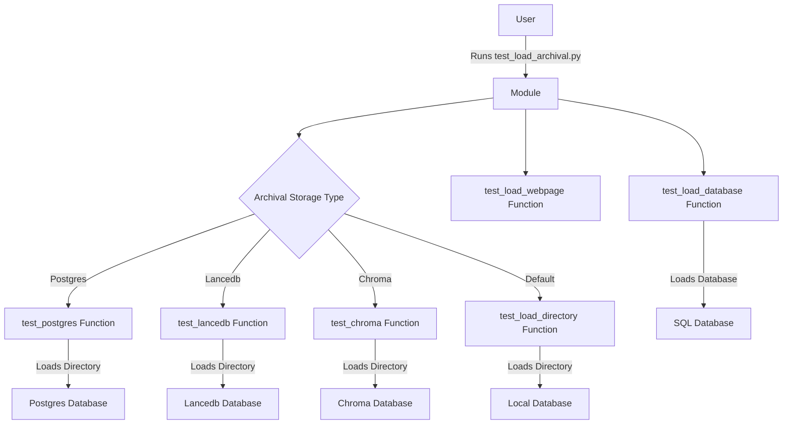

## Module: test_load_archival.py
Here is a comprehensive analysis of the provided code module:

- **Module Name**: test_load_archival.py

- **Primary Objectives**: The purpose of this module is to test the loading and storage of data using different archival storage types such as "postgres", "lancedb", and "chroma".

- **Critical Functions**: The main methods/functions in this module are:
  - `test_postgres()`: Tests the loading and storage of data using the "postgres" archival storage type.
  - `test_lancedb()`: Tests the loading and storage of data using the "lancedb" archival storage type.
  - `test_chroma()`: Tests the loading and storage of data using the "chroma" archival storage type.
  - `test_load_directory()`: Tests the loading of a directory into an index.
  - `test_load_webpage()`: Placeholder function for testing loading a webpage.
  - `test_load_database()`: Tests the loading of a database into an index.

- **Key Variables**: The key variables used in this module are:
  - `name`: Name of the dataset or index.
  - `dataset`: Dataset object loaded from the "MemGPT/example_short_stories" dataset.
  - `cache_dir`: Directory path for caching datasets.
  - `config`: MemGPTConfig object for configuring the archival storage type.
  - `engine`: SQLAlchemy engine object for connecting to a database.
  - `metadata`: SQLAlchemy MetaData object for reflecting the database.
  - `table_names`: List of table names in the reflected database.
  - `query`: SQL query for retrieving data from a table.
  - `df`: Pandas DataFrame object for storing data retrieved from the database.

- **Interdependencies**: This module depends on the following system components:
  - `tempfile`: For temporary file operations.
  - `asyncio`: For running asynchronous functions.
  - `os`: For environment variable operations and file system operations.
  - `datasets`: For loading datasets from Hugging Face.
  - `memgpt`: The main library for MemGPT functionality.
  - `presets`: For using preset configurations.
  - `personas`: For accessing persona-related functions and data.
  - `humans`: For accessing human-related functions and data.
  - `persistence_manager`: For managing the state of the agent.
  - `chromadb`: For interacting with the "chroma" archival storage type.
  - `lancedb`: For interacting with the "lancedb" archival storage type.
  - `subprocess`: For executing subprocess commands.
  - `sys`: For accessing system-specific parameters and functions.
  - `sqlalchemy`: For working with databases.
  - `pandas`: For working with data in tabular form.

- **Core vs. Auxiliary Operations**: The core operations of this module include testing the loading and storage of data using different archival storage types, loading directories, and loading databases. The auxiliary operations include installing dependencies, setting environment variables, and printing debug information.

- **Operational Sequence**: The operational sequence of this module is as follows:
  1. Install dependencies (`lancedb` and `chromadb`) if not already installed.
  2. Set the `MEMGPT_CONFIG_PATH` environment variable to "test_config.cfg".
  3. Test loading and storage of data using the "postgres" archival storage type.
  4. Test loading and storage of data using the "lancedb" archival storage type.
  5. Test loading and storage of data using the "chroma" archival storage type.
  6. Test loading a directory into an index.
  7. Test loading a database into an index.

- **Performance Aspects**: There are no specific performance aspects mentioned in the provided code module.

- **Reusability**: This module can be reused to test the loading and storage of data using different archival storage types, loading directories, and loading databases. However, some parts of the code may need modification depending on the specific use case.

- **Usage**: The module can be executed as a standalone script or imported as a module and used to test the functionality of the MemGPT library for loading and storing data.

- **Assumptions**: Based on the code provided, the assumptions made are:
  - The necessary dependencies (`lancedb`, `chromadb`, etc.) are already installed.
  - The required dataset ("MemGPT/example_short_stories") is available for loading.
  - The necessary configuration files ("test_config.cfg") are present.
  - The database file ("test.db") exists for loading into the index.
## Mermaid Diagram

