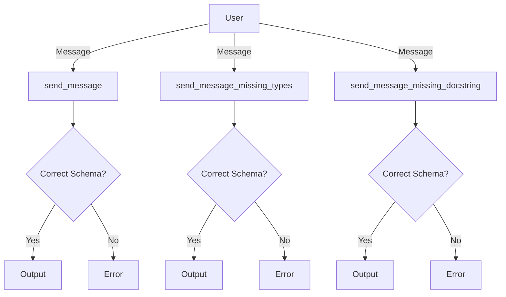

## Module: test_schema_generator.py
- **Module Name**: The module name is `test_schema_generator.py`.

- **Primary Objectives**: The primary purpose of this module is to generate and test JSON schemas for various functions. This includes checking whether the schema is correctly converted, handling missing types, and handling missing docstrings.

- **Critical Functions**: 
    - `send_message`: Sends a message to the human user. It returns None as it does not produce a response.
    - `send_message_missing_types`: Similar to `send_message`, but without type annotations, used for testing error handling.
    - `send_message_missing_docstring`: Similar to `send_message`, but without a docstring, used for testing error handling.
    - `test_schema_generator`: Tests the `generate_schema` function with different scenarios.
    - `test_schema_generator_with_old_function_set`: Tests the `generate_schema` function with a set of base functions and extra functions.

- **Key Variables**: 
    - `correct_schema`: The correct JSON schema for comparison.
    - `generated_schema`: The JSON schema generated by the `generate_schema` function.
    - `attr`: The attribute from the base_functions or extras_functions module.
    - `real_schema`: The actual schema for comparison.
    - `function_name`: The name of the function being tested.

- **Interdependencies**: This module interacts with the `inspect`, `base_functions`, `extras_functions`, `FUNCTIONS_CHAINING`, and `generate_schema` modules.

- **Core vs. Auxiliary Operations**: The core operations of this module are the functions `test_schema_generator` and `test_schema_generator_with_old_function_set`, which perform the primary testing. The auxiliary operations include the `send_message`, `send_message_missing_types`, and `send_message_missing_docstring` functions, which are used for testing purposes.

- **Operational Sequence**: The module first defines several functions for sending messages and testing. It then defines two main test functions that generate schemas for the defined functions and compare them against the correct schemas.

- **Performance Aspects**: Performance considerations aren't explicitly mentioned in the module. However, the use of assertions for testing can halt execution as soon as a test fails, which can save time when debugging.

- **Reusability**: The module is designed for testing and can be reused to validate the schema generation of other functions. The `send_message` function can also be reused for sending messages to the user.

- **Usage**: This module is used for testing the `generate_schema` function to ensure it correctly generates JSON schemas for different functions.

- **Assumptions**: The module assumes that the `generate_schema` function will throw an error if types are missing or if the docstring is missing. It also assumes that the `generate_schema` function will correctly generate the schema for the tested functions.
## Mermaid Diagram

