## Module: test_storage.py
- **Module Name**: test_storage.py

- **Primary Objectives**: This module is designed to test the functionalities of storage connectors in the MemGPT application. It verifies the operations of two types of storage connectors: PostgresStorageConnector and LanceDBConnector.

- **Critical Functions**: 
  - `test_postgres_openai()`: This function tests the PostgresStorageConnector with OpenAI.
  - `test_lancedb_openai()`: This function tests the LanceDBConnector with OpenAI.
  - `test_postgres_local()`: This function tests the PostgresStorageConnector with local storage.
  - `test_lancedb_local()`: This function tests the LanceDBConnector with local storage.

- **Key Variables**: 
  - `config`: It holds the configuration settings for the MemGPT application.
  - `embed_model`: It is the embedding model used for text embedding.
  - `passage`: It is the list of text passages to be inserted into the database.
  - `db`: It is the instance of the storage connector.
  - `query`: It is the query text used for testing the query functionality of the storage connector.
  - `query_vec`: It is the vector representation of the query text.
  - `res`: It is the result of the query operation.

- **Interdependencies**: This module interacts with several other modules in the MemGPT application including `memgpt.connectors.storage`, `memgpt.connectors.db`, `memgpt.embeddings`, and `memgpt.config`.

- **Core vs. Auxiliary Operations**: Core operations include testing the functionalities of the storage connectors. Auxiliary operations include setting up the environment and configuration for the tests.

- **Operational Sequence**: The module first checks the environment variables for the required database URLs and OpenAI API keys. Then it configures the MemGPT application and initializes the storage connector. It inserts passages into the database, retrieves all entries, and performs a query operation. Finally, it verifies the results of the query operation.

- **Performance Aspects**: This module uses pytest for testing, which is a robust framework that allows for efficient and effective testing. Performance considerations would be related to the speed and accuracy of the storage connectors and the embedding model.

- **Reusability**: This module can be reused for testing different storage connectors in the MemGPT application. The test functions can be modified to test different functionalities of the storage connectors.

- **Usage**: This module is used for testing the functionalities of storage connectors in the MemGPT application.

- **Assumptions**: The module assumes that the required environment variables for the database URLs and OpenAI API keys are set. It also assumes that the required packages are installed and the necessary modules can be imported.
## Mermaid Diagram

```mermaid
graph TD;
  A[Module: test_storage.py] -->|imports| B[os];
  A -->|imports| C[subprocess];
  A -->|imports| D[sys];
  A -->|imports| E[pytest];
  C -->|check_call| F[sys.executable];
  F -->|"-m pip install"| G["pgvector, psycopg, psycopg2-binary"];
  C -->|check_call| H[sys.executable];
  H -->|"-m pip install"| I[lancedb];
  A -->|imports| J[pgvector];
  A -->|imports| K[memgpt.connectors.storage];
  A -->|imports| L[memgpt.connectors.db];
  A -->|imports| M[memgpt.embeddings];
  A -->|imports| N[memgpt.config];
  A -->|imports| O[argparse];
  E -->|skipif| P[os.getenv PGVECTOR_TEST_DB_URL];
  E -->|skipif| Q[os.getenv OPENAI_API_KEY];
  E -->|skipif| R[config];
  R -->|config_path| S[MemGPTConfig];
  S -->|archival_storage_type| T["postgres"];
  S -->|archival_storage_uri| U[os.getenv PGVECTOR_TEST_DB_URL ];
  S -->|replace| V["postgres://"];
  S -->|save| W[config];
  R -->|embedding_model| X[embedding_model];
  R -->|passage| Y["This is a test passage"];
  R -->|passage| Z["This is another test passage"];
  R -->|passage| AA["Cinderella wept"];
  R -->|db| BB[PostgresStorageConnector];
  Y -->|insert| CC[Passage];
  Z -->|insert| CC;
  AA -->|insert| CC;
  BB -->|get_all| DD[db];
  R -->|query| EE["why was she crying"];
  R -->|query| FF[query_vec];
  DD -->|query| GG[2 results];
  GG -->|assert| HH["'wept' in results"];
  E -->|skipif| II["deleting..."];
  II -->|delete| JJ[db];
  II -->|...finished| JJ;
  E -->|skipif| KK[os.getenv LANCEDB_TEST_URL ];
  E -->|skipif| LL[os.getenv OPENAI_API_KEY ];
  E -->|skipif| MM[config];
  MM -->|config_path| NN[MemGPTConfig];
  NN -->|archival_storage_type| OO["lancedb"];
  NN -->|archival_storage_uri| PP[os.getenv LANCEDB_TEST_URL];
  NN -->|embedding_model| QQ[embedding_model];
  NN -->|passage| RR["This is a test passage"];
  NN -->|passage| SS["This is another test passage"];
  NN -->|passage| TT["Cinderella wept"];
  NN -->|db| UU[LanceDBConnector];
  RR -->|insert| VV[Passage];
  SS -->|insert| VV;
  TT -->|insert| VV;
  UU -->|get_all| WW[db];
  NN -->|query| XX["why was she crying"];
  NN -->|query| YY[query_vec];
  WW -->|query| ZZ[2 results];
  ZZ -->|assert| AAA["'wept' in results"];
  E -->|skipif| BBB["deleting..."];
  BBB -->|delete| CCC[db];
  BBB -->|...finished| CCC;
  E -->|skipif| DDD[os.getenv PGVECTOR_TEST_DB_URL ];
  E -->|skipif| EEE[config];
  EEE -->|config_path| FFF[MemGPTConfig];
  FFF -->|archival_storage_type| GGG["postgres"];
  FFF -->|archival_storage_uri| HHH[os.getenv PGVECTOR_TEST_DB_UR L];
  FFF -->|embedding_endpoint_type| III["local"];
  FFF -->|embedding_dim| JJJ[384];
  FFF -->|embedding_model| KKK[embedding_model];
  FFF -->|passage| LLL["This is a test passage"];
  FFF -->|passage| MMM["This is another test passage"];
  FFF -->|passage| NNN["Cinderella wept"];
  FFF -->|db| OOO[PostgresStorageConnector];
  LLL -->|insert| PPP[Passage];
  MMM -->|insert| PPP;
  NNN -->|insert| PPP;
  OOO -->|get_all| QQQ[db];
  FFF -->|query| RRR["why was she crying"];
  FFF -->|query| SSS[query_vec];
  QQQ -->|query| TTT[2 results];
  TTT -->|assert| UUU["'wept' in results"];
  FFF -->|skipif| VVV["deleting..."];
  VVV -->|delete| WWW[db];
  VVV -->|...finished| WWW;
  E -->|skipif| XXX[os.getenv LANCEDB_TEST_URL ];
  E -->|skipif| YYY[config];
  YYY -->|config_path| ZZZ[MemGPTConfig];
  ZZZ -->|archival_storage_type| AAAA["lancedb"];
  ZZZ -->|archival_storage_uri| BBBB[os.getenv LANCEDB_TEST_URL ];
  ZZZ -->|embedding_model| CCCC[embedding_model];
  ZZZ -->|passage| DDDD["This is a test passage"];
  ZZZ -->|passage| EEEE["This is another test passage"];
  ZZZ -->|passage| FFFF["Cinderella wept"];
  ZZZ -->|db| GGGG[LanceDBConnector];
  DDDD -->|insert| HHHH[Passage];
  EEEE -->|insert| HHHH;
  FFFF -->|insert| HHHH;
  GGGG -->|get_all| IIII[db];
  ZZZ -->|query| JJJJ["why was she crying"];
  ZZZ -->|query| KKKK[query_vec];
  IIII -->|query| LLLL[2 results];
  LLLL -->|assert| MMMM["'wept' in results"];
```

