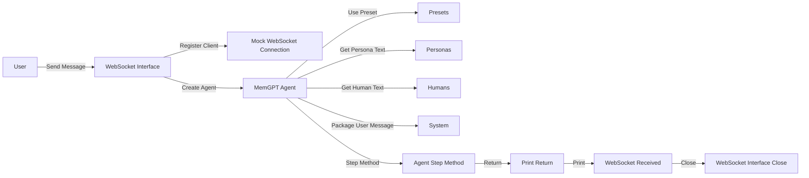

## Module: test_websocket_interface.py
- **Module Name**: The module is `test_websocket_interface.py`.

- **Primary Objectives**: The main purpose of this module is to test the WebSocket interface in the MemGPT system. It mocks the WebSocket connection, registers it, creates an agent, and tests the agent's interaction with the WebSocket interface.

- **Critical Functions**: 
    - `test_dummy()`: A placeholder test function that always passes.
    - `test_websockets()`: The main test function that mocks a WebSocket connection and tests the interaction with the MemGPT agent.

- **Key Variables**: 
    - `mock_websocket`: A mocked WebSocket connection.
    - `ws_interface`: The WebSocket interface to be tested.
    - `persistence_manager`: An in-memory state manager for the agent.
    - `memgpt_agent`: The MemGPT agent.
    - `user_message`: A mocked user message.

- **Interdependencies**: The module interacts with other components of the MemGPT system, including the WebSocket interface, agent presets, personas, humans, and the system package.

- **Core vs. Auxiliary Operations**: The core operation is the testing of the WebSocket interface (`test_websockets()`), while the auxiliary operation is the dummy test function (`test_dummy()`).

- **Operational Sequence**: The operational sequence involves creating a mock WebSocket connection, registering it with the WebSocket interface, creating an agent, packaging a user message, making the agent step through the message, and finally closing the WebSocket interface.

- **Performance Aspects**: The module uses asynchronous functions for testing, which can improve performance by allowing multiple operations to occur concurrently.

- **Reusability**: The module is designed for testing purposes, so it can be reused whenever the WebSocket interface needs to be tested. However, the specific tests and mocks may need to be adjusted based on the specific testing requirements.

- **Usage**: This module is used for testing the WebSocket interface in the MemGPT system.

- **Assumptions**: The module assumes that the WebSocket interface and the MemGPT agent function correctly. It also assumes that the mocked user message and WebSocket connection accurately represent actual user messages and WebSocket connections.
## Mermaid Diagram

