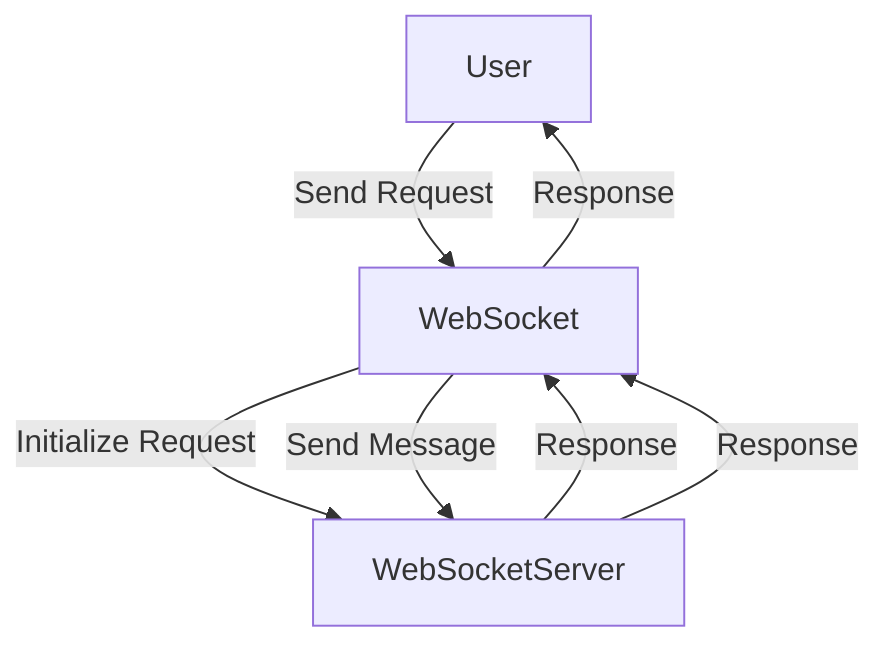

## Module: test_websocket_server.py
- **Module Name**: The module name is `test_websocket_server.py`.

- **Primary Objectives**: This module is designed to test the functionality of a WebSocket server. It involves sending a test configuration to the server and a test message, then waiting for the server's response.

- **Critical Functions**: 
  - `test_dummy()`: A placeholder test function that simply asserts true.
  - `test_websocket_server()`: The main test function that initiates a WebSocket server, sends a configuration and a message, receives responses, and then cancels the server task.

- **Key Variables**: 
  - `server`: An instance of the WebSocketServer.
  - `server_task`: A task created for running the server.
  - `test_config`: A dictionary that holds the configuration details for the test.
  - `uri`: The connection string for the WebSocket.
  - `websocket`: The WebSocket connection.
  - `response`: The response received from the WebSocket server.

- **Interdependencies**: This module interacts with the `WebSocketServer` from the `memgpt.server.websocket_server` module, `AgentConfig` from the `memgpt.config` module, and `DEFAULT_PORT` from the `memgpt.server.constants` module. It also uses the `pytest`, `asyncio`, `json`, and `websockets` libraries.

- **Core vs. Auxiliary Operations**: The core operation is the testing of the WebSocket server using `test_websocket_server()`. The auxiliary operation is the `test_dummy()` function which serves as a placeholder test.

- **Operational Sequence**: The server is initiated, a test configuration is sent, a response is awaited, a message is sent, another response is awaited, and finally, the server task is cancelled.

- **Performance Aspects**: The server task is cancelled after the test to free up resources. Also, asynchronous operations are used to improve performance by allowing other operations to proceed without waiting.

- **Reusability**: The `test_websocket_server()` function can be reused for similar WebSocket server testing scenarios with different configurations and messages.

- **Usage**: This module is used for testing the WebSocket server's handling of configurations and messages. It can be run as part of a test suite to ensure the server behaves as expected.

- **Assumptions**: It is assumed that the server responds appropriately to the sent configuration and message. It is also assumed that the server is running on `localhost` at the `DEFAULT_PORT`.
## Mermaid Diagram

